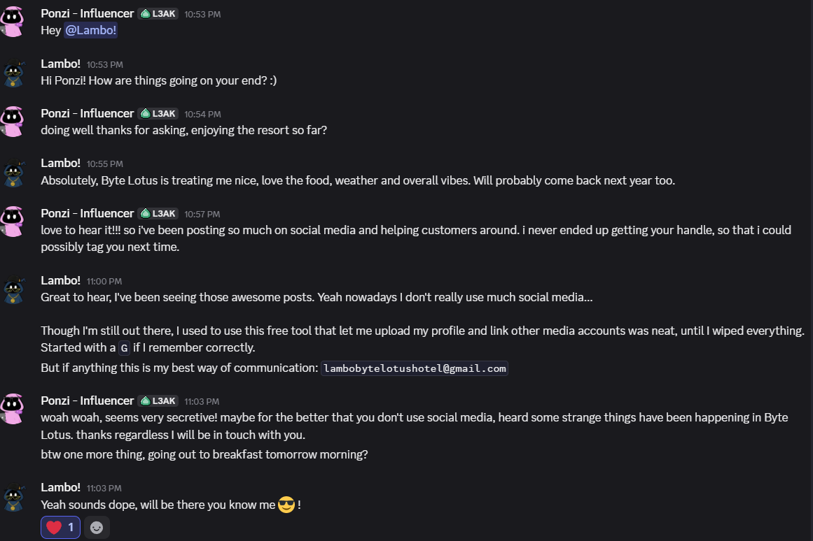
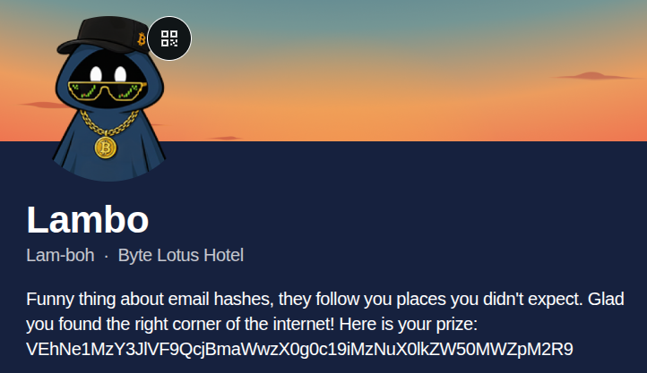

<div align="center">


# Overheard at Breakfast

#OSINT #SocialMedia #Hashing

</div>

---

I get a zip archive which contains a conversation.png

```bash
open conversation.png
```



When I get an email address and something starting with `G`, I instantly think of `Gravatar`.

We need the md5hash.

```bash
echo -n "lambobytelotushotel@gmail.com" | md5sum
d4a5fc5d3128890778667e24617d7cc0
```
`-n` removes the trailing newline.

https://gravatar.com/d4a5fc5d3128890778667e24617d7cc0

Brings me to this site:



The prize was the flag b64 encoded:
```
THM{S3creT_Pr0fil3_H4s_b33n_Ident1fi3d}
```

