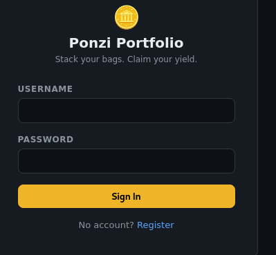
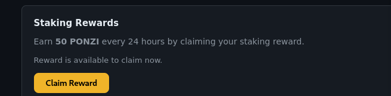
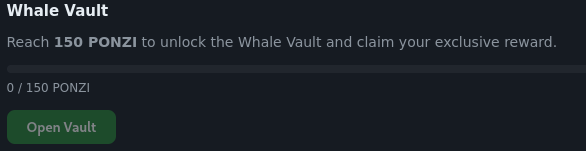
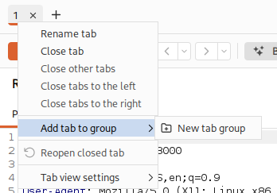
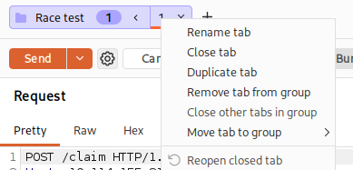
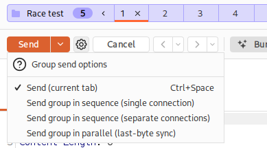
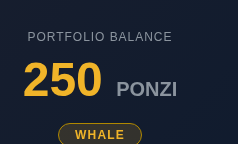

<div align="center">


# Towel on the Sunbed

#WebExploitation #BusinessLogic #BurpSuite #APIAbuse

</div>

---

```bash
nmap -sV -sC 10.112.153.154-oN nmap.txt
```

I can find a Node.js Express framework server on port 3000.



I will register an account.



I will capture this request in burpsuite to inspect it.

From the room description: 
```
He's convinced the app owes him a spot in the Whale Vault. The app disagrees, politely, once every 24 hours. Somewhere between his request and the server's clock, there's a gap wide enough to walk a whale through.
```

```HTTP
POST /claim HTTP/1.1
Host: 10.112.153.154:3000
Content-Length: 0
Accept-Language: en-US,en;q=0.9
User-Agent: Mozilla/5.0 (X11; Linux x86_64) AppleWebKit/537.36 (KHTML, like Gecko) Chrome/146.0.0.0 Safari/537.36
Accept: */*
Origin: http://10.112.153.154:3000
Referer: http://10.112.153.154:3000/dashboard
Accept-Encoding: gzip, deflate, br
Cookie: connect.sid=s%3ABNgBoUo8GXjMaqa2KZwn8qsmY4zB1HZB.ytYSLUG0yOQCZT0NpQh%2B11t95wI%2Ba75J%2BNWdQQinfxw
Connection: keep-alive
```
This is the request being sent when I try to claim the prize.

The response:
```http
HTTP/1.1 200 OK
X-Powered-By: Express
Content-Type: application/json; charset=utf-8
Content-Length: 114
ETag: W/"72-f8wsWDsVt6SP3811+HTqkwdvhHU"
Date: Fri, 07 Aug 2026 07:47:17 GMT
Connection: keep-alive
Keep-Alive: timeout=5

{"message":"Staking reward claimed successfully.","reward":50,"newBalance":50,"tier":"Shrimp","priceSnapshot":4.2}
```

When I try to claim it again, I get this message:
```http
{"error":"Reward already claimed. Please wait before claiming again.","secondsRemaining":86376}
```

By looking at the description of the room, we are searching for a race condition.

To access the whale vault we need 150 ponzi (Claim the reward 3 times):



I capture the claim request in burpsuite again and send it to repeater.

I then create a group to send multiuple claim requests at the same time:



I then right click the `1` request and select `Duplicate tab`:



I duplicate it 4 times, which will give me 250 ponzi (> 150).

Before I send the requests I click the arrow next to `Send` and choose to send all of the requests in parallell:



I send the group and look at all of the request's responses. They all look the same, so all of the claim requests worked?

I reload my page and can see that it worked!



I can now open the whale vault and claim the flag:
```
THM{REDACTED}
```
