<div align="center">


# Directory

**Difficulty:** Hard
**Category:** AD, Network Analysis, Cryptography

</div>
---


We are given one single `pcap` file.

### What ports did the threat actor **initially** find open? Format: from lowest to highest, separated by a comma.

If the attacker found open ports, we should be able to see how the attacker sends a `SYN` frame and the server responds with a `SYN ACK`. On the closed ports there will still be a response, but a `RST ACK` will be sent.

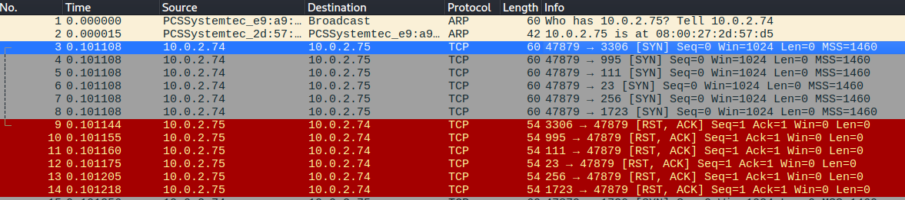

By looking at this image we have the attacker IP: `10.0.2.74` and the server IP: `10.0.2.75`. 

To find the ports that are open we look for the first `SYN ACK` frames (from `2.75` to `2.74`).

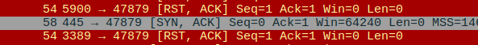

* 445 **SMB**
*  80 **(HTTP).**
* 139 **NetBIOS SMB**
* 53 **DNS**
* 135 **RPC**
* 464 **Kerberos Authentication**
* 3269 **LDAP over SSL**
* 88 **Kerberos**
* 593 **RPC**
* 3268 **Global Catalog LDAP**
* 389 **LDAP**
* 5357 **WSDAPI** (Web Services for Devices API)
* 636 **LDAPS** (Lightweight Directory Access Protocol Secure)

Thats all!

From highest to lowest:
53,80,88,135,139,389,445,464,593,636,3268,3269,5357

One thing to mention. When doing a nmap scan, it is common for the network logs to look like this:

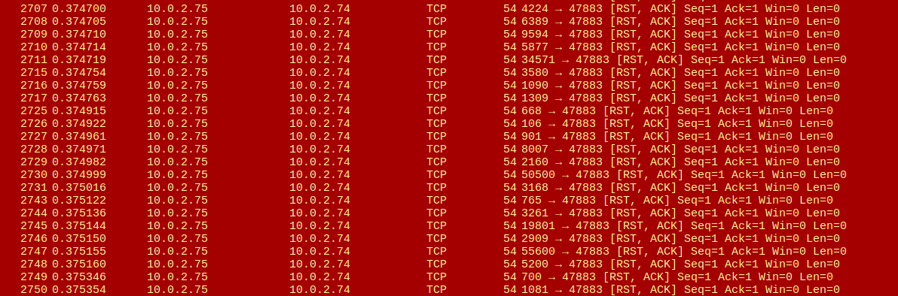

With the `ip.src==10.0.2.75` (server). It resets all the requests to the closed ports.

### The threat actor found four valid usernames, but only one username allowed the attacker to achieve a foothold on the server. What was the username? Format: Domain.TLD\username

I search for `ip.src==10.0.2.74 (attacker) && http`.

At first I see regular HTTP requests for looking at the port 80 HTTP site. But this caught my eye:

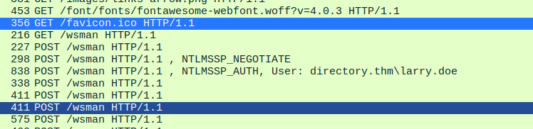

Something is up with the `wsman` directory. And `POST` data is sent with a user: `directory.thm\larry.doe`.

I would like to find the other valid users?

If I follow the HTTP stream for that packet I can find this:

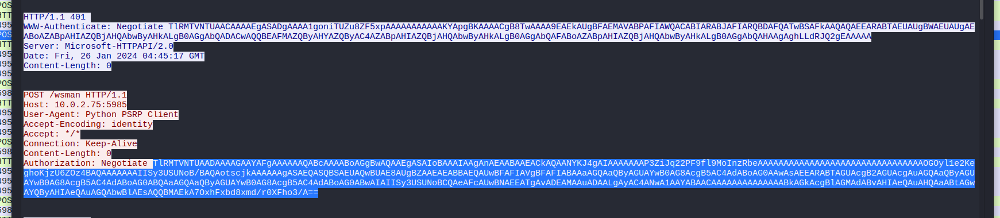

Where the red is the attacker, this is decoded from base64 and removed null bytes:

```
NTLMSSPXppŠœ¤5‚‰âݘ‰«m×åôÊŸ4[xáŽÊ]^ا †‚£ÍN™;>‚ËuPÚü‹lr9DIRECTORYADSERVERdirectory.thm,ADServer.directory.thmdirectory.thm‚ËuPÚ	WSMAN/10.0.2.75directory.thmlarry.doeKALIììaÝóþ½7ü
```

We can pick out: `directory.thm`, `larry.doe` and `KALI`.

After this packet, everything becomes encrypted, so the attacker must've gotten the hash before this.

From the HTTP data I can find the `NTLMSSP` three-message handshake:
1. Client sends a `NTLMSSP_NEGOTIATE` to the server:
* This contains:
	* **Negotiate flags**
	* **Domain name** (optional) - the client's hostname
	* ...
	* "Here's what I support, let's authenticate"

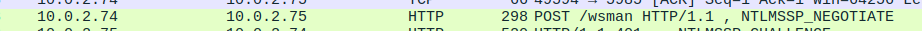
```
POST /wsman HTTP/1.1
Host: 10.0.2.75:5985
User-Agent: Python PSRP Client
Accept-Encoding: identity
Accept: */*
Connection: Keep-Alive
Content-Length: 0
Authorization: Negotiate TlRMTVNTUAABAAAAN4II4AAAAAAgAAAAAAAAACAAAAA=
```

2. Server sends a `NTLMSSP_CHALLENGE` to the client:
* This contains:
	* **Server challenge** - 8-byte random nonce
	* **Target name** - server's domain/hostname
	* ...
	* "Here's my challenge nonce - prove you know the password"
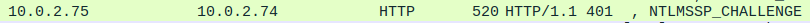
```
HTTP/1.1 401 
WWW-Authenticate: Negotiate TlRMTVNTUAACAAAAEgASADgAAAA1goniTUZu8ZF5xpAAAAAAAAAAAKYApgBKAAAACgB8TwAAAA9EAEkAUgBFAEMAVABPAFIAWQACABIARABJAFIARQBDAFQATwBSAFkAAQAQAEEARABTAEUAUgBWAEUAUgAEABoAZABpAHIAZQBjAHQAbwByAHkALgB0AGgAbQADACwAQQBEAFMAZQByAHYAZQByAC4AZABpAHIAZQBjAHQAbwByAHkALgB0AGgAbQAFABoAZABpAHIAZQBjAHQAbwByAHkALgB0AGgAbQAHAAgAghLLdRJQ2gEAAAAA
Server: Microsoft-HTTPAPI/2.0
Date: Fri, 26 Jan 2024 04:45:17 GMT
Content-Length: 0
```
3. Client sends a `NTLMSSP_AUTH` to the server:
* Contains:
	* **LM response** - LAN Manager hash response (Often empty in modern systems)
	* **NTLM response** - `NTLMv1` or `NTLMv2` hash computed from the password + server challenge.
	* **Domain name** & **Username**.
	* ...
	* "Here's my hashed response to your challenge, plus who I am"
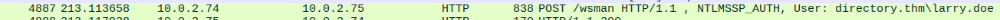
```
POST /wsman HTTP/1.1
Host: 10.0.2.75:5985
User-Agent: Python PSRP Client
Accept-Encoding: identity
Accept: */*
Connection: Keep-Alive
Content-Length: 0
Authorization: Negotiate TlRMTVNTUAADAAAAGAAYAFgAAAAAAQABcAAAABoAGgBwAQAAEgASAIoBAAAIAAgAnAEAABAAEACkAQAANYKJ4gAIAAAAAAAP3ZiJq22PF9fl9MoInzRbeAAAAAAAAAAAAAAAAAAAAAAAAAAAAAAAAOGOyl1e2KeghoKjzU6ZOz4BAQAAAAAAAIISy3USUNoB/BAQAotscjkAAAAAAgASAEQASQBSAEUAQwBUAE8AUgBZAAEAEABBAEQAUwBFAFIAVgBFAFIABAAaAGQAaQByAGUAYwB0AG8AcgB5AC4AdABoAG0AAwAsAEEARABTAGUAcgB2AGUAcgAuAGQAaQByAGUAYwB0AG8AcgB5AC4AdABoAG0ABQAaAGQAaQByAGUAYwB0AG8AcgB5AC4AdABoAG0ABwAIAIISy3USUNoBCQAeAFcAUwBNAEEATgAvADEAMAAuADAALgAyAC4ANwA1AAYABAACAAAAAAAAAAAAAABkAGkAcgBlAGMAdABvAHIAeQAuAHQAaABtAGwAYQByAHIAeQAuAGQAbwBlAEsAQQBMAEkA7OxhFxbd8xmd/r0XFho3/A==
```

So if we want to find the hash that the attacker has gotten.

This is how the `NTLMv2` hash is constructed:

`username::domain:ServerChallenge:NTProofStr:Blob`

* The `ServerChallenge` comes from the 401 response - 8 bytes at a fixed offset (byte 24)
```bash
# The NTLMSSP_CHALLENGE string:
echo "TlRMTVNTUAACAAAAEgASADgAAAA1goniTUZu8ZF5xpAAAAAAAAAAAKYApgBKAAAACgB8TwAAAA9EAEkAUgBFAEMAVABPAFIAWQACABIARABJAFIARQBDAFQATwBSAFkAAQAQAEEARABTAEUAUgBWAEUAUgAEABoAZABpAHIAZQBjAHQAbwByAHkALgB0AGgAbQADACwAQQBEAFMAZQByAHYAZQByAC4AZABpAHIAZQBjAHQAbwByAHkALgB0AGgAbQAFABoAZABpAHIAZQBjAHQAbwByAHkALgB0AGgAbQAHAAgAghLLdRJQ2gEAAAAA" | base64 -d | xxd | grep 4d -a100
```

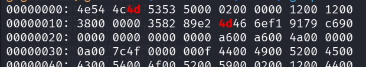

By counting in 2's we find that `4d46` is the 26th and 28th byte. (The challenge starts after the 24th byte). So the challenge would be: `4d466ef19179c690`· 

Now we have `larry.doe::directory.thm:4d466ef19179c690:NTProofStr:Blob`.

To get the `NTProofStr` we need to look at the `NTLMSSP_AUTH` block:
* **Username** - UTF-16LE string at the offset specified in the header -> `larry.doe`.
* **Domain** - UTF-16LE string -> `directory.thm`.
* **NTLM Response**  - has two parts:
	* First 16 bytes = `NTProofStr` 
	* Remaining bytes = `Blob` (contains timestamp, client nonce, target info ...)
```bash
# The NTLMSSP_AUTH string:
echo "TlRMTVNTUAADAAAAGAAYAFgAAAAAAQABcAAAABoAGgBwAQAAEgASAIoBAAAIAAgAnAEAABAAEACkAQAANYKJ4gAIAAAAAAAP3ZiJq22PF9fl9MoInzRbeAAAAAAAAAAAAAAAAAAAAAAAAAAAAAAAAOGOyl1e2KeghoKjzU6ZOz4BAQAAAAAAAIISy3USUNoB/BAQAotscjkAAAAAAgASAEQASQBSAEUAQwBUAE8AUgBZAAEAEABBAEQAUwBFAFIAVgBFAFIABAAaAGQAaQByAGUAYwB0AG8AcgB5AC4AdABoAG0AAwAsAEEARABTAGUAcgB2AGUAcgAuAGQAaQByAGUAYwB0AG8AcgB5AC4AdABoAG0ABQAaAGQAaQByAGUAYwB0AG8AcgB5AC4AdABoAG0ABwAIAIISy3USUNoBCQAeAFcAUwBNAEEATgAvADEAMAAuADAALgAyAC4ANwA1AAYABAACAAAAAAAAAAAAAABkAGkAcgBlAGMAdABvAHIAeQAuAHQAaABtAGwAYQByAHIAeQAuAGQAbwBlAEsAQQBMAEkA7OxhFxbd8xmd/r0XFho3/A==" | base64 -d | xxd
```

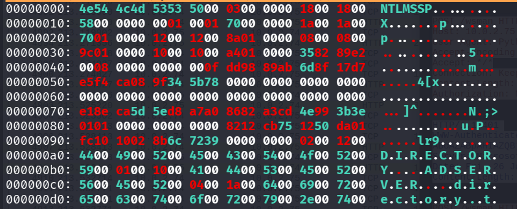

The `NTProofStr` starts at `00000070` (after the 0's to create a divider): `e18eca5d5ed8a7a08682a3cd4e993b3e`.

So the `NTLMv2` hash is:

```
larry.doe::directory.thm:4d466ef19179c690:e18eca5d5ed8a7a08682a3cd4e993b3e:Blob
```

If the question is for the last **30 characters**, does it want the `Blob` part?

Lets look at the logs again. I can search for `kerberos`:

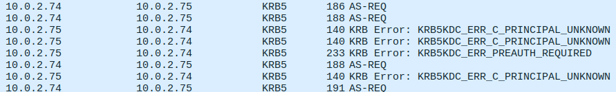

When the server responds with `..PRINCIPAL_UNKNOWN` it means that the attacker tried a invalid user. But when it responds with `PREAUTH_REQUIRED` the attacker has a valid user. This is the method that `Kerbrute` uses, since it is pre-authentication it does not generate the Event ID 4625 `An account failed to log on`. The only log creates is the `A Kerberos TGT was requested`. 

Here we can find the other 2 valid users!

* `ranith.kays`
* `john.ray`

I filter for `kerberos and kerberos.CNameString == "larry.doe"`

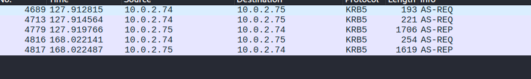

I get 5 frames. Since `74` is the attacker. We should look at where he is the destination.

Omg I found it:

The last frame `AS-REP` in `Kerberos` -> `as-rep` -> `enc-part` -> `cipher` (last 30 characters)

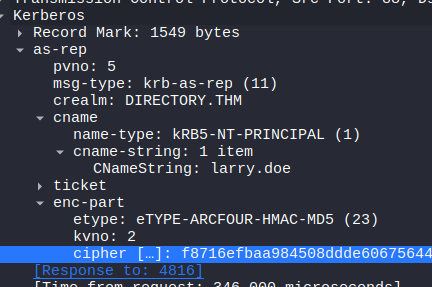

`55616532b664cd0b50cda8d4ba469f`.

The account `larry.doe` has **"Do not require Kerberos preauthentication"** set, which means:

* **Normal flow:** Client sends a `AS-REQ` with PA-ENC-TIMESTAMP (Proving they know the password) -> KDC veriifes -> sends `AS-REP`.
* **Without preauth:** Client sends `AS-REQ` with **no proof at all** -> KDC just hands back the `AS-REP` anyway.

The`AS-REP`'s **enc-part** is ncrypted with the user's password-derivedkey. Since anyone can request it without knowing the password, the attacker can:
1. Request the TGT for `larry.doe`
2. Take the encrypted portion from the `AS-REP`
3. Crack it offline

`AS-REP-ROASTING`! Like I did in the room **Attacktive Directory**.

**The hash format** would be: `$krb5asrep$23$larry.doe@DIRECTORY.THM:<cipher_hex>`:

```
$krb5asrep$23$larry.doe@DIRECTORY.THM:f8716efbaa984508ddde606756441480$805ab8be8cfb018a282718f7c040cd43924c6f9afeb6171230bbd3dccc79294dcf2f877a44c1a0981aadb7bb7a9510dd52d8dda4039ef4dcb444f18c9902be1623035e10aebf16ce4bdf5f7064f480e67e96ec2eb32bad95c5a1247bd7a241273fe80e281f4e6a99926f7969fcf803190c7096b947a33407f8578d4c0fb8b52d2aa8d0405a44b72bd21e014563cb71e82aee0e12538d0d440c930b98abf766e18ddc99a964e6e812ecf8dc8994a912a02074d40e5e6906915c1d216653d45df88636b51656f2c37de2020a2fd86ee7ecf6f0afe3f509fd31144e1573f9587155616532b664cd0b50cda8d4ba469f
```

We also need a '$' - dollarsign after the first 32 characters. 

```bash
hashcat -m 18200 john-doe.hash rockyou.txt
```

`mode 18200` is for `AS-REP-Roasting`. ($krb5asrep$23)

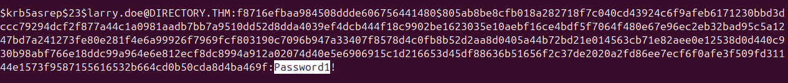

His password is: `Password1!`

If we look at all the traffic where the source is the attacker, we can see the frame at number `4816` being the last `AS-REQ` before receiving the user hash for `john.doe`. After this, at frame number `4855` we can see the beginning of the `HTTP` requests to port `5985 WinRM` (Windows Remote Management). 

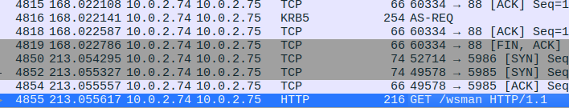

I filter for `http and tcp.port == 5985 and ip.src==10.0.2.74` to look at all the `POST` requests to the `/wsman` directory. Port `5985` is WinRM.

I cannot get this to work. I search on google for `WinRM decryptor` and find this github repo: 
https://github.com/h4sh5/decrypt-winrm

```bash
git clone https://github.com/h4sh5/decrypt-winrm
cd decrpyt-winrm
python3 -m venv .
source bin/activate
pip3 install -r requirements.txt

python3 winrm_decrypt.py -p '<john_passwd>' > decrpyted_traffic.txt
```

I find in the `decrypted_traffic.txt` that the commands are encoded in:

```
<rsp:CommandLine CommandId="16A4E141-FB8A-47F1-A3A6-28F3A6DE27FB">
                        <rsp:Command/>
                        <rsp:Arguments>loooong b64 string...
                        ...
                        ==</rsp:Arguments>
```

So I try to get them out:

```bash
grep -oP '(?<==rsp:Arguments>).*?(?=</rsp:Arguments>)' decrypted_traffic.txt > b64_arguments.txt
```

Now I do this:
```bash
cat b64_arguments | base64 -d
```

I can see the commands, but they contain a lot of other info:

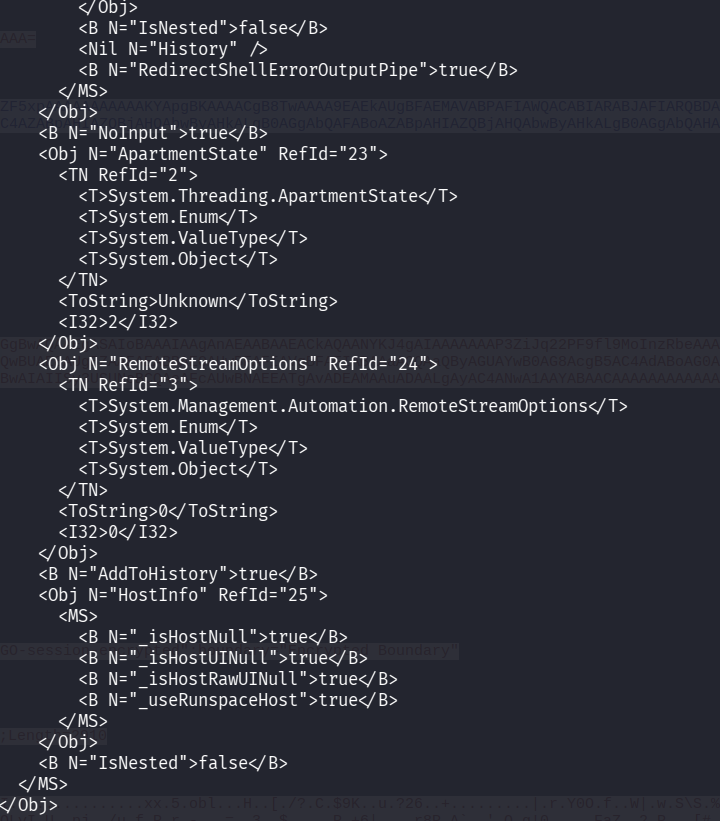

```bash
cat b64_arguments | base64 -d | less
:/whoami
```

I guess that `whoami` is run, which is correct, and the format is like this:

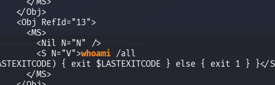

So I try to filter it even more:

```bash
cat b64_arguments | base64 -d | grep -a '<S N="V">'
```
`-a` - "Process a binary file as if it were text"
* I got an error "grep: (standard input): binary file matches", so I needed this flag.

Now I can see all the commands!

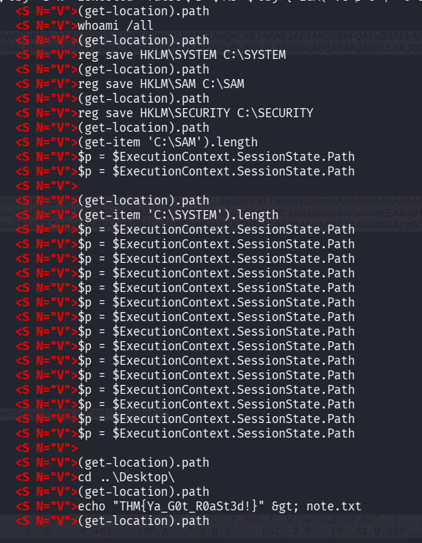

The attacker copies the `SYSTEM` and `SAM` files, which means he will perform a `SecretsDump`.

**What were the second and third commands that the threat actor executed on the system? Format: command1,command2**

By looking at the format in the answer field, this is the answer:

`reg save HKLM\SYSTEM C:\SYSTEM,reg save HKLM\SAM C:\SAM`,

**What is the flag?** `THM{REDACTED}`