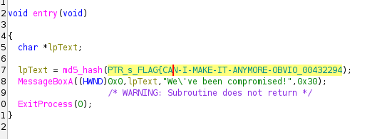
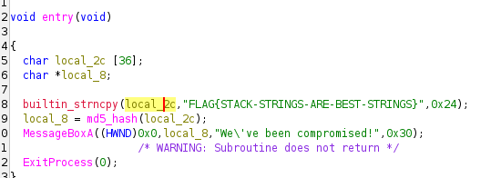
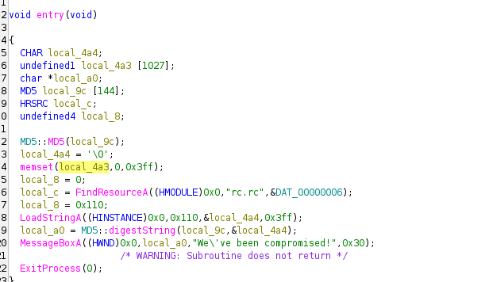
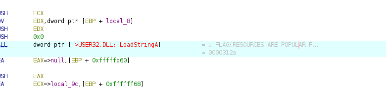

<div align="center">


# Basic Malware RE

**Difficulty:** Medium  
**Category:** Malware analysis / Reverse engineering

</div>

---


## TASK 1
It says "do not use any type of debugger", but Ghidra is allowed! Lets go..



This was pretty easy

```bash
strings strings1.exe | grep FLAG | grep CAN-I
>FLAG{CAN-I-MAKE-IT-ANYMORE-OBVIOUS}
```

## TASK 2



`strncpy(dest, src, <int>)`
* copies the FLAG{STACK-STRINGS-ARE-BEST-STRINGS} to `local_2c`
* Sets local_8 = (md5 hash of local_2c)
* So the flag is: FLAG{STACK-STRINGS-ARE-BEST-STRINGS}

## TASK 3



`memset`
* "fill memory with a particular value"
* `memset(start, value, size)`
* Fill starting from `local_4a3` with 1023 0's

```c
local_c = FindResourceA((HMODULE)0x0,"rc.rc",&DAT_00000006);
```
Find the resource called `rc.rc` 

I found this in the flow:



FLAG{RESOURCES-ARE-POPULAR-FOR-MALWARE}
It was the flag.
